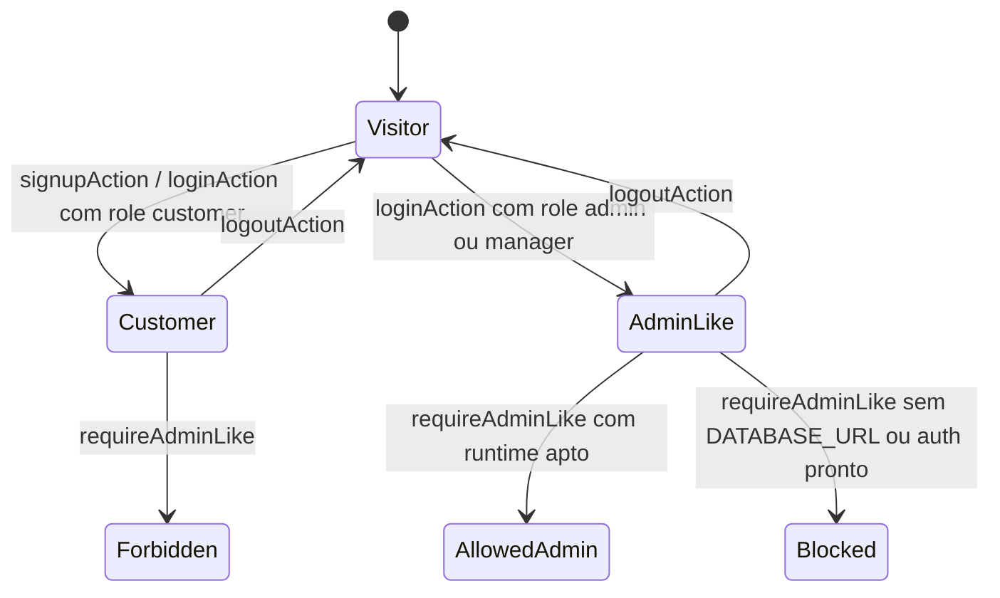

# Auth, Design Tecnico

> Spec executavel da unit `auth`. Foca no COMO a autenticacao e autorizacao sao construidas no sistema atual.

## Interface

### Endpoints HTTP

| Metodo | Caminho | Entrada | Saida | Status codes |
|--------|---------|---------|-------|--------------|
| `GET/POST` | `/api/auth/[...all]` | Requisicoes Better Auth, cookies e payloads do provider | Respostas Better Auth para sessao, login, cadastro e logout | Gerenciado pelo Better Auth |

### Server Actions e Funcoes

| Simbolo | Assinatura | Retorno | Observacao |
|---------|-----------|---------|------------|
| `loginAction` | `(_previousState: AuthActionState, formData: FormData)` | `Promise<AuthActionState>` ou redirect | Valida credenciais, chama `auth.api.signInEmail`, mescla carrinho guest e redireciona. |
| `signupAction` | `(_previousState: AuthActionState, formData: FormData)` | `Promise<AuthActionState>` ou redirect | Cria usuario customer por e-mail/senha e redireciona para `returnTo` ou `/minha-conta`. |
| `logoutAction` | `()` | redirect | Encerra sessao Better Auth e redireciona para `/login`. |
| `getCurrentSession` | `()` | `Promise<AppSession>` | Consulta Better Auth via headers da request com timeout de 5 segundos. |
| `normalizeRole` | `(value: unknown)` | `AuthRole \| null` | Aceita apenas `customer`, `admin` e `manager`. |
| `validateReturnTo` | `(value: FormDataEntryValue \| string \| null \| undefined)` | `string` | Normaliza destino interno seguro para redirects pos-auth. |
| `requireAuthenticated` | `(session = getCurrentSession())` | `Promise<PolicyDecision>` | Wrapper generico para sessao autenticada. |
| `requireCustomer` | `(session = getCurrentSession())` | `Promise<PolicyDecision>` | Autoriza qualquer usuario autenticado para area customer. |
| `requireAdminLike` | `(session = getCurrentSession())` | `Promise<PolicyDecision>` | Exige banco, auth pronto e papel `admin` ou `manager`. |
| `requireOwner` | `(resourceUserId: string, session = getCurrentSession())` | `Promise<PolicyDecision>` | Exige usuario autenticado dono do recurso. |
| `policyMessage` | `(decision: PolicyDecision)` | `string` | Mensagem segura para UI sem expor detalhe sensivel. |

### Tipos de Dados

```ts
type AuthRole = "customer" | "admin" | "manager";

type AppSession =
  | { status: "authenticated"; userId: string; email: string; role: AuthRole }
  | {
      status: "unauthenticated";
      reason: "missing" | "expired" | "invalid" | "timeout" | "unavailable";
    };

type PolicyDecision =
  | { status: "allowed"; userId: string; role: AuthRole }
  | { status: "unauthenticated"; reason: "missing" | "expired" | "invalid" | "timeout" | "unavailable" }
  | { status: "forbidden"; reason: "insufficient_role" | "not_owner" }
  | { status: "blocked"; reason: "missing_database" | "environment_guardrail" | "auth_not_ready" };
```

## Fluxo Principal

1. A configuracao Better Auth e montada em `src/features/auth/server/auth.ts`.
2. Quando `db` existe, o Better Auth usa `drizzleAdapter` com tabelas `users`, `sessions`, `accounts` e `verifications`.
3. O campo adicional `role` e registrado no modelo `users`, com tipos `customer`, `admin` e `manager`, e valor padrao `customer`.
4. As telas de login/cadastro chamam Server Actions em `src/features/auth/server/actions.ts`.
5. `loginAction` e `signupAction` validam entrada com Zod antes de chamar o provider.
6. `validateReturnTo` limpa destinos inseguros antes de qualquer redirect.
7. A leitura de sessao ocorre via `getCurrentSession`, usando `auth.api.getSession({ headers })`.
8. `getCurrentSession` aplica timeout de 5 segundos e converte erros em `AppSession` unauthenticated controlado.
9. Layouts protegidos chamam policies server-side antes de renderizar conteudo protegido.
10. `src/app/(customer)/layout.tsx` exige `requireCustomer` e redireciona falhas para `/login?returnTo=/minha-conta`.
11. `src/app/admin/layout.tsx` exige `requireAdminLike`; visitante vai para login e bloqueios de role/runtime mostram tela segura.

## Fluxos Alternativos

- **Auth real indisponivel:** `getRuntimeMode().isAuthReady` falso faz actions retornarem erro controlado e sessao resolver como `unavailable`.
- **Banco ausente no admin:** `requireAdminLike` retorna `blocked/missing_database` antes de consultar role.
- **Secret/auth ausente no admin:** `requireAdminLike` retorna `blocked/auth_not_ready`.
- **Sessao inexistente:** `getCurrentSession` retorna `unauthenticated/missing`.
- **Papel desconhecido:** `normalizeRole` retorna `null` e a sessao vira `unauthenticated/invalid`.
- **Timeout do provider:** `withTimeout` converte em `unauthenticated/timeout`.
- **Login com carrinho guest:** `loginAction` captura token guest antes do sign-in, resolve sessao nova, chama `mergeGuestCartIntoUser` e expira token guest.
- **Erro de login/cadastro:** actions retornam mensagem generica controlada, sem repassar erro bruto do provider.
- **Logout com falha:** `logoutAction` ainda redireciona para `/login`.

## Dependencias

- `better-auth`: provider central de autenticacao, endpoints e sessao.
- `better-auth/adapters/drizzle`: adaptador usado quando `db` esta disponivel.
- `next/headers`: fornece headers/cookies da request para o Better Auth server-side.
- `next/navigation`: redirect em Server Actions e layouts protegidos.
- `src/db/client.ts`: decide se ha Drizzle/Postgres real disponivel.
- `src/db/schema.ts`: tabelas auth e enum `user_role`.
- `src/lib/env.ts`: fornece `BETTER_AUTH_SECRET`, `BETTER_AUTH_URL` e `NEXT_PUBLIC_APP_URL`.
- `src/lib/runtime-mode.ts`: define disponibilidade de banco/auth e mensagens de guardrail.
- `src/features/cart/server/cart-session.ts`: resolve e expira token guest para merge pos-login.
- `src/features/cart/server/cart-service.ts`: executa merge de carrinho guest para usuario autenticado.

## Decisoes de Design Identificadas

| Decisao | Evidencia no codigo | Confianca |
|---------|---------------------|-----------|
| Better Auth e a fonte de sessao do App Router. | `src/features/auth/server/auth.ts`, `src/app/api/auth/[...all]/route.ts` | 🟢 |
| Role e campo persistido no usuario, nao inputavel no cadastro publico. | `src/features/auth/server/auth.ts`, `src/db/schema.ts` | 🟢 |
| Customer e o papel padrao para novos usuarios. | `src/features/auth/server/auth.ts`, `src/db/schema.ts` | 🟢 |
| Admin usa policy server-side no layout, antes das paginas internas. | `src/app/admin/layout.tsx` | 🟢 |
| Area customer usa route group protegido por layout. | `src/app/(customer)/layout.tsx` | 🟢 |
| Redirecionamento pos-auth e allowlist de path interno. | `src/features/auth/server/session.ts` | 🟢 |
| Falhas de auth viram mensagens seguras e estados tipados. | `src/features/auth/server/actions.ts`, `src/features/auth/server/policies.ts` | 🟢 |
| Admin-like depende de runtime com banco e auth prontos. | `src/features/auth/server/policies.ts`, `src/lib/runtime-mode.ts` | 🟢 |
| Carrinho guest e preservado no login via merge server-side. | `src/features/auth/server/actions.ts`, `src/features/cart/server/cart-service.ts` | 🟢 |

## Estado Interno

### Persistido

- `users`: usuario, e-mail, nome e `role`.
- `sessions`: sessao Better Auth.
- `accounts`: credenciais/contas do provider.
- `verifications`: tokens/codigos de verificacao do provider.

### Derivado em runtime

- `AppSession`: resultado normalizado de `auth.api.getSession`.
- `PolicyDecision`: decisao de acesso derivada de sessao, role, dono do recurso e runtime.
- `AuthActionState`: estado de erro/idle usado por formularios de login/cadastro.

### Transicoes relevantes



## Observabilidade

- Nao ha logger estruturado dedicado na unit `auth`.
- Falhas sao observaveis indiretamente por retorno de `AuthActionState`, `PolicyDecision` e telas de bloqueio.
- O design atual evita emitir detalhes brutos de excecoes Better Auth para UI.
- Testes unitarios e E2E cobrem actions, policies, sessao e bloqueio de areas protegidas.

## Riscos e Lacunas

- 🔴 Nao ha fluxo completo documentado de recuperacao de senha.
- 🔴 A area de cliente ainda nao implementa perfil e enderecos reais de forma completa.
- 🔴 Nao ha permissao granular alem de `customer`, `admin` e `manager`.
- 🟡 `BETTER_AUTH_SECRET` tem fallback de build/dev; producao precisa garantir secret real por ambiente.
- 🟡 Sem logger estruturado, diagnostico operacional de falhas auth depende de testes e sintomas de UI.
- 🟡 O merge do carrinho no login depende do token guest ainda estar disponivel e valido no momento do sign-in.
