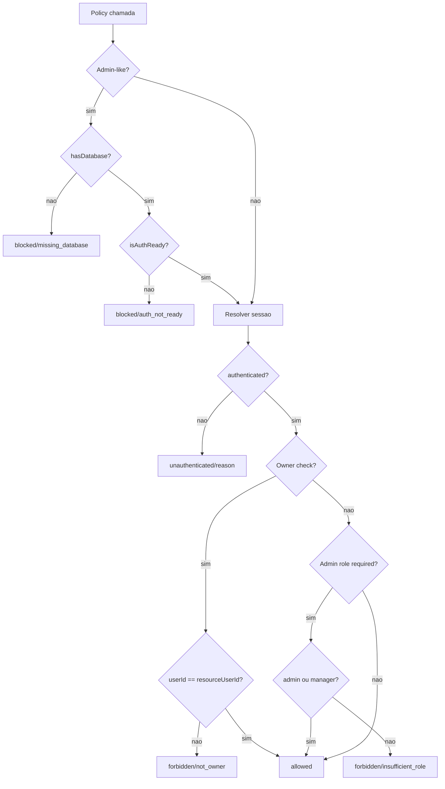

# Auth / Policies Admin, Customer e Owner, Design Tecnico

> Spec executavel da subunidade `auth/policies-admin-customer-owner`. Foca no COMO as decisoes de autorizacao sao construidas e consumidas.

## Interface

### Tipos

```ts
type PolicyDecision =
  | { status: "allowed"; userId: string; role: AuthRole }
  | { status: "unauthenticated"; reason: "missing" | "expired" | "invalid" | "timeout" | "unavailable" }
  | { status: "forbidden"; reason: "insufficient_role" | "not_owner" }
  | { status: "blocked"; reason: "missing_database" | "environment_guardrail" | "auth_not_ready" };
```

### Funcoes

| Simbolo | Assinatura | Retorno | Observacao |
|---------|-----------|---------|------------|
| `requireAuthenticated` | `(session = getCurrentSession())` | `Promise<PolicyDecision>` | Resolve a promise de sessao e delega para `requireAuthenticatedSession`. |
| `requireAuthenticatedSession` | `(session: AppSession)` | `PolicyDecision` | Mapeia sessao autenticada/nao autenticada para decisao tipada. |
| `requireCustomer` | `(session = getCurrentSession())` | `Promise<PolicyDecision>` | Exige apenas sessao autenticada. |
| `requireAdminLike` | `(session = getCurrentSession())` | `Promise<PolicyDecision>` | Exige banco, auth pronto e role `admin` ou `manager`. |
| `requireOwner` | `(resourceUserId: string, session = getCurrentSession())` | `Promise<PolicyDecision>` | Exige sessao autenticada com `userId` igual ao dono do recurso. |
| `policyMessage` | `(decision: PolicyDecision)` | `string` | Converte decisao em mensagem publica segura. |

### Consumidores Principais

| Consumidor | Policy | Comportamento |
|------------|--------|---------------|
| `src/app/admin/layout.tsx` | `requireAdminLike` | Redireciona visitante; renderiza bloqueio para runtime/role; libera children se allowed. |
| `src/app/(customer)/layout.tsx` | `requireCustomer` | Redireciona qualquer falha para login. |
| Admin product/coupon/shipping/upload/notification actions | `requireAdminLike` | Retorna resultado de erro com `policyMessage`. |
| Order/payment customer actions | `requireCustomer` | Bloqueia leitura/pagamento sem sessao autenticada. |

## Fluxo Principal: Sessao para Decisao

1. O consumidor chama uma policy com sessao implicita ou injetada.
2. A sessao implicita vem de `getCurrentSession`.
3. `requireAuthenticatedSession` verifica `session.status`.
4. Se `authenticated`, retorna `{ status: "allowed", userId, role }`.
5. Se `unauthenticated`, retorna `{ status: "unauthenticated", reason }`.
6. A policy especializada aplica regras extras sobre esse resultado base.

## Fluxo Principal: Customer

1. Layout/action customer chama `requireCustomer`.
2. `requireCustomer` resolve a sessao atual.
3. A decisao base e calculada por `requireAuthenticatedSession`.
4. Qualquer role autenticada e aceita.
5. Visitante, sessao invalida, timeout ou auth indisponivel recebem decisao `unauthenticated`.
6. `CustomerLayout` redireciona qualquer decisao diferente de `allowed` para `/login?returnTo=/minha-conta`.

## Fluxo Principal: Admin-Like

1. Layout/action admin chama `requireAdminLike`.
2. A policy le `getRuntimeMode`.
3. Se `mode.hasDatabase` for falso, retorna `blocked/missing_database`.
4. Se `mode.isAuthReady` for falso, retorna `blocked/auth_not_ready`.
5. Somente depois do runtime apto, resolve a sessao.
6. Sessao nao autenticada e devolvida como `unauthenticated`.
7. Sessao autenticada com role diferente de `admin` e `manager` retorna `forbidden/insufficient_role`.
8. Sessao autenticada com role `admin` ou `manager` retorna `allowed`.
9. `AdminLayout` redireciona somente `unauthenticated`; `blocked` e `forbidden` renderizam tela `Acesso bloqueado`.

## Fluxo Principal: Owner

1. Action ou service chama `requireOwner(resourceUserId)`.
2. A policy resolve sessao atual.
3. Se a sessao nao estiver autenticada, propaga decisao `unauthenticated`.
4. Se `authenticated.userId !== resourceUserId`, retorna `forbidden/not_owner`.
5. Se os ids forem iguais, retorna `allowed`.

## Fluxos Alternativos

- **Banco ausente no admin:** retorna `blocked/missing_database` sem consultar sessao ou role.
- **Auth ausente no admin:** retorna `blocked/auth_not_ready` sem autorizar papel administrativo.
- **Customer em admin:** retorna `forbidden/insufficient_role`.
- **Visitante em admin:** quando runtime esta apto, retorna `unauthenticated` e o layout redireciona para login.
- **Visitante em customer:** retorna `unauthenticated` e o layout redireciona para login.
- **Mensagem de bloqueio:** `policyMessage` converte `blocked`, `forbidden` e `unauthenticated` em textos controlados.

## Dependencias

- `src/features/auth/server/session.ts`: fornece `AppSession`, `AuthRole` e `getCurrentSession`.
- `src/lib/runtime-mode.ts`: fornece `getRuntimeMode`, `hasDatabase` e `isAuthReady`.
- `next/navigation`: usado pelos layouts consumidores para redirect.
- Actions de dominio: produtos, cupons, frete, pedidos, pagamentos, notificacoes e uploads.

## Decisoes de Design Identificadas

| Decisao | Evidencia no codigo | Confianca |
|---------|---------------------|-----------|
| Policies sao server-only. | `src/features/auth/server/policies.ts` | 🟢 |
| Admin verifica runtime antes de sessao/role. | `src/features/auth/server/policies.ts` | 🟢 |
| `requireCustomer` nao filtra por role, apenas por autenticacao. | `src/features/auth/server/policies.ts` | 🟢 |
| `requireOwner` e independente de role administrativa. | `src/features/auth/server/policies.ts` | 🟢 |
| Layout admin distingue redirect de visitante e tela bloqueada para runtime/role. | `src/app/admin/layout.tsx` | 🟢 |
| Layout customer usa redirect simples para qualquer falha. | `src/app/(customer)/layout.tsx` | 🟢 |
| Actions convertem policy em mensagens retornaveis, nao em excecoes. | `src/features/*/server/*actions.ts`, `src/features/uploads/product-image-upload.ts` | 🟢 |

## Estado Interno

Esta subunidade nao mantem estado proprio persistido. Ela calcula decisoes derivadas de:

- `AppSession`: estado autenticado/nao autenticado vindo da leitura de sessao.
- `RuntimeMode`: disponibilidade de banco, auth real e ambiente.
- `resourceUserId`: dono esperado de um recurso para `requireOwner`.



## Observabilidade

- Nao ha logs estruturados especificos nas policies.
- Resultado observavel e `PolicyDecision`, consumido por layouts, actions e testes.
- E2E de admin sem banco valida tela `Acesso bloqueado` e mensagem sobre `DATABASE_URL`.
- E2E de customer anonimo valida redirect para login.
- Teste unitario atual valida o mapeamento base de sessao autenticada e nao autenticada.

## Riscos e Lacunas

- 🔴 A permissao administrativa ainda e ampla: `admin` e `manager` acessam as mesmas superficies protegidas por `requireAdminLike`.
- 🟡 Branches de runtime e owner ainda merecem cobertura unit direta mais completa.
- 🟡 Actions precisam lembrar de chamar a policy correta; a policy nao intercepta chamadas por si so.
- 🟡 `environment_guardrail` esta no tipo, mas o branch pratico atual cobre principalmente `missing_database` e `auth_not_ready`.
