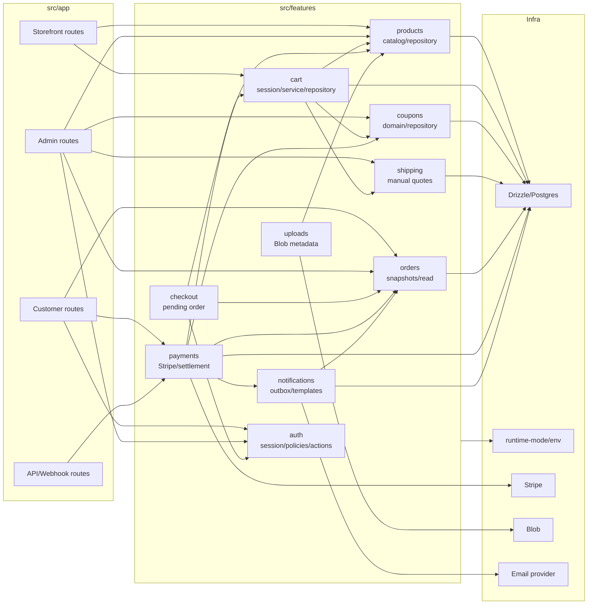

# C4 Components - Triade Essenza Next

```mermaid
flowchart LR
  subgraph app["src/app"]
    storefront["Storefront routes"]
    customerRoutes["Customer routes"]
    adminRoutes["Admin routes"]
    apiRoutes["API/Webhook routes"]
  end

  subgraph features["src/features"]
    auth["auth\nsession/policies/actions"]
    products["products\ncatalog/repository"]
    cart["cart\nsession/service/repository"]
    coupons["coupons\ndomain/repository"]
    shipping["shipping\nmanual quotes"]
    checkout["checkout\npending order"]
    orders["orders\nsnapshots/read"]
    payments["payments\nStripe/settlement"]
    notifications["notifications\noutbox/templates"]
    uploads["uploads\nBlob metadata"]
  end

  subgraph infra["Infra"]
    db["Drizzle/Postgres"]
    runtime["runtime-mode/env"]
    stripe["Stripe"]
    blob["Blob"]
    email["Email provider"]
  end

  storefront --> products
  storefront --> cart
  customerRoutes --> auth
  customerRoutes --> orders
  customerRoutes --> payments
  adminRoutes --> auth
  adminRoutes --> products
  adminRoutes --> coupons
  adminRoutes --> shipping
  adminRoutes --> orders
  apiRoutes --> payments

  cart --> products
  cart --> coupons
  cart --> shipping
  checkout --> auth
  checkout --> cart
  checkout --> orders
  payments --> orders
  payments --> products
  payments --> coupons
  payments --> notifications
  uploads --> products
  notifications --> orders

  features --> runtime
  products --> db
  cart --> db
  coupons --> db
  shipping --> db
  orders --> db
  payments --> db
  notifications --> db
  payments --> stripe
  uploads --> blob
  notifications --> email
```
