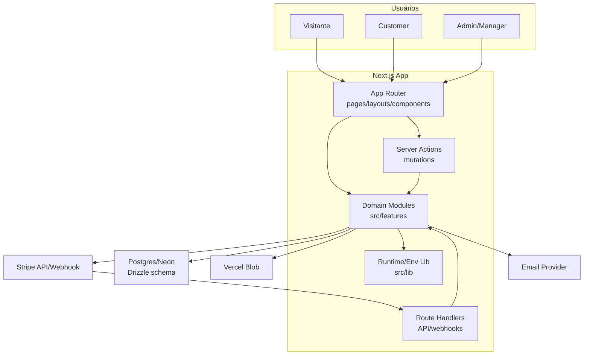

# C4 Containers - Triade Essenza Next

```mermaid
flowchart TB
  subgraph users["Usuários"]
    visitor["Visitante"]
    customer["Customer"]
    admin["Admin/Manager"]
  end

  subgraph next["Next.js App"]
    app["App Router\npages/layouts/components"]
    actions["Server Actions\nmutations"]
    handlers["Route Handlers\nAPI/webhooks"]
    features["Domain Modules\nsrc/features"]
    lib["Runtime/Env Lib\nsrc/lib"]
  end

  db["Postgres/Neon\nDrizzle schema"]
  blob["Vercel Blob"]
  stripe["Stripe API/Webhook"]
  email["Email Provider"]

  visitor --> app
  customer --> app
  admin --> app
  app --> actions
  app --> features
  actions --> features
  handlers --> features
  features --> lib
  features --> db
  features --> blob
  features --> stripe
  features --> email
  stripe --> handlers
```
