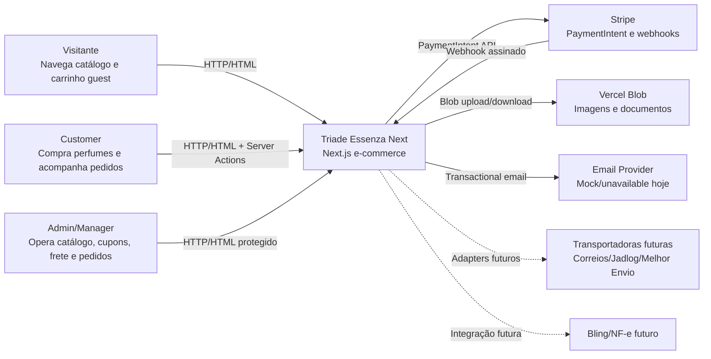

# C4 Context - Triade Essenza Next

```mermaid
flowchart LR
  customer["Customer\nCompra perfumes e acompanha pedidos"]
  visitor["Visitante\nNavega catálogo e carrinho guest"]
  admin["Admin/Manager\nOpera catálogo, cupons, frete e pedidos"]
  stripe["Stripe\nPaymentIntent e webhooks"]
  blob["Vercel Blob\nImagens e documentos"]
  email["Email Provider\nMock/unavailable hoje"]
  shipping["Transportadoras futuras\nCorreios/Jadlog/Melhor Envio"]
  bling["Bling/NF-e futuro"]

  system["Triade Essenza Next\nNext.js e-commerce"]

  visitor -->|"HTTP/HTML"| system
  customer -->|"HTTP/HTML + Server Actions"| system
  admin -->|"HTTP/HTML protegido"| system
  system -->|"PaymentIntent API"| stripe
  stripe -->|"Webhook assinado"| system
  system -->|"Blob upload/download"| blob
  system -->|"Transactional email"| email
  system -. "Adapters futuros" .-> shipping
  system -. "Integração futura" .-> bling
```
