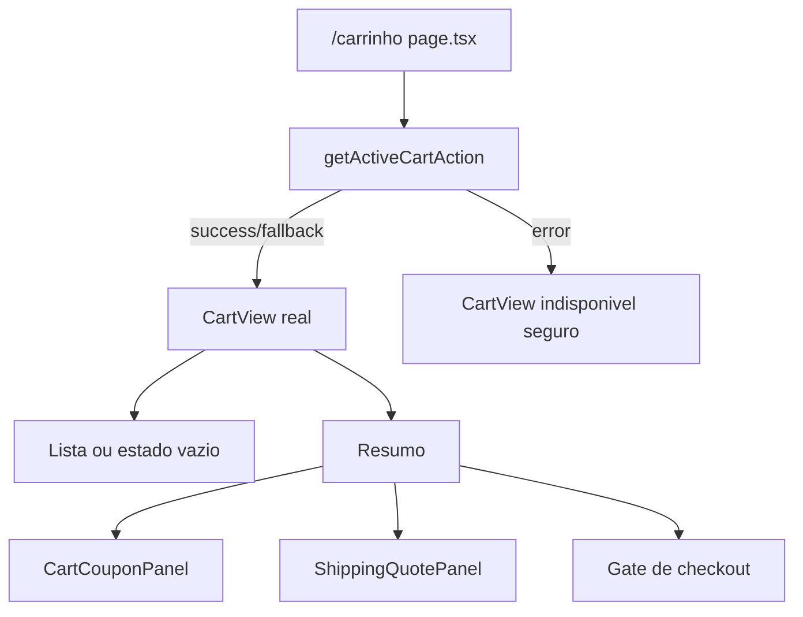

# Cart / Carrinho Publico, Design Tecnico

> Spec executavel da subunidade `cart/carrinho-publico`. Descreve COMO a rota `/carrinho` compoe dados server-side, UI de itens, cupom, frete e gate de checkout sem expor regras criticas ao cliente.

## 1. Interface

### 1.1 Rota

```txt
GET /carrinho
```

A rota e implementada por `src/app/(storefront)/carrinho/page.tsx` e renderiza uma pagina server-side do App Router.

### 1.2 Contrato da pagina

```ts
async function CarrinhoPage(): Promise<JSX.Element>
```

Responsabilidades:

- chamar `getActiveCartAction()`;
- transformar falha em `CartView` indisponivel seguro;
- renderizar heading "Carrinho";
- entregar o modelo final para `CartView`.

### 1.3 Contrato do componente principal

```ts
type CartViewProps = {
  cart: CartViewModel;
};

function CartView({ cart }: CartViewProps): JSX.Element
```

Responsabilidades:

- renderizar mensagens;
- renderizar estado vazio ou lista de itens;
- renderizar resumo financeiro;
- compor `CartCouponPanel`;
- compor `ShippingQuotePanel`;
- decidir CTA de checkout.

### 1.4 Actions utilizadas

- `getActiveCartAction()`
- `updateCartItemQuantityFormAction(formData)`
- `removeCartItemFormAction(formData)`
- `clearCartFormAction()`
- `applyCouponStateAction(previousState, formData)`
- `removeCouponStateAction(previousState)`
- `quoteShippingStateAction(previousState, formData)`
- `selectShippingOptionStateAction(previousState, formData)`
- `removeShippingSelectionStateAction(previousState, formData)`

## 2. Composicao da Pagina



## 3. Fluxo Principal: Renderizacao Server-Side

1. `CarrinhoPage` executa no servidor.
2. A pagina chama `getActiveCartAction()`.
3. Se o resultado for `success` ou `fallback`, usa `result.cart`.
4. Se o resultado for erro:
   - cria objeto de carrinho com `id: null`;
   - status `active`;
   - owner guest;
   - totais zerados;
   - persistencia `unavailable`;
   - `messages: [result.message]`.
5. A pagina renderiza:
   - `<main className="page-shell">`;
   - intro com "Sessao de compra" e `h1` "Carrinho";
   - `<CartView cart={cart} />`.

## 4. Fluxo Principal: Estado Vazio

1. `CartView` verifica `cart.items.length === 0`.
2. Se vazio, renderiza painel com:
   - "Carrinho vazio";
   - `h2` "Nenhum item adicionado";
   - explicacao curta;
   - link primario para `/produtos`.
3. O resumo continua visivel com totais zerados.
4. O CTA de checkout fica desabilitado como "Selecione itens e frete".

## 5. Fluxo Principal: Lista de Itens

1. Para cada item em `cart.items`, renderizar `article.cart-item`.
2. Exibir:
   - `productNameSnapshot`;
   - `unitPriceSnapshotCents` formatado;
   - `itemSubtotalCents` formatado.
3. Renderizar formulario de quantidade:
   - hidden `itemId`;
   - input `quantity` numerico com `min=1`;
   - botao "Atualizar".
4. Renderizar formulario de remocao:
   - hidden `itemId`;
   - botao com `aria-label="Remover {nome}"`.
5. As mutacoes chamam server actions e revalidam `/carrinho`.

## 6. Fluxo Principal: Resumo Financeiro

O resumo e renderizado em `aside.cart-summary` com `aria-label="Resumo do carrinho"`.

Campos:

- `subtotalCents`;
- `discountCents`;
- `partialTotalCents`;
- `shippingAmountCents`;
- `partialTotalWithShippingCents`.

Todos os valores monetarios passam por `formatMoney`.

## 7. Fluxo Principal: Cupom

1. `CartView` passa `cart.coupon` para `CartCouponPanel`.
2. Se existe cupom:
   - renderiza codigo;
   - renderiza `valueLabel`;
   - disponibiliza botao "Remover".
3. Se nao existe cupom:
   - renderiza campo `code`;
   - placeholder `DEV10`;
   - botao "Aplicar".
4. `useActionState` envia para action correspondente.
5. Em sucesso, `router.refresh()` atualiza a pagina.
6. Mensagem de sucesso/erro aparece com `role="status"`.

## 8. Fluxo Principal: Frete

1. `CartView` passa para `ShippingQuotePanel`:
   - `cart.id`;
   - `cartHash` calculado como `productId:quantity` unido por `|`;
   - `cart.shippingPostalCode`;
   - `cart.shippingQuote`.
2. O painel renderiza formulario de CEP.
3. Ao cotar:
   - action valida CEP;
   - service calcula cotacao;
   - UI mostra "Cotacao de frete calculada." em sucesso.
4. Se existem opcoes:
   - renderiza label;
   - prazo estimado;
   - preco;
   - botao "Selecionar".
5. O painel permite "Remover frete".
6. Em sucesso de cotacao, selecao ou remocao, `router.refresh()` atualiza a pagina.

## 9. Fluxo Principal: Gate de Checkout

```ts
if (cart.items.length === 0 || !cart.shippingQuoteId) {
  disabled("Selecione itens e frete")
} else if (cart.owner.kind === "guest") {
  link("/login?returnTo=/checkout", "Entrar para checkout")
} else {
  link("/checkout", "Iniciar checkout")
}
```

Regras:

- carrinho vazio nao inicia checkout;
- carrinho sem frete nao inicia checkout;
- visitante precisa autenticar antes do checkout;
- usuario autenticado pode seguir para checkout;
- a pagina nao inicia pagamento diretamente.

## 10. Estados de UI

### 10.1 Loading

Nao ha loading explicito na pagina server-side. Nos paineis cliente, botoes usam `disabled` enquanto `useActionState` esta pendente.

### 10.2 Vazio

Estado vazio e renderizado no painel principal, mantendo resumo visivel.

### 10.3 Erro seguro

Erros de action viram mensagens no carrinho indisponivel ou mensagens de formulario. A UI nao renderiza stack trace, DSN, secrets ou payload tecnico.

### 10.4 Fallback

Fallback sem banco e refletido por mensagens do service e coberto por E2E que espera texto `dev/fixture`.

## 11. Acessibilidade

- Pagina possui `h1` "Carrinho".
- Resumo usa `aria-label="Resumo do carrinho"`.
- Secao de carrinho usa `aria-label="Carrinho"`.
- Painel de frete usa `aria-label="Frete"`.
- Mensagens usam `role="status"`.
- Remocao de item usa `aria-label` com nome do produto.
- Campos de quantidade, cupom e CEP possuem `label`.

## 12. Dependencias

- `src/app/(storefront)/carrinho/page.tsx`
- `src/features/cart/components/cart-view.tsx`
- `src/features/cart/components/cart-coupon-panel.tsx`
- `src/features/shipping/components/shipping-quote-panel.tsx`
- `src/features/cart/server/cart-actions.ts`
- `src/features/cart/types.ts`
- `src/lib/money.ts`
- `next/link`
- `next/navigation`

## 13. Decisoes de Design

- A pagina e server-side para buscar o carrinho antes da renderizacao.
- Mutacoes de item usam formularios server action sem estado cliente complexo.
- Cupom e frete usam componentes cliente porque dependem de feedback interativo e `router.refresh()`.
- Resumo continua visivel mesmo em carrinho vazio para manter a estrutura da compra estavel.
- Checkout e um gate de navegacao, nao uma action de pagamento.
- Falha de carregamento do carrinho e transformada em view segura, mantendo a pagina carregavel.

## 14. Rastreabilidade RF -> Implementacao

| RF | Implementacao |
|----|---------------|
| RF-CART-PUB-01 | `CarrinhoPage`, `CartView` |
| RF-CART-PUB-02 | `getActiveCartAction` em `page.tsx` |
| RF-CART-PUB-03 | fallback inline em `page.tsx` |
| RF-CART-PUB-04 | branch vazia em `CartView` |
| RF-CART-PUB-05 | bloco `form-message` com `role=status` |
| RF-CART-PUB-06 | map de `cart.items` |
| RF-CART-PUB-07 | `updateCartItemQuantityFormAction` |
| RF-CART-PUB-08 | `removeCartItemFormAction` |
| RF-CART-PUB-09 | `clearCartFormAction` |
| RF-CART-PUB-10 | `cart-summary` |
| RF-CART-PUB-11 | `CartCouponPanel` |
| RF-CART-PUB-12 | `ShippingQuotePanel` |
| RF-CART-PUB-13 | `selectShippingOptionStateAction`, `removeShippingSelectionStateAction` |
| RF-CART-PUB-14 | CTA disabled |
| RF-CART-PUB-15 | link `/login?returnTo=/checkout` |
| RF-CART-PUB-16 | link `/checkout` |
| RF-CART-PUB-17 | `cart.spec.ts` fallback |

## 15. Riscos e Lacunas

- A frase de apoio do checkout pode estar defasada em relacao ao fluxo com Stripe implementado em fases posteriores.
- O item do carrinho nao renderiza imagem, mesmo que outras superficies do catalogo exibam imagens.
- O input de quantidade nao recebe `max` baseado em estoque; o servidor ainda e a fonte de verdade.
- `cartHash` e calculado na UI a partir de produto e quantidade; qualquer evolucao de regra de frete deve manter esse contrato alinhado ao service.
- A pagina depende de refresh apos actions cliente; falhas de rede podem deixar feedback visual temporariamente defasado.
