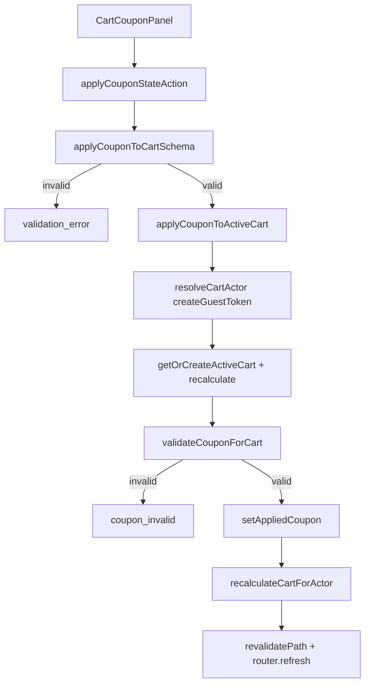

# Cart / Cupom e Frete no Carrinho, Design Tecnico

> Spec executavel da subunidade `cart/cupom-frete-carrinho`. Descreve COMO cupom e frete entram no carrinho por UI cliente, server actions, service, repositories e recalculo centralizado.

## 1. Interface

### 1.1 Componentes

```ts
function CartCouponPanel(props: { coupon: CouponView | null }): JSX.Element

function ShippingQuotePanel(props: {
  quote?: ShippingQuote | null;
  cartId: string | null;
  cartHash: string;
  destinationPostalCode?: string | null;
}): JSX.Element
```

### 1.2 Actions de cupom

```ts
async function applyCouponAction(formData: FormData): Promise<CartActionResult>
async function applyCouponStateAction(
  previousState: CartCouponActionState,
  formData: FormData
): Promise<CartCouponActionState>

async function removeCouponAction(): Promise<CartActionResult>
async function removeCouponStateAction(
  previousState: CartCouponActionState
): Promise<CartCouponActionState>
```

### 1.3 Actions de frete

```ts
async function quoteShippingAction(formData: FormData): Promise<CartActionResult>
async function quoteShippingStateAction(
  previousState: CartShippingActionState,
  formData: FormData
): Promise<CartShippingActionState>

async function selectShippingOptionAction(formData: FormData): Promise<CartActionResult>
async function selectShippingOptionStateAction(
  previousState: CartShippingActionState,
  formData: FormData
): Promise<CartShippingActionState>

async function removeShippingSelectionAction(formData: FormData): Promise<CartActionResult>
async function removeShippingSelectionStateAction(
  previousState: CartShippingActionState,
  formData: FormData
): Promise<CartShippingActionState>
```

### 1.4 Services

```ts
async function applyCouponToActiveCart(code: string): Promise<CartActionResult>
async function removeCouponFromActiveCart(): Promise<CartActionResult>
async function quoteShippingForActiveCart(input: { postalCode: string }): Promise<CartActionResult>
async function selectShippingOptionForActiveCart(input: { quoteId: string; optionId: string }): Promise<CartActionResult>
async function removeShippingSelectionFromActiveCart(): Promise<CartActionResult>
async function recalculateCartView(cart: CartView): Promise<CartView>
```

## 2. Fluxo Principal: Aplicar Cupom

1. UI renderiza `CartCouponPanel` sem cupom.
2. Usuario informa `code`.
3. `applyCouponStateAction` chama `applyCouponAction`.
4. `applyCouponAction` valida FormData com `applyCouponToCartSchema`.
5. Se schema falha, retorna `validation_error` com "Codigo de cupom invalido.".
6. Se schema passa, action chama `applyCouponToActiveCart(code)`.
7. Service resolve ator com `createGuestToken: true`.
8. Se ator e `unavailable`, retorna mensagem segura.
9. Service obtem ou cria carrinho ativo.
10. Recalcula carrinho para obter subtotal atual.
11. Chama `validateCouponForCart({ code, subtotalCents })`.
12. Se cupom invalido:
    - retorna `coupon_invalid`;
    - inclui mensagem de validacao;
    - preserva carrinho recalculado.
13. Se cupom valido:
    - persiste `validation.coupon.id` no carrinho;
    - recalcula carrinho;
    - retorna `CartActionResult`.
14. Action revalida `/carrinho` e `/produtos`.
15. State action converte sucesso/fallback em mensagem "Cupom aplicado ao carrinho.".
16. Componente chama `router.refresh()` quando status e `success`.



## 3. Fluxo Principal: Remover Cupom

1. UI renderiza cupom aplicado com codigo e `valueLabel`.
2. Usuario clica "Remover".
3. `removeCouponStateAction` chama `removeCouponAction`.
4. Service resolve ator sem criar token.
5. Se ator indisponivel, retorna erro seguro.
6. Repositorio executa `clearAppliedCoupon(actor)`.
7. Carrinho e recalculado.
8. Action revalida `/carrinho` e `/produtos`.
9. State action retorna "Cupom removido do carrinho." em sucesso/fallback.
10. Componente executa `router.refresh()`.

## 4. Fluxo Principal: Cotar Frete

1. `ShippingQuotePanel` renderiza campo `postalCode`.
2. Formulario envia `cartId`, `cartHash` e `postalCode`.
3. `quoteShippingStateAction` chama `quoteShippingAction`.
4. `quoteShippingAction` valida FormData com `quoteShippingSchema`.
5. Se schema falha, retorna `validation_error` com "CEP invalido.".
6. Service resolve ator com `createGuestToken: true`.
7. Obtem ou cria carrinho ativo.
8. Valida CEP com `validatePostalCode`.
9. Lista regras manuais via `shippingRepository.listManualRules()`.
10. Se ha regras manuais, usa regras persistidas.
11. Se nao ha regras manuais, usa `devShippingRules`.
12. Gera opcoes com `buildManualShippingOptions`.
13. Se nao ha opcoes, retorna erro "Nao ha cobertura manual para este CEP.".
14. Cria quote com:
    - `cartId`;
    - `cartHash` gerado no service;
    - `postalCode`;
    - `options`;
    - `source: "fixture" | "manual"`.
15. Persiste quote no repository de frete.
16. Seleciona primeira opcao.
17. Grava selecao de frete no carrinho.
18. Recalcula carrinho.
19. State action retorna "Cotacao de frete calculada." em sucesso/fallback.
20. UI executa `router.refresh()`.

## 5. Fluxo Principal: Selecionar Opcao de Frete

1. UI lista opcoes de `quote.options`.
2. Usuario clica "Selecionar".
3. Formulario envia `quoteId`, `optionId` e `postalCode`.
4. Action valida com `selectShippingOptionSchema`.
5. Service resolve ator.
6. Carrega carrinho ativo.
7. Busca quote por id.
8. Se quote nao existe, retorna `validation_error`.
9. Se `cart.id === null` ou `quote.cartId !== cart.id`, retorna `forbidden`.
10. Chama `selectShippingQuoteOption(input)`.
11. Se selecao falha, retorna `validation_error`.
12. Resolve opcao selecionada ou primeira opcao.
13. Grava selecao no carrinho.
14. Recalcula carrinho.
15. State action retorna "Frete selecionado.".
16. UI executa `router.refresh()`.

## 6. Fluxo Principal: Remover Frete

1. UI mostra botao "Remover frete" quando ha opcoes.
2. Formulario envia `quoteId`.
3. Action valida formato minimo com schema parcial de `quoteId`.
4. Service resolve ator.
5. Se ator indisponivel, retorna erro seguro.
6. Repositorio executa `clearShippingSelection(actor)`.
7. Carrinho e recalculado.
8. State action retorna "Frete removido.".
9. UI executa `router.refresh()`.

## 7. Recalculo de Cupom e Frete

`recalculateCartView` centraliza os totais:

1. Revalida itens e estoque.
2. Calcula `subtotalCents`.
3. Busca cupom por `appliedCouponId`.
4. Calcula desconto com `calculateCouponDiscountCents`.
5. Le `shippingAmountCents`.
6. Detecta `freeShipping` quando:

```ts
coupon?.type === "free_shipping" && shippingAmountCents > 0
```

7. Define `effectiveShippingAmountCents` como `0` quando frete gratis se aplica.
8. Calcula `partialTotalCents = subtotalCents - discountCents`.
9. Chama `calculateAppliedCoupon` para gerar `coupon`, `discountCents` e mensagens finais.
10. Retorna:
    - `coupon`;
    - `discountCents`;
    - `shippingAmountCents` efetivo;
    - `partialTotalCents`;
    - `partialTotalWithShippingCents`;
    - mensagens de cupom/frete gratis.
11. `recalculateCartForActor` remove cupom aplicado se o recalculo resultar em `coupon === null`.

## 8. Estados de UI

### 8.1 Cupom sem codigo aplicado

- Campo `code`.
- Placeholder `DEV10`.
- Botao "Aplicar".
- Botao desabilitado durante `applyPending`.

### 8.2 Cupom aplicado

- Codigo do cupom.
- Label de valor.
- Botao "Remover".
- Botao desabilitado durante `removePending`.

### 8.3 Frete sem cotacao

- Campo `postalCode`.
- Botao "Cotar".
- Texto "Cotacao ainda nao realizada.".

### 8.4 Frete com opcoes

- Lista de opcoes com label, prazo, preco e botao selecionar.
- Botao "Remover frete".
- Mensagem de sucesso/erro com `role="status"`.

## 9. Revalidacao

Todas as actions de cupom/frete chamam `revalidateCartPaths()`, que revalida:

- `/carrinho`;
- `/produtos`.

Os componentes cliente tambem chamam `router.refresh()` apos sucesso para atualizar o resumo renderizado no servidor.

## 10. Seguranca e Integridade

- Codigo de cupom passa por schema e service de cupom.
- CEP passa por schema e dominio de frete.
- Quote de frete precisa existir.
- Quote de frete precisa pertencer ao carrinho atual.
- Cliente nao decide desconto, frete efetivo ou total final.
- Frete gratis nao altera a quote original; altera apenas o valor efetivo no carrinho recalculado.
- Mudancas de item devem limpar frete selecionado para evitar quote stale.

## 11. Dependencias

- `src/features/cart/components/cart-coupon-panel.tsx`
- `src/features/shipping/components/shipping-quote-panel.tsx`
- `src/features/cart/server/cart-actions.ts`
- `src/features/cart/server/cart-service.ts`
- `src/features/cart/schemas.ts`
- `src/features/coupons/server/coupon-service.ts`
- `src/features/coupons/domain.ts`
- `src/features/shipping/domain`
- `src/features/shipping/server/shipping-repository.ts`
- `src/features/shipping/server/shipping-service.ts`
- `src/features/shipping/server/shipping-fixtures.ts`
- `src/lib/money.ts`
- `next/navigation`
- `next/cache`

## 12. Rastreabilidade RF -> Implementacao

| RF | Implementacao |
|----|---------------|
| RF-CART-COUPON-01 | `CartCouponPanel` branch sem cupom |
| RF-CART-COUPON-02 | `applyCouponAction`, `applyCouponToActiveCart` |
| RF-CART-COUPON-03 | `validateCouponForCart` + retorno `coupon_invalid` |
| RF-CART-COUPON-04 | `CartCouponPanel` branch com cupom |
| RF-CART-COUPON-05 | `removeCouponAction`, `removeCouponFromActiveCart` |
| RF-CART-COUPON-06 | `recalculateCartForActor` |
| RF-CART-COUPON-07 | `recalculateCartView` free shipping |
| RF-CART-COUPON-08 | `router.refresh()` em `CartCouponPanel` |
| RF-CART-SHIP-01 | `ShippingQuotePanel` formulario CEP |
| RF-CART-SHIP-02 | `quoteShippingAction`, `quoteShippingForActiveCart` |
| RF-CART-SHIP-03 | `quoteShippingSchema`, `validatePostalCode` |
| RF-CART-SHIP-04 | `listManualRules` ou `devShippingRules` |
| RF-CART-SHIP-05 | branch sem opcoes de frete |
| RF-CART-SHIP-06 | map de `quote.options` |
| RF-CART-SHIP-07 | `selectShippingOptionAction`, `selectShippingOptionForActiveCart` |
| RF-CART-SHIP-08 | branch quote nao encontrada |
| RF-CART-SHIP-09 | validacao `quote.cartId !== cart.id` |
| RF-CART-SHIP-10 | `removeShippingSelectionAction`, `clearShippingSelection` |
| RF-CART-SHIP-11 | `router.refresh()` em `ShippingQuotePanel` |
| RF-CART-SHIP-12 | texto "Cotacao ainda nao realizada." |

## 13. Riscos e Lacunas

- `cartHash` enviado pelo componente e o hash criado no service nao tem exatamente a mesma composicao; se virar validacao forte, precisa padronizar.
- Frete externo real ainda nao entra aqui; o fluxo e manual/fixture.
- A quote original permanece com preco mesmo quando frete gratis zera o valor efetivo.
- Remocao de cupom/frete depende de refresh para refletir totalmente no resumo server-rendered.
- A consistencia contra quote stale depende de limpeza de frete em mutacoes de item no repositorio do carrinho.
