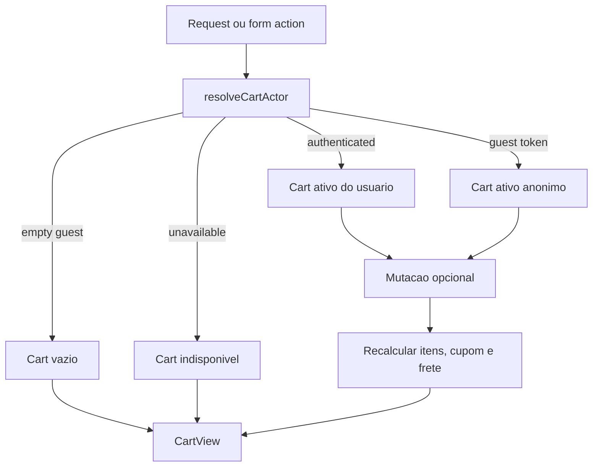

# Cart, Design Tecnico

> Spec executavel da unit `cart`. Este documento descreve o COMO da implementacao observada no Next.js atual, preservando contratos publicos, fallback de desenvolvimento e limites de negocio ja codificados.

## 1. Interface

### 1.1 Tipos centrais

```ts
type CartStatus = "active" | "converted" | "abandoned";
type CartPersistence = "database" | "dev_fallback" | "unavailable";

type CartActor =
  | { kind: "authenticated"; userId: string; guestCartToken?: string | null; persistence: CartPersistence }
  | { kind: "guest"; guestCartToken: string; persistence: CartPersistence }
  | { kind: "empty_guest"; persistence: CartPersistence }
  | { kind: "unavailable"; persistence: "unavailable"; reason: string };

type CartItem = {
  id: string;
  productId: string;
  name: string;
  slug: string;
  quantity: number;
  unitPriceCents: number;
  subtotalCents: number;
  stockQuantity: number;
  imageUrl: string | null;
  available: boolean;
  message?: string;
};

type CartView = {
  id: string | null;
  status: CartStatus | "unavailable";
  items: CartItem[];
  subtotalCents: number;
  discountCents: number;
  shippingCents: number;
  totalCents: number;
  couponCode: string | null;
  shippingSelection: CartShippingSelection | null;
  persistence: CartPersistence;
  messages: string[];
};
```

### 1.2 Funcoes de dominio

- `calculateItemSubtotalCents(item)` multiplica preco unitario por quantidade.
- `calculateCartSubtotalCents(items)` soma subtotais validos.
- `validateQuantityForStock(quantity, stockQuantity)` rejeita quantidade menor que 1 e quantidade acima do estoque disponivel.
- `validatePurchasableProduct(product)` aceita somente produto publicado, ativo, nao futuro e com estoque positivo.
- `createUnavailableCartView(reason)` cria uma visao segura quando o carrinho nao pode ser carregado.

### 1.3 Services publicos do carrinho

- `getActiveCart()` resolve o ator atual e retorna a visao ativa do carrinho.
- `addItemToCart({ productId, quantity })` cria ou reutiliza carrinho ativo e adiciona item validado.
- `updateCartItemQuantity({ itemId, quantity })` altera quantidade, respeitando estoque atual.
- `removeCartItem({ itemId })` remove item do carrinho ativo.
- `clearActiveCart()` remove todos os itens do carrinho ativo.
- `applyCouponToActiveCart({ code })` valida cupom contra subtotal atual e aplica.
- `removeCouponFromActiveCart()` limpa cupom aplicado.
- `quoteShippingForActiveCart({ postalCode })` calcula opcoes de frete para o carrinho atual.
- `selectShippingOptionForActiveCart({ quoteId, optionId })` seleciona uma opcao de frete previamente cotada.
- `removeShippingSelectionFromActiveCart()` remove selecao de frete.
- `mergeGuestCartIntoUser()` migra itens anonimos para o carrinho autenticado.

### 1.4 Server actions

As actions ficam em `src/features/cart/server/cart-actions.ts` e fazem a ponte entre formularios/UI e services:

- Actions diretas retornam `CartActionResult`.
- Form actions fazem parse com Zod e retornam estado serializavel para componentes cliente.
- Mutacoes revalidam principalmente `/carrinho` e, quando aplicavel, `/produtos`.

### 1.5 Componentes de UI

- `src/app/(storefront)/carrinho/page.tsx` carrega o carrinho no servidor.
- `CartView` renderiza itens, resumo, mensagens, estado vazio e caminho para checkout.
- `CartCouponPanel` aplica/remove cupom via action.
- `ShippingQuotePanel` cota e seleciona frete.
- `AddToCartForm` adiciona produto a partir de listagem ou detalhe.

## 2. Fluxo Principal: Resolver Ator

1. Ler o modo de runtime com `getRuntimeMode()`.
2. Ler cookie `triade_cart`.
3. Obter sessao atual com `getCurrentSession()`.
4. Se o ambiente estiver inseguro para banco real ou sem acesso a banco em producao/preview, retornar ator `unavailable`.
5. Se houver usuario autenticado, retornar ator `authenticated`, preservando token anonimo se existir.
6. Se houver cookie anonimo, retornar ator `guest`.
7. Se uma mutacao precisa criar carrinho e nao ha cookie, gerar token anonimo e gravar cookie.
8. Em `dev/test` sem `DATABASE_URL`, retornar ator `guest` com persistencia `dev_fallback`.
9. Caso contrario, retornar `empty_guest`.

## 3. Fluxo Principal: Adicionar Item

1. Resolver ator com permissao de criar token anonimo.
2. Se ator for `unavailable`, retornar erro seguro.
3. Buscar produto por id no repositorio de produtos.
4. Validar se o produto e compravel:
   - publicado;
   - ativo;
   - `publishedAt <= now`;
   - estoque maior que zero.
5. Buscar ou criar carrinho ativo para o ator.
6. Obter quantidade ja existente do mesmo produto.
7. Validar `quantidade atual + quantidade solicitada` contra estoque.
8. Inserir ou incrementar item, armazenando snapshot de nome, slug, preco e imagem.
9. Recalcular carrinho.
10. Retornar `CartActionResult` com mensagens e `CartView`.

## 4. Fluxo Principal: Atualizar, Remover e Limpar

### Atualizar quantidade

1. Resolver ator atual.
2. Carregar carrinho ativo.
3. Encontrar item pelo id.
4. Buscar produto atual para validar disponibilidade e estoque.
5. Validar nova quantidade.
6. Atualizar item no repositorio.
7. Limpar selecao de frete, pois o hash do carrinho muda.
8. Recalcular totais.

### Remover item

1. Resolver ator atual.
2. Carregar carrinho ativo.
3. Remover item pelo id.
4. Limpar selecao de frete.
5. Recalcular totais.

### Limpar carrinho

1. Resolver ator atual.
2. Carregar carrinho ativo.
3. Remover todos os itens.
4. Limpar selecao de frete.
5. Recalcular totais.

## 5. Fluxo Principal: Recalculo do Carrinho

1. Carregar itens persistidos.
2. Para cada item, buscar produto atual.
3. Se produto nao existir ou nao for compravel, manter item marcado como indisponivel e emitir mensagem.
4. Se quantidade excede estoque atual, limitar ao estoque disponivel e emitir mensagem.
5. Calcular subtotal por item.
6. Calcular subtotal do carrinho.
7. Se houver cupom:
   - buscar cupom;
   - validar contra subtotal e regras ativas;
   - calcular desconto;
   - se invalido, retornar mensagem e desconto zero.
8. Se houver selecao de frete valida, somar frete.
9. Se cupom concede frete gratis, zerar frete elegivel.
10. Calcular total final.
11. Retornar `CartView` normalizado.

## 6. Fluxo Principal: Cupom

### Aplicar cupom

1. Resolver ator com possibilidade de criar token anonimo.
2. Obter ou criar carrinho ativo.
3. Recalcular subtotal atual.
4. Validar codigo de cupom com service de cupons.
5. Persistir cupom normalizado no carrinho.
6. Recalcular carrinho.
7. Retornar mensagem de sucesso ou erro amigavel.

### Remover cupom

1. Resolver ator atual.
2. Carregar carrinho ativo.
3. Limpar codigo de cupom.
4. Recalcular carrinho.

## 7. Fluxo Principal: Frete

### Cotar frete

1. Resolver ator atual.
2. Validar CEP com schema.
3. Carregar carrinho ativo.
4. Recalcular itens compraveis.
5. Gerar hash do carrinho para amarrar cotacao aos itens/quantidades.
6. Calcular opcoes via regras manuais ou fixture de desenvolvimento.
7. Persistir cotacao.
8. Selecionar opcao padrao quando aplicavel.
9. Recalcular carrinho com frete selecionado.

### Selecionar opcao

1. Resolver ator atual.
2. Carregar carrinho ativo.
3. Buscar cotacao por id.
4. Verificar se a cotacao pertence ao carrinho atual.
5. Selecionar opcao solicitada.
6. Persistir selecao e recalcular.

### Remover selecao

1. Resolver ator atual.
2. Limpar selecao de frete do carrinho.
3. Recalcular totais.

## 8. Fluxo Principal: Merge de Carrinho Anonimo

1. Ler token anonimo do cookie.
2. Se nao houver token, retornar carrinho autenticado ativo.
3. Criar ator anonimo e ator autenticado.
4. Carregar carrinho anonimo ativo.
5. Se carrinho anonimo estiver vazio, garantir carrinho autenticado e retornar.
6. Para cada item anonimo:
   - buscar produto atual;
   - validar se ainda e compravel;
   - calcular quantidade existente no carrinho autenticado;
   - limitar migracao ao estoque restante;
   - registrar avisos quando algo for ignorado ou reduzido.
7. Inserir itens validos no carrinho autenticado.
8. Marcar carrinho anonimo como `converted`.
9. Transferir cupom somente se o carrinho autenticado ainda nao tiver cupom.
10. Recalcular carrinho autenticado e retornar avisos.

## 9. Persistencia

### 9.1 Repositorio Drizzle

O repositorio persistente usa tabelas de carrinho, itens, cotacoes e selecoes de frete. Ele deve:

- buscar carrinho ativo por usuario autenticado ou token anonimo;
- criar carrinho ativo quando necessario;
- incrementar item existente ou inserir novo item;
- atualizar quantidade;
- remover item;
- limpar itens;
- gravar/remover cupom;
- gravar/remover selecao de frete;
- marcar carrinho anonimo como convertido;
- limpar frete em alteracoes que invalidam a cotacao.

### 9.2 Fallback de desenvolvimento

Sem `DATABASE_URL` em `dev/test`, o sistema usa armazenamento em memoria:

- carrinhos em `Map` global;
- ids previsiveis por ambiente;
- persistencia marcada como `dev_fallback`;
- cotacoes baseadas em fixtures seguras;
- ausencia total de conexao com banco real.

Este fallback existe para desenvolvimento e testes. Ele nao deve ser usado como persistencia de producao.

## 10. UI e Navegacao

### 10.1 Pagina `/carrinho`

1. Chama `getActiveCartAction()` no servidor.
2. Se a action falhar, renderiza `createUnavailableCartView()` com mensagem segura.
3. Renderiza `CartView` com:
   - estado vazio;
   - lista de itens;
   - atualizacao/remocao;
   - painel de cupom;
   - painel de frete;
   - resumo de pedido;
   - CTA de checkout apenas quando ha itens compraveis.

### 10.2 Add to cart

1. `AddToCartForm` recebe produto e estoque disponivel.
2. Formulario limita quantidade minima e maxima no cliente.
3. Action valida novamente no servidor.
4. Sucesso revalida carrinho e superficies publicas afetadas.

## 11. Fluxos Alternativos

- Ator indisponivel: retorna erro seguro sem stack trace ou segredo.
- Schema invalido: retorna mensagem de validacao amigavel.
- Produto indisponivel: item nao e adicionado ou fica marcado como indisponivel no recalculo.
- Estoque insuficiente: quantidade e rejeitada na mutacao ou reduzida no merge/recalculo.
- Item inexistente: action retorna erro de item nao encontrado.
- Cupom invalido: cupom nao e aplicado e mensagem explica o motivo sem revelar regra interna sensivel.
- CEP invalido: cotacao nao e executada.
- Area sem cobertura: retorna estado sem opcoes de frete.
- Cotacao de outro carrinho: selecao e rejeitada.
- Carrinho convertido: nao deve receber novas mutacoes como carrinho ativo anonimo.

## 12. Dependencias

- `src/features/auth/server/session.ts`
- `src/lib/runtime-mode.ts`
- `src/features/products/server/product-repository.ts`
- `src/features/products/domain/product-publication.ts`
- `src/features/coupons/server/coupon-service.ts`
- `src/features/shipping/server/shipping-service.ts`
- `src/features/shipping/server/shipping-repository.ts`
- `src/features/shipping/domain/shipping-rules.ts`
- `src/db/schema.ts`
- `next/headers`
- `next/cache`
- utilitarios de dinheiro e componentes de UI compartilhados.

## 13. Decisoes de Design

- Carrinho e implementado como fluxo server-first.
- `CartActor` isola usuario autenticado, visitante anonimo, visitante vazio e indisponibilidade.
- O fallback em memoria e explicito e limitado a `dev/test`.
- Itens guardam snapshots de produto para preservar visualizacao mesmo se o catalogo mudar.
- Estoque nao e reservado no carrinho; a validacao definitiva precisa ocorrer no checkout/pedido.
- Frete e invalidado quando itens mudam.
- Cupom de frete gratis zera frete elegivel, sem alterar a regra original da cotacao.
- Merge anonimo prioriza nao perder itens, mas respeita estoque atual.
- UI evita expor checkout quando o carrinho nao tem itens compraveis.

## 14. Estado Interno



## 15. Observabilidade

- Mensagens de negocio sao retornadas em `CartView.messages`.
- A UI renderiza mensagens com `role="status"` quando aplicavel.
- Testes E2E cobrem carrinho em fallback sem banco real.
- O fluxo nao depende de logs com dados sensiveis.

## 16. Riscos e Lacunas

- Como o carrinho nao reserva estoque, ha risco de corrida ate o checkout.
- O fallback em memoria deve ser resetado em testes para evitar vazamento entre cenarios.
- A copia de UI do carrinho pode ficar defasada quando o checkout/pagamento evolui; isso deve ser revisado em fases de storefront.
- Cotacoes de frete dependem da consistencia do hash do carrinho e precisam ser invalidadas sempre que itens mudam.
- Regras de cupom e frete se cruzam no total final; regressao nessa area deve ter testes combinados.
