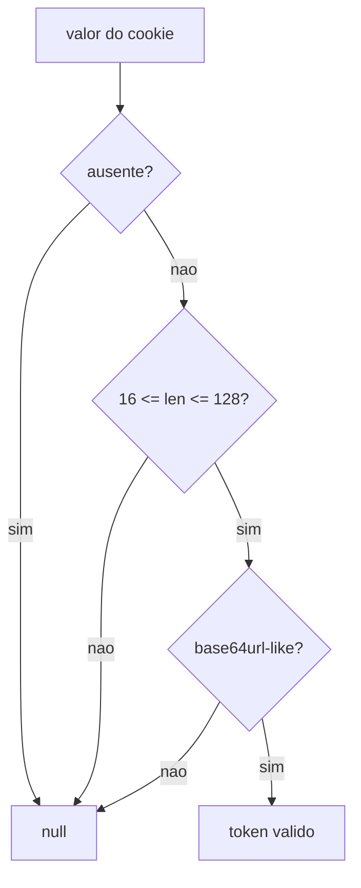
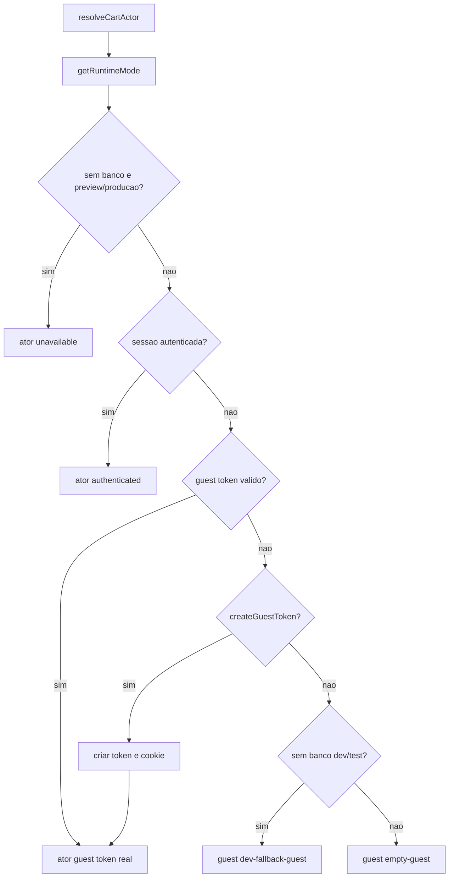
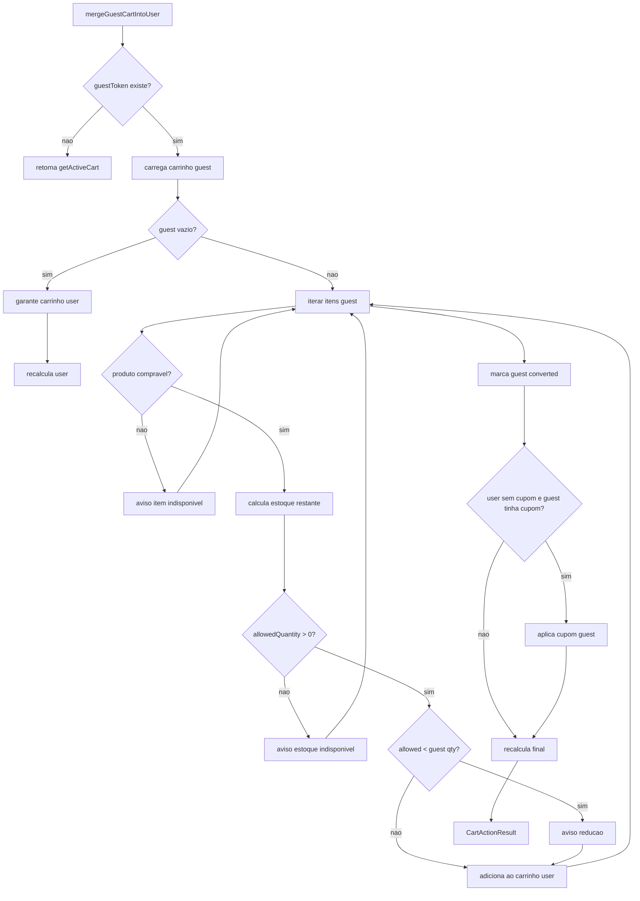

# Cart / Sessao e Merge Guest, Design Tecnico

> Spec executavel da subunidade `cart/sessao-merge-guest`. Descreve COMO o sistema resolve o ator do carrinho, gerencia o cookie anonimo e mescla carrinho guest no carrinho autenticado.

## 1. Interface

### 1.1 Constantes

```ts
const guestCartCookieName = "guestCartToken";
const guestCartMaxAgeSeconds = 60 * 60 * 24 * 30;
```

### 1.2 Funcoes de sessao

```ts
async function resolveCartActor(
  options: { createGuestToken?: boolean } = {}
): Promise<CartActor>

async function getGuestCartTokenForMerge(): Promise<string | null>

async function expireGuestCartToken(): Promise<void>

function createGuestCartToken(): string

function readGuestCartTokenValue(value: string | undefined): string | null
```

### 1.3 Funcao de merge

```ts
async function mergeGuestCartIntoUser(input: {
  userId: string;
  guestToken: string | null;
}): Promise<CartActionResult>
```

## 2. Modelo de Ator

```ts
type CartActor =
  | { kind: "guest"; guestToken: string }
  | { kind: "authenticated"; userId: string; role: UserRole; guestToken?: string }
  | { kind: "unavailable"; reason: "unsafe_environment" | string };
```

O ator e a fronteira de autorizacao do carrinho. Toda operacao de repository recebe ator e deve operar apenas no carrinho associado a ele.

## 3. Fluxo Principal: Validar Token Guest

1. Receber valor bruto do cookie.
2. Retornar `null` se o valor estiver ausente.
3. Retornar `null` se o tamanho for menor que 16.
4. Retornar `null` se o tamanho for maior que 128.
5. Retornar `null` se houver caractere fora de `[A-Za-z0-9_-]`.
6. Retornar token valido caso passe nas regras.



## 4. Fluxo Principal: Criar Token Guest

1. Chamar `randomBytes(32)`.
2. Converter para `base64url`.
3. Retornar string resultante.
4. Ao gravar no cookie, usar:
   - `httpOnly: true`;
   - `sameSite: "lax"`;
   - `secure: true` em `production` ou `preview`;
   - `maxAge: 30 dias`;
   - `path: "/"`.

## 5. Fluxo Principal: Resolver Ator

1. Ler runtime com `getRuntimeMode()`.
2. Ler cookie store com `cookies()`.
3. Ler e validar `guestCartToken`.
4. Obter sessao com `getCurrentSession()`.
5. Se nao ha banco e ambiente e `preview` ou `production`, retornar:

```ts
{ kind: "unavailable", reason: "unsafe_environment" }
```

6. Se `createGuestToken === true`, token guest e nulo, e sessao nao autenticada:
   - gerar token guest;
   - gravar cookie com opcoes seguras.
7. Se sessao esta autenticada, retornar ator authenticated:

```ts
{
  kind: "authenticated",
  userId: session.userId,
  role: session.role,
  guestToken: guestToken ?? undefined
}
```

8. Se existe token guest valido, retornar:

```ts
{ kind: "guest", guestToken }
```

9. Se nao ha banco em development/test, retornar:

```ts
{ kind: "guest", guestToken: "dev-fallback-guest" }
```

10. Caso contrario, retornar:

```ts
{ kind: "guest", guestToken: "empty-guest" }
```

## 6. Decisao de Ambiente



## 7. Fluxo Principal: Obter e Expirar Token para Merge

### Obter token

1. Ler cookie store.
2. Ler `guestCartToken`.
3. Validar com `readGuestCartTokenValue`.
4. Retornar token ou `null`.

### Expirar token

1. Ler cookie store.
2. Executar `cookieStore.delete(guestCartCookieName)`.
3. Nao retorna payload.

## 8. Fluxo Principal: Merge Guest no Usuario

1. Receber `userId` e `guestToken`.
2. Se `guestToken` e nulo:
   - retornar `getActiveCart()`.
3. Criar ator guest:

```ts
{ kind: "guest", guestToken }
```

4. Criar ator autenticado interno:

```ts
{ kind: "authenticated", userId, role: "customer" }
```

5. Buscar carrinho guest ativo.
6. Capturar `guestCouponId`.
7. Se carrinho guest nao existe ou nao tem itens:
   - garantir carrinho autenticado ativo;
   - recalcular;
   - retornar resultado.
8. Garantir carrinho autenticado ativo.
9. Criar lista `warnings`.
10. Iterar cada item do carrinho guest.
11. Para cada item:
   - buscar produto atual;
   - rejeitar se produto nao existe ou nao esta disponivel para compra;
   - buscar carrinho atual do usuario;
   - calcular quantidade ja existente do mesmo produto;
   - calcular `allowedQuantity = min(item.quantity, max(stockQuantity - existingQuantity, 0))`;
   - se `allowedQuantity <= 0`, registrar aviso e ignorar item;
   - se `allowedQuantity < item.quantity`, registrar aviso de reducao;
   - adicionar item ao carrinho do usuario com snapshot atual.
12. Se carrinho guest tem id, marcar como `converted`.
13. Buscar carrinho autenticado resultante.
14. Se havia cupom guest e carrinho autenticado esta sem cupom, aplicar cupom guest.
15. Recalcular carrinho autenticado.
16. Retornar resultado com mensagens do recalculo + `warnings`.

## 9. Diagrama do Merge



## 10. Persistencia Esperada

O service depende de `cartRepository` para:

- `getActiveCart(actor)`;
- `getOrCreateActiveCart(actor)`;
- `addItem(actor, item)`;
- `markCartConverted(cartId)`;
- `setAppliedCoupon(actor, couponId)`.

O repositorio deve garantir que:

- ator guest acessa somente carrinho por token;
- ator authenticated acessa somente carrinho por user id;
- carrinho convertido nao reaparece como carrinho ativo;
- fallback dev/test respeita a mesma semantica de ator.

## 11. Estados e Mensagens

### Estados relevantes

- `guest` com token real;
- `guest` com token `dev-fallback-guest`;
- `guest` com token `empty-guest`;
- `authenticated` com ou sem guest token preservado;
- `unavailable`;
- carrinho `active`;
- carrinho `converted`.

### Mensagens de merge

- `Item indisponivel removido do merge: {produto}.`
- `Estoque indisponivel para {produto}.`
- `Quantidade de {produto} limitada ao estoque disponivel.`

## 12. Dependencias

- `next/headers`
- `node:crypto`
- `src/features/auth/server/session.ts`
- `src/lib/runtime-mode.ts`
- `src/features/cart/types.ts`
- `src/features/cart/server/cart-repository.ts`
- `src/features/products/server/product-repository.ts`
- `src/features/products/domain`
- `src/features/coupons/server/coupon-service.ts`

## 13. Decisoes de Design

- Cookie guest e `httpOnly` para impedir leitura por JavaScript cliente.
- Sessao autenticada tem precedencia sobre carrinho guest na resolucao do ator.
- Token guest e preservado no ator authenticated para permitir merge apos login.
- Preview/producao sem banco falham de forma segura em vez de usar fallback.
- Merge revalida produto e estoque no momento da autenticacao.
- Merge usa snapshots atuais do produto ao inserir no carrinho autenticado.
- Cupom guest nao sobrescreve cupom ja escolhido no carrinho autenticado.
- Conversao do carrinho guest acontece apos tentativa de migracao, mesmo com avisos.

## 14. Rastreabilidade RF -> Implementacao

| RF | Implementacao |
|----|---------------|
| RF-CART-SESSION-01 | `readGuestCartTokenValue` |
| RF-CART-SESSION-02 | `createGuestCartToken` |
| RF-CART-SESSION-03 | `guestCartCookieOptions` |
| RF-CART-SESSION-04 | branch authenticated de `resolveCartActor` |
| RF-CART-SESSION-05 | branch guest token de `resolveCartActor` |
| RF-CART-SESSION-06 | branch `createGuestToken` de `resolveCartActor` |
| RF-CART-SESSION-07 | branch dev/test de `resolveCartActor` |
| RF-CART-SESSION-08 | branch unsafe de `resolveCartActor` |
| RF-CART-SESSION-09 | `getGuestCartTokenForMerge` |
| RF-CART-SESSION-10 | `expireGuestCartToken` |
| RF-CART-MERGE-01 | loop de `mergeGuestCartIntoUser` |
| RF-CART-MERGE-02 | retorno inicial `getActiveCart()` |
| RF-CART-MERGE-03 | branch guest vazio |
| RF-CART-MERGE-04 | validacao `isProductAvailableForPurchase` |
| RF-CART-MERGE-05 | calculo `allowedQuantity` |
| RF-CART-MERGE-06 | warnings de estoque |
| RF-CART-MERGE-07 | `markCartConverted` |
| RF-CART-MERGE-08 | `setAppliedCoupon` condicional |
| RF-CART-MERGE-09 | `recalculateCartForActor` + `toResult` |

## 15. Riscos e Lacunas

- `mergeGuestCartIntoUser` nao chama `expireGuestCartToken`; se necessario, isso deve ser orquestrado pelo fluxo de login.
- O ator autenticado criado no merge fixa `role: "customer"`, podendo perder nuances caso administradores tambem comprem.
- As mensagens de merge dependem da tela chamadora renderizar `CartActionResult.cart.messages`.
- A conversao do carrinho guest deve ser respeitada pelo repositorio para impedir reuso.
- Como nao ha reserva de estoque, ainda pode haver corrida entre merge e checkout final.
