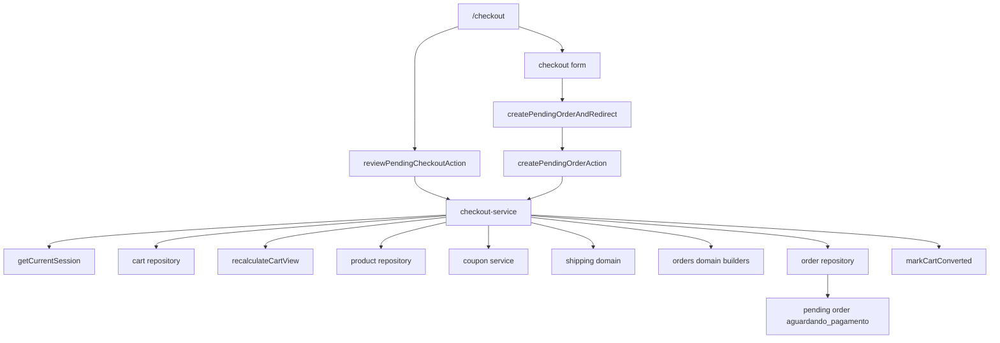
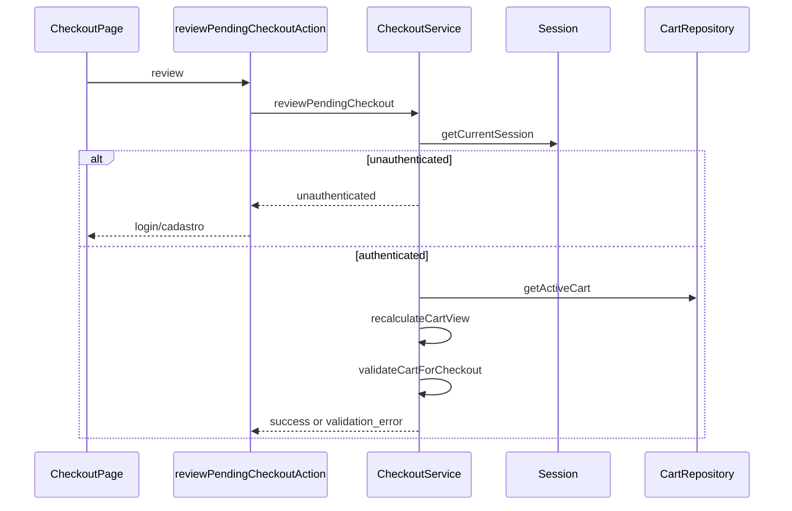
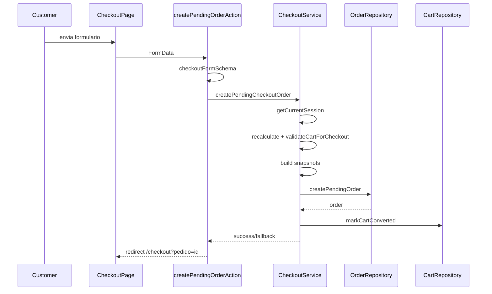

# Checkout, Design Tecnico

> Spec executavel da unit `checkout`.
> Descreve COMO o carrinho autenticado vira pedido pendente com snapshots server-side.

## 1. Topologia



## 2. Componentes

### 2.1 Rota `/checkout`

Arquivo: `src/app/(storefront)/checkout/page.tsx`.

Responsabilidades:

- ler `searchParams.pedido`;
- quando houver `pedido`, buscar pedido pendente do customer;
- exibir resumo de pedido criado quando o pedido for acessivel;
- chamar `reviewPendingCheckoutAction` quando nao houver pedido valido;
- renderizar estado de login quando usuario nao esta autenticado;
- renderizar bloqueio de carrinho invalido;
- renderizar revisao de itens e formulario de entrega quando carrinho esta valido;
- renderizar resumo financeiro server-side.

### 2.2 Actions

Arquivo: `src/features/checkout/server/checkout-actions.ts`.

```ts
reviewPendingCheckoutAction(): Promise<CheckoutReviewResult>

createPendingOrderAction(
  previousState: CheckoutActionState,
  formData: FormData
): Promise<CheckoutActionState>

createPendingOrderAndRedirect(formData: FormData): Promise<void>
```

Responsabilidades:

- parsear `FormData` via `checkoutFormSchema`;
- delegar criacao para service;
- retornar erro amigavel em state action;
- revalidar caminhos apos sucesso;
- redirecionar para `/checkout?pedido=<id>`.

### 2.3 Service

Arquivo: `src/features/checkout/server/checkout-service.ts`.

```ts
reviewPendingCheckout(): Promise<CheckoutReviewResult>

createPendingCheckoutOrder(
  input: CheckoutFormInput
): Promise<CheckoutCreateResult>
```

O service e a fonte de verdade do checkout. Ele resolve sessao, recalcula carrinho, valida elegibilidade, cria snapshots e persiste pedido pendente.

### 2.4 Orders Domain

Arquivo: `src/features/orders/domain.ts`.

Responsabilidades:

- status inicial `aguardando_pagamento`;
- expiracao de 60 minutos;
- normalizacao de CEP;
- criacao de numero publico;
- criacao de token publico;
- snapshot de cliente;
- snapshot de endereco;
- snapshot de cupom;
- snapshot de frete;
- draft de pedido pendente.

## 3. Fluxo: Review de Checkout

1. `/checkout` chama `reviewPendingCheckoutAction`.
2. Action chama `reviewPendingCheckout`.
3. Service obtem sessao atual.
4. Se sessao nao for autenticada:
   - retorna `unauthenticated`;
   - pagina mostra login/cadastro.
5. Service monta ator autenticado.
6. Repository busca carrinho ativo.
7. `recalculateCartView` recalcula subtotais, desconto, frete e total.
8. `validateCartForCheckout` valida carrinho.
9. Se invalido:
   - retorna `validation_error` com mensagem controlada.
10. Se valido:
   - retorna cart recalculado e e-mail da sessao.



## 4. Validacao do Carrinho

`validateCartForCheckout` deve bloquear:

1. ambiente sem banco fora de `development`/`test`;
2. carrinho sem id;
3. carrinho sem itens;
4. carrinho com status diferente de `active`;
5. produto inexistente;
6. produto nao compravel;
7. quantidade maior que estoque atual;
8. cupom aplicado invalido;
9. ausencia de shipping quote;
10. ausencia de option selecionada;
11. quote expirada;
12. quote de outro carrinho.

O retorno e sempre mensagem controlada, sem detalhes internos.

## 5. Fluxo: Criar Pedido Pendente

1. Usuario envia formulario de checkout.
2. `createPendingOrderAndRedirect` chama `createPendingOrderAction`.
3. Action parseia `FormData` com `checkoutFormSchema`.
4. Se invalido:
   - retorna state de erro.
5. Action chama `createPendingCheckoutOrder`.
6. Service exige sessao autenticada.
7. Service valida o input novamente via schema.
8. Service recalcula carrinho ativo.
9. Service valida carrinho para checkout.
10. Service confere ownership:
    - `cart.owner.kind === "user"`;
    - `cart.owner.userId === session.userId`.
11. Service cria address snapshot.
12. Service compara CEP da cotacao com CEP do endereco.
13. Service carrega produtos reais dos itens.
14. Service carrega cupom aplicado quando existir.
15. Service cria coupon snapshot.
16. Service cria shipping snapshot.
17. Se shipping snapshot for nulo:
    - retorna `validation_error`.
18. Service cria pending order draft.
19. Repository persiste pedido.
20. Service marca carrinho como convertido.
21. Action revalida caminhos.
22. Redirect leva para `/checkout?pedido=<id>`.



## 6. Schema do Formulario

`checkoutFormSchema` aceita apenas:

```ts
type CheckoutFormInput = {
  fullName: string;
  phone: string;
  postalCode: string;
  state: string;
  city: string;
  district: string;
  street: string;
  number: string;
  complement?: string | null;
  recipient?: string | null;
};
```

Campos proibidos/ignorados:

- `subtotalCents`;
- `discountCents`;
- `shippingAmountCents`;
- `grandTotalCents`;
- `userId`;
- `cartId`;
- `role`;
- `status`;
- `couponId`;
- `shippingQuoteId`.

## 7. Snapshots

### 7.1 Customer

```ts
buildCustomerSnapshot({
  fullName,
  email: session.email,
  phone
})
```

Regras:

- e-mail vem da sessao;
- e-mail e normalizado para lowercase;
- nome e telefone sao trimados.

### 7.2 Endereco

```ts
buildAddressSnapshot({
  fullName,
  recipient,
  postalCode,
  state,
  city,
  district,
  street,
  number,
  complement
})
```

Regras:

- CEP e normalizado;
- UF e uppercase;
- pais fixo `BR`;
- destinatario cai para `fullName` quando vazio.

### 7.3 Frete

`buildShippingSnapshot(cart)`:

- exige quote;
- exige option selecionada;
- copia provider/source/label/prazo;
- copia valor original;
- usa `cart.shippingAmountCents` como valor efetivo;
- marca `freeShippingApplied` quando valor original > 0 e efetivo = 0.

### 7.4 Cupom

`buildCouponSnapshot`:

- retorna `null` sem cupom;
- copia id, codigo, tipo, valor e desconto aplicado;
- registra `usedCountAtCheckout`;
- nao incrementa `usedCount`.

### 7.5 Itens

`buildPendingOrderDraft`:

- usa snapshots de carrinho;
- enriquece com dados atuais de produto quando disponiveis;
- captura sku, slug e imagem de capa;
- preserva preco unitario e quantidade do carrinho.

## 8. Pedido Pendente

Status inicial:

```ts
PENDING_ORDER_STATUS = "aguardando_pagamento"
```

Expiracao:

```ts
PENDING_ORDER_EXPIRATION_MINUTES = 60
expiresAt = createdAt + 60min
```

Totais:

- `subtotalCents` vem do carrinho recalculado;
- `discountTotalCents` vem do carrinho recalculado;
- `shippingTotalCents` vem do carrinho recalculado;
- `grandTotalCents` vem de `partialTotalWithShippingCents`;
- moeda fixa `BRL`.

## 9. Ownership e Seguranca

Criar pedido exige:

- sessao autenticada;
- carrinho owner `user`;
- `cart.owner.userId === session.userId`;
- pedido criado com `userId` da sessao;
- e-mail do customer snapshot vindo da sessao.

Qualquer divergencia retorna `forbidden` ou `validation_error`, nunca cria pedido.

## 10. CEP de Entrega vs Frete

Antes de criar pedido:

1. normalizar CEP do endereco;
2. normalizar CEP da shipping quote;
3. comparar igualdade;
4. bloquear divergencia.

Mensagem esperada:

```text
CEP do endereco precisa ser o mesmo da cotacao de frete selecionada.
```

## 11. Revalidacao e Redirect

Apos sucesso ou fallback:

- `revalidatePath("/carrinho")`;
- `revalidatePath("/checkout")`;
- `revalidatePath("/pedidos")`;
- `revalidatePath("/admin/pedidos")`;
- redirect para `/checkout?pedido=<orderId>`.

`/checkout?pedido=<id>` deve usar leitura de pedido do customer, respeitando ownership.

## 12. Estados de UI

### 12.1 Nao Autenticado

- heading "Entre para continuar";
- link login;
- link cadastro;
- ambos com `returnTo=/checkout`.

### 12.2 Carrinho Invalido

- heading "Revise o carrinho";
- mensagem retornada pelo service;
- link para `/carrinho`.

### 12.3 Revisao Valida

- lista de itens;
- formulario de cliente/entrega;
- resumo com subtotal, desconto, frete e total;
- informacao de que dados de cartao nao sao coletados ali.

### 12.4 Pedido Criado

- heading "Pedido criado";
- resumo do pedido;
- itens do pedido;
- orientacao para continuar pagamento pela area de pedidos.

## 13. Tratamento de Erros

| Erro | Camada | Resultado |
|------|--------|-----------|
| sem sessao | service | `unauthenticated` |
| formulario invalido | action/service | `validation_error` ou state `error` |
| carrinho vazio | service | `validation_error` |
| carrinho inativo | service | `validation_error` |
| produto indisponivel | service | `validation_error` |
| estoque insuficiente | service | `validation_error` |
| cupom invalido | service | `validation_error` |
| frete ausente | service | `validation_error` |
| quote expirada | service | `validation_error` |
| quote de outro carrinho | service | `validation_error` |
| owner divergente | service | `forbidden` |
| repository indisponivel | repository/service | `unavailable` |

## 14. Rastreabilidade RF -> Design

| RF | Design |
|----|--------|
| RF-CHECKOUT-01 | Rota `/checkout`. |
| RF-CHECKOUT-02 | Estado "Nao Autenticado". |
| RF-CHECKOUT-03 | Fluxo de Review. |
| RF-CHECKOUT-04 | Validacao do Carrinho. |
| RF-CHECKOUT-05 | Validacao `cart.status`. |
| RF-CHECKOUT-06 | Product repository + `validatePurchasableProduct`. |
| RF-CHECKOUT-07 | `validateQuantityForStock`. |
| RF-CHECKOUT-08 | Coupon service + subtotal. |
| RF-CHECKOUT-09 | Shipping snapshot e quote required. |
| RF-CHECKOUT-10 | `isQuoteExpired`. |
| RF-CHECKOUT-11 | Validacao `quote.cartId`. |
| RF-CHECKOUT-12 | Schema/Formulario. |
| RF-CHECKOUT-13 | `checkoutFormSchema`. |
| RF-CHECKOUT-14 | CEP de Entrega vs Frete. |
| RF-CHECKOUT-15 | Schema allowlist + snapshots. |
| RF-CHECKOUT-16 | Builders de snapshots. |
| RF-CHECKOUT-17 | Pedido Pendente. |
| RF-CHECKOUT-18 | Expiracao 60 minutos. |
| RF-CHECKOUT-19 | `markCartConverted`. |
| RF-CHECKOUT-20 | Redirect. |
| RF-CHECKOUT-21 | Estado "Pedido Criado". |
| RF-CHECKOUT-22 | Revalidacao. |
| RF-CHECKOUT-23 | UI sem cartao. |
| RF-CHECKOUT-24 | Resultado `fallback`. |

## 15. Dependencias

- `src/app/(storefront)/checkout/page.tsx`
- `src/features/checkout/server/checkout-actions.ts`
- `src/features/checkout/server/checkout-service.ts`
- `src/features/orders/schemas.ts`
- `src/features/orders/domain.ts`
- `src/features/orders/types.ts`
- `src/features/orders/server/order-repository.ts`
- `src/features/orders/server/order-actions.ts`
- `src/features/orders/components/order-summary.tsx`
- `src/features/cart/server/cart-repository.ts`
- `src/features/cart/server/cart-service.ts`
- `src/features/cart/domain.ts`
- `src/features/products/server/product-repository.ts`
- `src/features/coupons/domain.ts`
- `src/features/coupons/server/coupon-service.ts`
- `src/features/shipping/domain`
- `next/cache`
- `next/navigation`

## 16. Decisoes de Design

- Checkout e autenticado, sem pedido anonimo.
- Checkout cria pedido pendente, nao pagamento.
- Cartao nao e coletado na pagina de checkout.
- Totais sao derivados do carrinho recalculado.
- Snapshot e a fronteira entre carrinho mutavel e pedido pendente.
- Estoque nao e decrementado na criacao do pedido pendente.
- Cupom nao e consumido na criacao do pedido pendente.
- Carrinho e convertido apos pedido criado.
- Pedido pendente expira em 60 minutos.

## 17. Riscos Tecnicos

- Sem reserva de estoque, produto pode acabar entre pedido pendente e pagamento.
- Pedido pendente expirado precisa de rotina/fluxo operacional para nao ficar pagavel indefinidamente.
- Fallback dev/test precisa ficar claramente sinalizado.
- Alterar schema sem atualizar builders pode quebrar snapshots.
- Revalidacao incompleta pode deixar carrinho antigo visivel apos pedido.
- Pagamento posterior precisa repetir validacoes criticas antes de settlement.
