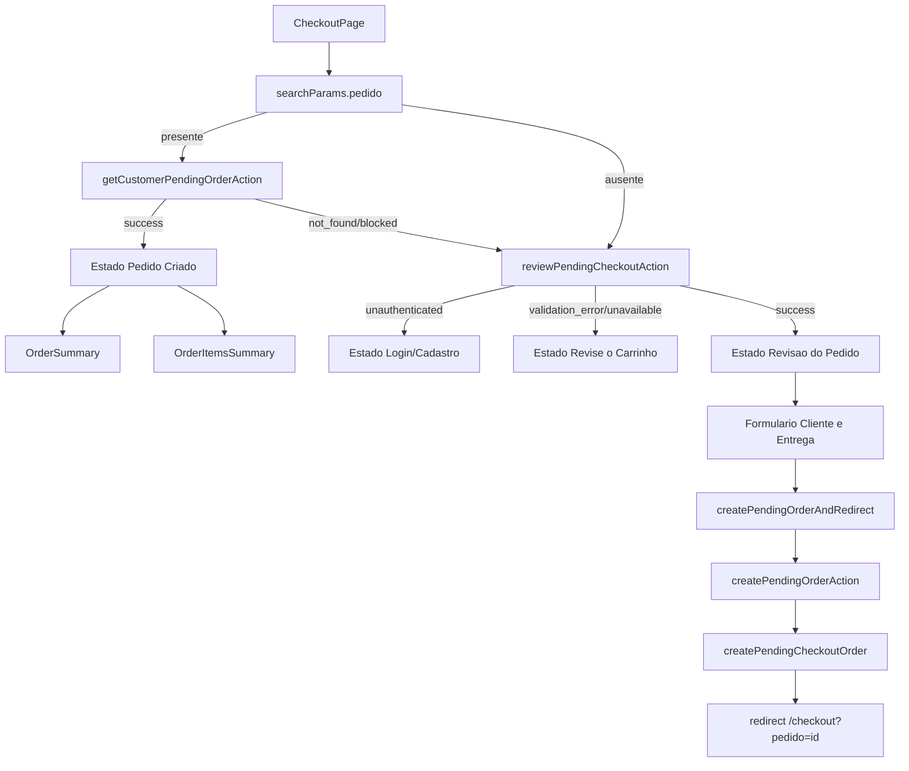
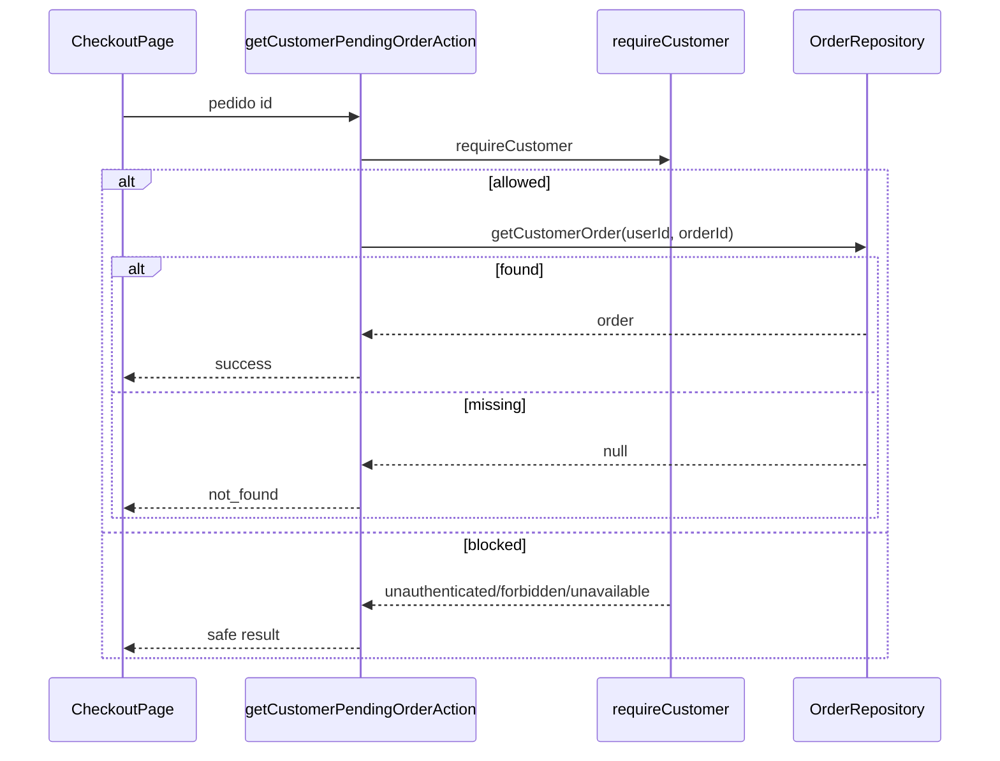

# Checkout / Revisao e Pedido Pendente, Design Tecnico

> Spec executavel da subunidade `checkout/revisao-pedido-pendente`.
> Descreve COMO a pagina `/checkout` alterna entre revisao do carrinho e resumo de pedido pendente.

## 1. Topologia

## 2. Estados da Pagina

### 2.1 Pedido Criado

Entrada:

- query string `pedido`;
- `getCustomerPendingOrderAction(pedido)` retorna `success`.

UI:

- `p.muted`: "Checkout pendente";
- `h1`: "Pedido criado";
- texto orientando pagamento posterior;
- `OrderSummary`;
- `OrderItemsSummary`.

Regra central:

- pedido so aparece se a action customer-scoped permitir leitura.

### 2.2 Login/Cadastro

Entrada:

- `reviewPendingCheckoutAction()` retorna `unauthenticated`.

UI:

- `h1`: "Entre para continuar";
- mensagem do service;
- link `/login?returnTo=/checkout`;
- link `/cadastro?returnTo=/checkout`.

### 2.3 Revise o Carrinho

Entrada:

- review retorna `validation_error`, `unavailable` ou outro status diferente de `success`.

UI:

- `h1`: "Revise o carrinho";
- mensagem controlada do service;
- link `/carrinho`.

### 2.4 Revisao do Pedido

Entrada:

- review retorna `success`.

UI:

- heading "Revisao do pedido";
- lista de itens;
- formulario "Cliente e entrega";
- aside "Resumo";
- aviso de pagamento posterior;
- aviso de que dados de cartao nao sao coletados no formulario.

## 3. Fluxo `?pedido=`

1. `CheckoutPage` aguarda `searchParams`.
2. Se `params.pedido` existir:
   - chama `getCustomerPendingOrderAction(params.pedido)`.
3. Action exige `requireCustomer`.
4. Repository busca pedido do customer autenticado.
5. Se encontrar:
   - retorna `success`;
   - pagina renderiza pedido criado.
6. Se nao encontrar ou nao permitir:
   - pagina nao exibe dados do pedido;
   - fluxo segue para review normal do checkout.

## 4. Fluxo de Review

1. Sem pedido valido, pagina chama `reviewPendingCheckoutAction`.
2. Action delega para `reviewPendingCheckout`.
3. Service autentica customer.
4. Service recalcula carrinho.
5. Service valida carrinho, produtos, cupom e frete.
6. Resultado define estado visual:
   - `unauthenticated` -> Login/Cadastro;
   - nao `success` -> Revise o carrinho;
   - `success` -> Revisao do Pedido.

## 5. Fluxo de Criacao e Redirect

1. Customer preenche formulario.
2. Form envia para `createPendingOrderAndRedirect`.
3. Action chama `createPendingOrderAction`.
4. Action valida schema.
5. Service cria pedido pendente.
6. Action revalida caminhos relacionados.
7. Se sucesso/fallback com `orderId`:
   - redirect para `/checkout?pedido=<id>`.
8. Pagina carrega novamente no fluxo `?pedido=`.
9. Pedido criado e exibido.

## 6. Contrato da UI de Revisao

### Itens

Cada item deve renderizar:

- nome snapshot;
- quantidade;
- preco unitario;
- subtotal.

### Formulario

Campos:

- `fullName`;
- `phone`;
- `recipient`;
- `postalCode`;
- `state`;
- `city`;
- `district`;
- `street`;
- `number`;
- `complement`.

`postalCode` deve usar `cart.shippingPostalCode` como `defaultValue` quando disponivel.

### Resumo

Campos:

- subtotal;
- desconto;
- frete;
- total;
- cupom;
- frete selecionado;
- aviso de expiracao em 60 minutos;
- aviso de cartao nao coletado.

## 7. Contrato de Pedido Criado

`OrderSummary` deve exibir:

- numero do pedido;
- status;
- total;
- expiracao quando status for `aguardando_pagamento`;
- `paidAt` quando existir;
- status de pagamento;
- aviso de processamento seguro de cartao pelo Payment Element.

`OrderItemsSummary` deve exibir:

- nome snapshot;
- SKU snapshot;
- quantidade;
- preco unitario;
- total de linha.

## 8. Ownership e Privacidade

O design nao deve confiar no id recebido por query string.

Regras:

- `pedido` sempre passa por action server-side;
- action exige customer;
- repository recebe `userId` e `orderId`;
- pedido nao encontrado retorna `not_found`;
- pedido de outro customer se comporta como nao encontrado;
- UI nao mostra mensagem distinguindo pedido inexistente de pedido alheio.

## 9. Separacao Checkout x Pagamento

Esta tela:

- cria pedido pendente;
- mostra resumo do pedido;
- orienta pagamento posterior;
- nao renderiza Payment Element;
- nao cria PaymentIntent;
- nao confirma pagamento;
- nao recebe dados de cartao.

A area de pedidos/pagamento assume o proximo passo.

## 10. Tratamento de Erros

| Caso | Resultado tecnico | UI |
|------|-------------------|----|
| Guest em `/checkout` | `unauthenticated` | Login/cadastro |
| Pedido query alheio | `not_found` | Sem dados do pedido; segue review |
| Pedido query inexistente | `not_found` | Sem dados do pedido; segue review |
| Carrinho vazio | `validation_error` | Revise o carrinho |
| Carrinho sem frete | `validation_error` | Revise o carrinho |
| Formulario invalido | action state error ou retorno seguro | Mensagem amigavel |
| Pedido criado | `success`/`fallback` | Redirect para `?pedido=` |

## 11. Acessibilidade e UX

- A pagina deve usar headings claros por estado.
- Formulario deve usar `label` envolvendo cada input.
- Estados de bloqueio devem ter CTA unico e claro.
- Resumo deve possuir `aria-label="Resumo do pedido"`.
- Itens do pedido devem usar `aria-label="Itens do pedido"`.
- Mensagens nao devem depender apenas de cor.

## 12. Rastreabilidade RF -> Design

| RF | Design |
|----|--------|
| RF-CHECKOUT-REVIEW-01 | Fluxo `?pedido=`. |
| RF-CHECKOUT-REVIEW-02 | Estado Pedido Criado. |
| RF-CHECKOUT-REVIEW-03 | Ownership e Privacidade. |
| RF-CHECKOUT-REVIEW-04 | Estado Login/Cadastro. |
| RF-CHECKOUT-REVIEW-05 | Estado Revisao do Pedido. |
| RF-CHECKOUT-REVIEW-06 | Estado Revise o Carrinho. |
| RF-CHECKOUT-REVIEW-07 | Contrato da UI de Revisao / Itens. |
| RF-CHECKOUT-REVIEW-08 | Contrato da UI de Revisao / Formulario. |
| RF-CHECKOUT-REVIEW-09 | Campo `postalCode` com default. |
| RF-CHECKOUT-REVIEW-10 | Contrato da UI de Revisao / Resumo. |
| RF-CHECKOUT-REVIEW-11 | Cupom/frete no resumo. |
| RF-CHECKOUT-REVIEW-12 | Fluxo de Criacao e Redirect. |
| RF-CHECKOUT-REVIEW-13 | Redirect para `?pedido=`. |
| RF-CHECKOUT-REVIEW-14 | Estado Pedido Criado. |
| RF-CHECKOUT-REVIEW-15 | Separacao Checkout x Pagamento. |
| RF-CHECKOUT-REVIEW-16 | Formulario sem cartao. |
| RF-CHECKOUT-REVIEW-17 | Revalidacao em action. |

## 13. Dependencias

- `src/app/(storefront)/checkout/page.tsx`
- `src/features/checkout/server/checkout-actions.ts`
- `src/features/checkout/server/checkout-service.ts`
- `src/features/orders/server/order-actions.ts`
- `src/features/orders/components/order-summary.tsx`
- `src/features/orders/server/order-repository.ts`
- `src/features/auth/server/policies.ts`
- `src/lib/money.ts`
- `next/link`
- `next/navigation`

## 14. Decisoes de Design

- Query `pedido` tem prioridade sobre novo review.
- Pedido alheio/inexistente nao exibe dado e nao diferencia causa.
- Pedido criado e apenas resumo; pagamento fica fora da revisao.
- Revisao nao usa componente client complexo; formulario posta para server action.
- Resumo financeiro usa carrinho recalculado.
- Campo CEP herda CEP do frete para reduzir divergencia.

## 15. Riscos Tecnicos

- Se `?pedido=` invalido cair silenciosamente em review, o usuario pode nao entender que o pedido nao foi encontrado.
- Copy de pagamento deve estar alinhada com o fluxo real da area de pedidos.
- Sem estado client de erro no formulario, falhas de action podem exigir cuidado de UX.
- Se ownership de pedido for relaxado no repository, query string vira vetor de vazamento.
- Se review nao revalidar carrinho, pedido pode ser criado com frete/produto stale.
