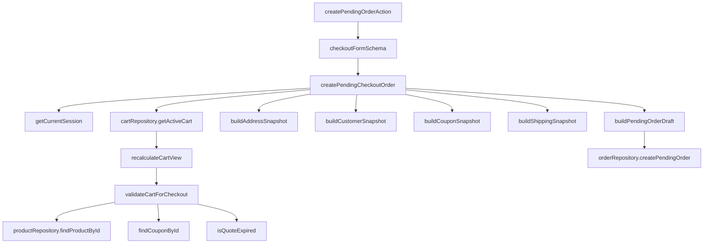
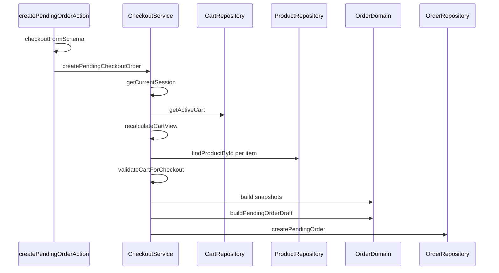

# Checkout / Snapshots e Validacao, Design Tecnico

> Spec executavel da subunidade `checkout/snapshots-validacao`.
> Descreve COMO as validacoes server-side e os snapshots sao montados antes de persistir o pedido pendente.

## 1. Topologia



## 2. Fluxo de Validacao

1. Action parseia formulario com `checkoutFormSchema`.
2. Service exige sessao autenticada.
3. Service valida input novamente com o mesmo schema.
4. Service monta ator autenticado.
5. Service carrega carrinho ativo.
6. Service recalcula carrinho.
7. `validateCartForCheckout` roda validacoes de elegibilidade.
8. Service valida ownership do carrinho.
9. Service cria snapshots.
10. Service cria draft.
11. Repository persiste pedido.



## 3. Schema Allowlist

`checkoutFormSchema` aceita somente:

```ts
{
  fullName,
  phone,
  postalCode,
  state,
  city,
  district,
  street,
  number,
  complement,
  recipient
}
```

Qualquer campo extra deve ser ignorado pelo desenho do parse. Totais e ownership nunca entram nos builders a partir do cliente.

Campos explicitamente nao confiaveis:

- `subtotalCents`;
- `discountCents`;
- `shippingAmountCents`;
- `grandTotalCents`;
- `userId`;
- `role`;
- `cartId`;
- `status`;
- `couponId`;
- `shippingQuoteId`.

## 4. `validateCartForCheckout`

Entrada:

```ts
cart: Awaited<ReturnType<typeof recalculateCartView>>
```

Saida:

```ts
{ status: "valid" } | { status: "invalid"; message: string }
```

Validacoes:

1. runtime sem banco fora de `development`/`test` bloqueia checkout;
2. `cart.id === null` bloqueia;
3. `cart.items.length === 0` bloqueia;
4. `cart.status !== "active"` bloqueia;
5. cada item busca produto atual;
6. `validatePurchasableProduct` deve retornar available;
7. `validateQuantityForStock` deve retornar valid;
8. cupom aplicado e revalidado por subtotal;
9. shipping quote deve existir;
10. shipping quote id deve existir;
11. selected option deve existir;
12. quote expirada bloqueia;
13. quote de outro carrinho bloqueia.

## 5. Ownership

Depois da validacao do carrinho:

```ts
cart.owner.kind === "user"
cart.owner.userId === session.userId
```

Se qualquer condicao falhar:

- retornar `forbidden`;
- nao criar snapshots;
- nao persistir pedido;
- nao converter carrinho.

## 6. Customer Snapshot

Builder:

```ts
buildCustomerSnapshot({
  fullName: parsed.data.fullName,
  email: session.email,
  phone: parsed.data.phone
})
```

Transformacoes:

- `fullName.trim()`;
- `email.trim().toLowerCase()`;
- `phone.trim()`.

Fonte de verdade:

- e-mail vem da sessao;
- nao aceitar e-mail do formulario nesta etapa.

## 7. Address Snapshot

Builder:

```ts
buildAddressSnapshot({
  ...parsed.data,
  fullName: parsed.data.fullName
})
```

Transformacoes:

- recipient = `recipient.trim()` ou `fullName.trim()`;
- postalCode = apenas digitos;
- state = uppercase;
- city/district/street/number = trim;
- complement = trim ou null;
- country = `BR`.

Validacao adicional:

```ts
normalizePostalCode(cart.shippingPostalCode) === address.postalCode
```

Se divergir, retornar `validation_error`.

## 8. Coupon Snapshot

Fluxo:

1. Se `cart.appliedCouponId` existir, buscar cupom atual.
2. Validar cupom em `validateCartForCheckout`.
3. Montar snapshot:

```ts
buildCouponSnapshot({
  coupon,
  discountCents: cart.discountCents
})
```

Saida:

- `null` sem cupom;
- id, code, type, value;
- discountCents aplicado;
- usedCountAtCheckout observacional.

Nao deve:

- incrementar usage;
- recalcular desconto a partir do cliente;
- alterar cupom real.

## 9. Shipping Snapshot

Builder:

```ts
buildShippingSnapshot(cart)
```

Pre-condicoes:

- `cart.shippingQuote`;
- `cart.shippingQuoteId`;
- `cart.shippingQuote.selectedOptionId`;
- option selecionada existe dentro da quote;
- quote nao expirada;
- quote pertence ao carrinho.

Campos:

- postalCode normalizado;
- quoteId;
- optionId;
- provider;
- source;
- label;
- estimatedDays;
- originalAmountCents = selected.priceCents;
- effectiveAmountCents = cart.shippingAmountCents;
- freeShippingApplied = `selected.priceCents > 0 && cart.shippingAmountCents === 0`.

Se builder retornar null, pedido nao deve ser criado.

## 10. Item Snapshots

`buildPendingOrderDraft` percorre `cart.items`.

Para cada item:

1. localizar produto real por `productId`;
2. usar SKU do produto ou fallback `productId`;
3. usar nome do produto ou fallback `item.productNameSnapshot`;
4. usar slug do produto ou null;
5. escolher imagem cover ou primeira imagem;
6. preservar `unitPriceSnapshotCents`;
7. preservar `quantity`;
8. preservar `itemSubtotalCents`.

O preco vem do carrinho recalculado, nao do payload.

## 11. Draft do Pedido

Builder:

```ts
buildPendingOrderDraft({
  userId: session.userId,
  cart,
  products: realProducts,
  customerSnapshot,
  shippingAddressSnapshot,
  shippingSnapshot,
  couponSnapshot
})
```

Campos derivados:

- `cartId = cart.id`;
- `status = aguardando_pagamento`;
- `subtotalCents = cart.subtotalCents`;
- `discountTotalCents = cart.discountCents`;
- `shippingTotalCents = cart.shippingAmountCents`;
- `grandTotalCents = cart.partialTotalWithShippingCents`;
- `currency = BRL`;
- `createdAt = now`;
- `expiresAt = createdAt + 60min`.

## 12. Ordem Segura

Ordem obrigatoria:

1. autenticar;
2. schema allowlist;
3. recalcular carrinho;
4. validar carrinho/produto/estoque/cupom/frete;
5. validar ownership;
6. validar CEP endereco vs frete;
7. montar snapshots;
8. criar draft;
9. persistir pedido;
10. converter carrinho.

Essa ordem evita snapshot de dados invalidos e impede conversao de carrinho quando o pedido falha.

## 13. Tratamento de Erros

| Falha | Retorno |
|-------|---------|
| Sem sessao | `unauthenticated` |
| Schema invalido | `validation_error` |
| Carrinho invalido | `validation_error` |
| Produto indisponivel | `validation_error` |
| Estoque insuficiente | `validation_error` |
| Cupom invalido | `validation_error` |
| Frete ausente | `validation_error` |
| Quote expirada | `validation_error` |
| Quote de outro carrinho | `validation_error` |
| Owner divergente | `forbidden` |
| CEP divergente | `validation_error` |
| Repository indisponivel | `unavailable` |

Mensagens devem ser amigaveis e nao vazar stack trace, SQL, secrets ou payload interno.

## 14. Rastreabilidade RF -> Design

| RF | Design |
|----|--------|
| RF-CHECKOUT-SNAP-01 | Fluxo de Validacao / Recalc. |
| RF-CHECKOUT-SNAP-02 | `validateCartForCheckout` produtos. |
| RF-CHECKOUT-SNAP-03 | `validateQuantityForStock`. |
| RF-CHECKOUT-SNAP-04 | Coupon Snapshot + validacao. |
| RF-CHECKOUT-SNAP-05 | Shipping Snapshot + quote validations. |
| RF-CHECKOUT-SNAP-06 | Ownership. |
| RF-CHECKOUT-SNAP-07 | Schema Allowlist. |
| RF-CHECKOUT-SNAP-08 | Campos nao confiaveis. |
| RF-CHECKOUT-SNAP-09 | Customer Snapshot. |
| RF-CHECKOUT-SNAP-10 | Address Snapshot. |
| RF-CHECKOUT-SNAP-11 | CEP endereco vs frete. |
| RF-CHECKOUT-SNAP-12 | Item Snapshots. |
| RF-CHECKOUT-SNAP-13 | Coupon Snapshot. |
| RF-CHECKOUT-SNAP-14 | Shipping Snapshot. |
| RF-CHECKOUT-SNAP-15 | `freeShippingApplied`. |
| RF-CHECKOUT-SNAP-16 | Draft do Pedido. |
| RF-CHECKOUT-SNAP-17 | Expiracao 60min. |
| RF-CHECKOUT-SNAP-18 | Ordem Segura / efeitos colaterais ausentes. |

## 15. Dependencias

- `src/features/checkout/server/checkout-service.ts`
- `src/features/orders/domain.ts`
- `src/features/orders/types.ts`
- `src/features/orders/schemas.ts`
- `src/features/cart/server/cart-service.ts`
- `src/features/cart/domain.ts`
- `src/features/products/server/product-repository.ts`
- `src/features/coupons/domain.ts`
- `src/features/coupons/server/coupon-service.ts`
- `src/features/shipping/domain`
- `src/features/orders/server/order-repository.ts`

## 16. Decisoes de Design

- Snapshot so nasce depois de validacao do carrinho.
- E-mail do customer vem da sessao.
- Totais vêm do carrinho recalculado.
- CEP do endereco precisa bater com frete selecionado.
- Produto real enriquece snapshot, mas carrinho fornece fallback.
- Cupom snapshot e observacional nesta etapa.
- Frete preserva valor original e valor efetivo.
- Pedido pendente nao consome estoque/cupom/pagamento.

## 17. Riscos Tecnicos

- Se snapshot for recalculado depois do pedido, historico pode perder auditabilidade.
- Se validacao de estoque nao repetir no pagamento, pedido pendente pode ser pago sem estoque.
- Se coupon usage for consumido cedo, pedido abandonado queimaria cupom.
- Se imagem de produto mudar, snapshot preserva apenas a imagem escolhida no momento.
- Se CEP de endereco divergir do frete, entrega e cobranca ficam inconsistentes.
