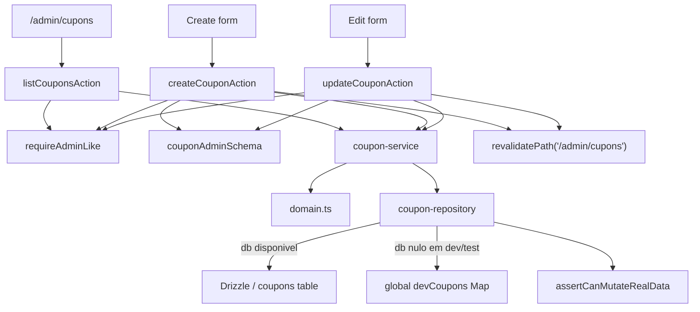

# Coupons / Admin Cupons, Design Tecnico

> Spec executavel da subunit `coupons/admin-cupons`.
> Descreve COMO a administracao de cupons e organizada em actions server-side, schemas, service, repository Drizzle/fallback e guardrails.

## 1. Interface

### 1.1 Actions Administrativas

```ts
listCouponsAction(): Promise<CouponAdminActionResult<CouponView[]>>
createCouponAction(formData: FormData): Promise<CouponMutationResult>
updateCouponAction(id: string, formData: FormData): Promise<CouponMutationResult>
createCouponFormAction(formData: FormData): Promise<void>
updateCouponFormAction(id: string, formData: FormData): Promise<void>
```

As actions sao o limite server-side entre UI administrativa e dominio. Elas concentram:

- validacao de permissao;
- parse de `FormData`;
- chamada ao service;
- revalidate de rota administrativa;
- redirecionamento de formulario em sucesso.

### 1.2 Service

```ts
listAdminCoupons(): Promise<CouponView[]>
createAdminCoupon(input: CouponAdminInput): Promise<CouponMutationResult>
updateAdminCoupon(id: string, input: CouponAdminInput): Promise<CouponMutationResult>
```

O service nao decide permissao de usuario. Ele recebe input ja autorizado pela action e orquestra repository + conversao para view.

### 1.3 Schema Administrativo

```ts
type CouponAdminInput = {
  code: string;
  type: "percentage" | "fixed_amount" | "free_shipping";
  value: number;
  isActive?: boolean;
  startsAt?: Date | null;
  endsAt?: Date | null;
  maxUses?: number | null;
  minimumSubtotalCents?: number | null;
};
```

### 1.4 Resultado de Mutacao

```ts
type CouponMutationResult =
  | { status: "success"; coupon: CouponView; message: string }
  | { status: "dev_fallback"; coupon: CouponView; message: string }
  | { status: "validation_error"; message: string; fieldErrors?: Record<string, string[]> }
  | { status: "forbidden"; message: string }
  | { status: "blocked"; message: string };
```

## 2. Topologia



## 3. Fluxo: Listar Cupons

1. UI administrativa solicita lista de cupons.
2. `listCouponsAction` chama `requireAdminLike`.
3. Se policy falhar:
   - retornar `forbidden` para usuario sem papel aceito;
   - retornar `blocked` quando a propria policy indicar bloqueio de ambiente.
4. Se policy permitir, chamar `listAdminCoupons`.
5. Service chama `repository.listCouponsForAdmin`.
6. Repository:
   - usa Drizzle quando `db !== null`;
   - usa fallback dev/test quando `db === null` e ambiente permitir.
7. Service converte cada `Coupon` em `CouponView` via `toCouponView`.
8. Action retorna lista para a UI.

## 4. Fluxo: Criar Cupom

1. Formulario administrativo envia `FormData`.
2. `createCouponAction` chama `requireAdminLike`.
3. Se policy falhar, retornar resultado seguro.
4. Action converte `FormData` para objeto bruto:
   - `code`;
   - `type`;
   - `value`;
   - `isActive`;
   - `startsAt`;
   - `endsAt`;
   - `maxUses`;
   - `minimumSubtotalCents`.
5. `couponAdminSchema` valida o input.
6. Em erro de schema, action retorna `validation_error`.
7. Em sucesso, action chama `createAdminCoupon`.
8. Service chama `repository.createCoupon`.
9. Repository Drizzle:
   - chama `assertCanMutateRealData`;
   - bloqueia se guardrail negar escrita;
   - normaliza codigo;
   - converte campos para formato da tabela;
   - insere e retorna cupom.
10. Repository fallback:
   - gera id previsivel `coupon-dev-{codigo}`;
   - escreve em Map de memoria;
   - retorna `dev_fallback`.
11. Action revalida `/admin/cupons` quando o resultado representa mutacao bem-sucedida.
12. Form action redireciona para `/admin/cupons` somente em sucesso ou fallback dev/test bem-sucedido.

## 5. Fluxo: Atualizar Cupom

1. UI envia id do cupom e `FormData`.
2. `updateCouponAction` chama `requireAdminLike`.
3. Action valida `id` minimamente antes de delegar.
4. Action converte e valida `FormData` com o mesmo schema de criacao.
5. Em erro de schema, retornar `validation_error`.
6. Em sucesso, chamar `updateAdminCoupon(id, input)`.
7. Service chama `repository.updateCoupon`.
8. Repository Drizzle:
   - chama `assertCanMutateRealData`;
   - atualiza row por id;
   - atualiza `updatedAt`;
   - retorna `blocked` com mensagem segura quando id nao existe.
9. Repository fallback:
   - atualiza Map em memoria;
   - pode recriar a entrada e reiniciar `usedCount`;
   - retorna mensagem explicita de fallback.
10. Action revalida `/admin/cupons` apos mutacao bem-sucedida.
11. Form action redireciona apenas em sucesso/fallback permitido.

## 6. Parse de FormData

O parse administrativo deve converter entradas HTML em tipos de dominio.

| Campo | Origem comum | Conversao |
|-------|--------------|-----------|
| `code` | input text | string trimada pelo schema e normalizada depois. |
| `type` | select | enum atual de cupom. |
| `value` | input number | numero. |
| `isActive` | checkbox | boolean. |
| `startsAt` | input datetime/date | `Date` ou `null`. |
| `endsAt` | input datetime/date | `Date` ou `null`. |
| `maxUses` | input number vazio/opcional | inteiro ou `null`. |
| `minimumSubtotalCents` | input number vazio/opcional | inteiro em centavos ou `null`. |

Datas vazias devem virar `null`. Datas invalidas nao devem atravessar ate repository como `Invalid Date`.

## 7. Validacao

### 7.1 Codigo

- string obrigatoria;
- trim;
- minimo 1;
- maximo 64;
- normalizacao final para uppercase via dominio.

### 7.2 Tipo e Valor

- `percentage`: valor > 0 e <= 100;
- `fixed_amount`: valor inteiro positivo, em centavos ou unidade canonica ja definida pelo schema atual;
- `free_shipping`: valor numerico valido, sem gerar desconto direto de itens.

### 7.3 Limites

- `maxUses`: inteiro positivo quando informado;
- `minimumSubtotalCents`: inteiro nao negativo quando informado;
- `startsAt`/`endsAt`: opcionais e coerentes.

## 8. Repository Drizzle

### 8.1 Criacao

```ts
async function createCoupon(input: CouponAdminInput): Promise<CouponMutationResult> {
  const guard = assertCanMutateRealData();
  if (!guard.allowed) return blocked(guard.message);

  const row = toCouponInsertRow(input);
  const inserted = await db.insert(coupons).values(row).returning();
  return success(toCoupon(inserted));
}
```

### 8.2 Atualizacao

```ts
async function updateCoupon(id: string, input: CouponAdminInput): Promise<CouponMutationResult> {
  const guard = assertCanMutateRealData();
  if (!guard.allowed) return blocked(guard.message);

  const updated = await db
    .update(coupons)
    .set(toCouponUpdateRow(input))
    .where(eq(coupons.id, id))
    .returning();

  if (!updated) return blocked("Cupom nao encontrado.");
  return success(toCoupon(updated));
}
```

### 8.3 Listagem

- Ordenar por `code` ascendente.
- Converter rows para `Coupon`.
- Nao aplicar filtro publico de vigencia; admin precisa enxergar inativos, futuros, expirados e esgotados.

## 9. Repository Fallback

O fallback existe para desenvolvimento/teste sem banco.

1. Inicializa Map global com `devCoupons`.
2. Listagem retorna todos os cupons do Map ordenados por codigo.
3. Criacao normaliza codigo e salva `coupon-dev-{codigo}`.
4. Atualizacao substitui o cupom do Map.
5. Resultado deve ser `dev_fallback` com mensagem explicita.
6. Fallback nao e persistencia real e nao deve ser aceito silenciosamente em producao.

## 10. Politicas e Erros

### 10.1 Policy

`requireAdminLike` e obrigatorio em todas as actions da subunit.

Falhas devem ser mapeadas para:

- `forbidden`: usuario autenticado/anonimo sem permissao;
- `blocked`: ambiente, auth ou policy explicitamente bloqueado.

### 10.2 Erros de Validacao

Retornar:

- status `validation_error`;
- mensagem generica amigavel;
- detalhes por campo quando apropriado.

Nao retornar:

- stack trace;
- SQL;
- variaveis de ambiente;
- dados de sessao;
- detalhes de guardrail sensiveis.

## 11. Revalidate e Redirect

Depois de `success` ou `dev_fallback`:

```ts
revalidatePath("/admin/cupons");
```

As form actions podem redirecionar para `/admin/cupons` somente depois de mutacao bem-sucedida. Em `validation_error`, `forbidden` ou `blocked`, a action deve retornar resultado para a UI lidar com a mensagem.

## 12. Estados de UI Administrativa

Embora esta subunit foque o contrato server-side, a UI admin deve conseguir representar:

- carregando/listando;
- lista vazia;
- cupom ativo;
- cupom inativo;
- cupom agendado;
- cupom expirado;
- cupom esgotado;
- erro de permissao;
- erro de validacao;
- fallback dev/test;
- mutacao bloqueada.

## 13. Rastreabilidade RF -> Design

| RF | Design |
|----|--------|
| RF-ADMIN-COUPON-01 | Fluxo de listagem + `requireAdminLike`. |
| RF-ADMIN-COUPON-02 | Fluxo de criacao + `requireAdminLike`. |
| RF-ADMIN-COUPON-03 | Fluxo de atualizacao + `requireAdminLike`. |
| RF-ADMIN-COUPON-04 | `listAdminCoupons` + repository ordenado + `CouponView`. |
| RF-ADMIN-COUPON-05 | `createCouponAction` -> schema -> service -> repository. |
| RF-ADMIN-COUPON-06 | `updateCouponAction` -> schema -> service -> repository. |
| RF-ADMIN-COUPON-07 | Branch de update sem row retornada. |
| RF-ADMIN-COUPON-08 | `couponAdminSchema.code`. |
| RF-ADMIN-COUPON-09 | `normalizeCouponCode`. |
| RF-ADMIN-COUPON-10 | enum do schema administrativo. |
| RF-ADMIN-COUPON-11 | validacao de percentual no schema. |
| RF-ADMIN-COUPON-12 | validacao de valor fixo no schema. |
| RF-ADMIN-COUPON-13 | tipo `free_shipping` como beneficio preparado. |
| RF-ADMIN-COUPON-14 | parse/validacao de datas opcionais. |
| RF-ADMIN-COUPON-15 | validacao de `maxUses`. |
| RF-ADMIN-COUPON-16 | validacao de `minimumSubtotalCents`. |
| RF-ADMIN-COUPON-17 | campo `isActive` persistido e view de status. |
| RF-ADMIN-COUPON-18 | `revalidatePath('/admin/cupons')`. |
| RF-ADMIN-COUPON-19 | form action redireciona so em sucesso. |
| RF-ADMIN-COUPON-20 | `assertCanMutateRealData`. |
| RF-ADMIN-COUPON-21 | repository fallback. |
| RF-ADMIN-COUPON-22 | bloqueio de fallback silencioso fora de dev/test. |

## 14. Dependencias

- `src/features/coupons/server/admin-coupon-actions.ts`
- `src/features/coupons/server/coupon-service.ts`
- `src/features/coupons/server/coupon-repository.ts`
- `src/features/coupons/server/coupon-fixtures.ts`
- `src/features/coupons/schemas.ts`
- `src/features/coupons/domain.ts`
- `src/features/coupons/types.ts`
- `src/features/auth/server/policies.ts`
- `src/lib/runtime-mode.ts`
- `src/db/schema.ts`
- `src/db/client.ts`
- `next/cache`
- `next/navigation`

## 15. Decisoes de Design

- Actions administrativas ficam separadas do fluxo publico de cupom.
- A policy fica na borda da action, antes de parse caro ou mutacao.
- Schema centraliza validacao de input administrativo.
- Service e fino e delega persistencia ao repository.
- Repository encapsula Drizzle e fallback.
- Admin lista todos os cupons, inclusive inativos/futuros/expirados, porque essa e uma necessidade operacional.
- Fallback e permitido apenas como experiencia local/teste e sempre retorna status proprio.
- Mutacao real depende de guardrail explicito.

## 16. Riscos Tecnicos

- Datas nativas podem aceitar formatos ambiguos; idealmente devem ser endurecidas em evolucao futura.
- Criacao duplicada de codigo precisa de constraint ou validacao dedicada.
- Fallback de update pode reiniciar contador de uso e nao deve ser tratado como comportamento produtivo.
- Erros de banco precisam ser traduzidos para respostas seguras antes de chegar a UI.
- Revalidate nao substitui autorizacao; a pagina tambem deve permanecer protegida.
