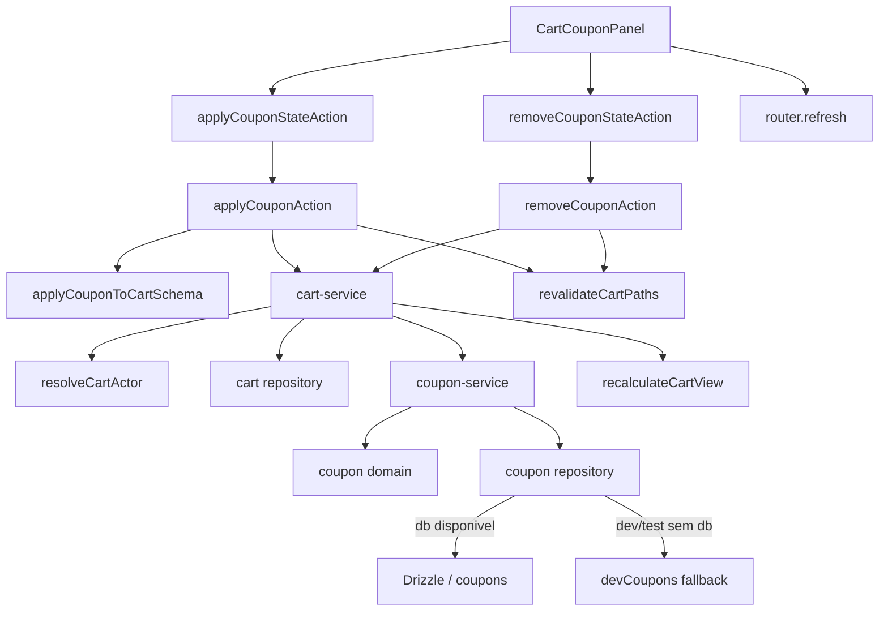
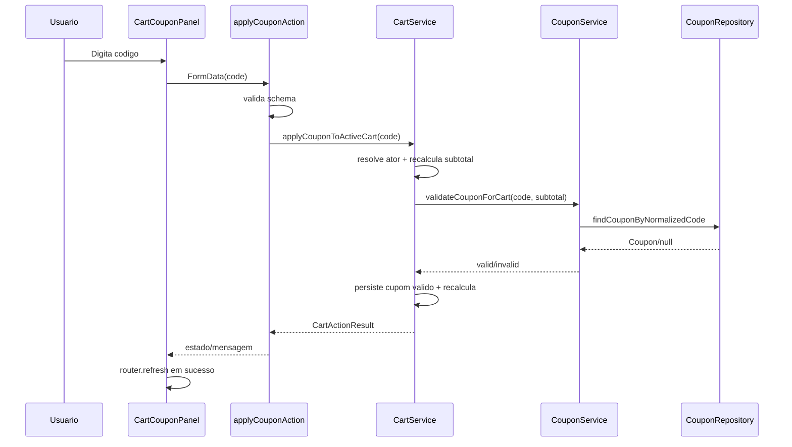

# Coupons / Cupom Publico no Carrinho, Design Tecnico

> Spec executavel da subunit `coupons/cupom-publico-carrinho`.
> Descreve COMO a UI publica do carrinho aplica, remove, valida e recalcula cupons com fonte de verdade server-side.

## 1. Interface

### 1.1 Componente Publico

```ts
function CartCouponPanel(props: {
  coupon: CouponView | null;
}): JSX.Element
```

Responsabilidades:

- renderizar formulario de cupom quando nao ha cupom aplicado;
- renderizar resumo do cupom quando ha cupom aplicado;
- disparar actions stateful para aplicar/remover;
- exibir mensagens de sucesso, erro e pending;
- chamar refresh client-side apos sucesso para atualizar resumo server-rendered.

### 1.2 Actions

```ts
async function applyCouponAction(formData: FormData): Promise<CartActionResult>
async function applyCouponStateAction(
  previousState: CartCouponActionState,
  formData: FormData
): Promise<CartCouponActionState>

async function removeCouponAction(): Promise<CartActionResult>
async function removeCouponStateAction(
  previousState: CartCouponActionState
): Promise<CartCouponActionState>
```

### 1.3 Service de Carrinho

```ts
async function applyCouponToActiveCart(code: string): Promise<CartActionResult>
async function removeCouponFromActiveCart(): Promise<CartActionResult>
async function recalculateCartView(cart: CartView): Promise<CartView>
async function recalculateCartForActor(actor: CartActor): Promise<CartActionResult>
```

### 1.4 Service de Cupons

```ts
async function validateCouponForCart(input: {
  code: string;
  subtotalCents: number;
  now?: Date;
}): Promise<CouponValidationResult>

async function calculateAppliedCoupon(input: {
  couponId: string | null;
  subtotalCents: number;
  now?: Date;
}): Promise<CouponCalculation>
```

## 2. Topologia



## 3. Fluxo: Renderizar Painel Sem Cupom

1. Carrinho server-rendered fornece `coupon: null`.
2. `CartCouponPanel` exibe:
   - heading "Cupom";
   - campo de codigo;
   - placeholder de desenvolvimento quando aplicavel;
   - botao "Aplicar".
3. Formulario envia apenas o codigo digitado.
4. Subtotal, usuario, carrinho e desconto nao sao aceitos como fonte de verdade do client.

## 4. Fluxo: Aplicar Cupom

1. Usuario informa codigo no painel.
2. `applyCouponStateAction` recebe `FormData`.
3. `applyCouponAction` valida `FormData` com schema de aplicacao de cupom.
4. Se codigo vazio/invalido:
   - retorna `validation_error`;
   - UI exibe mensagem amigavel;
   - carrinho nao e alterado.
5. Se schema passa, action chama `applyCouponToActiveCart(code)`.
6. Service resolve ator com `createGuestToken: true`.
7. Se nao houver carrinho ativo, service cria/recupera carrinho do ator.
8. Service recalcula carrinho antes da validacao para obter subtotal server-side.
9. Service chama `validateCouponForCart({ code, subtotalCents })`.
10. `coupon-service` normaliza codigo.
11. Repository busca cupom por codigo normalizado.
12. Dominio valida status, vigencia, limite de uso, subtotal minimo e valor.
13. Se invalidado:
    - service retorna `coupon_invalid`;
    - mensagem vem do resultado de validacao;
    - nenhum `appliedCouponId` e persistido.
14. Se valido:
    - service persiste `validation.coupon.id` no carrinho ativo;
    - service recalcula carrinho;
    - retorna `success`.
15. Action revalida paths do carrinho/produtos.
16. State action transforma resultado em mensagem de UI.
17. Componente chama `router.refresh()` em sucesso.



## 5. Fluxo: Remover Cupom

1. Carrinho possui `coupon` convertido em `CouponView`.
2. `CartCouponPanel` exibe codigo, `valueLabel` e botao "Remover".
3. Usuario clica remover.
4. `removeCouponStateAction` chama `removeCouponAction`.
5. Action chama `removeCouponFromActiveCart`.
6. Service resolve ator sem precisar criar novo token quando nao ha carrinho.
7. Repository limpa referencia de cupom aplicado.
8. Carrinho e recalculado.
9. Action revalida paths do carrinho/produtos.
10. State action retorna mensagem "Cupom removido do carrinho.".
11. Componente chama `router.refresh()` em sucesso.

## 6. Recalculo com Cupom Aplicado

`recalculateCartView` e o ponto de convergencia dos totais.

1. Recebe carrinho atual.
2. Revalida itens e calcula `subtotalCents`.
3. Se existe `appliedCouponId`, chama `calculateAppliedCoupon`.
4. `calculateAppliedCoupon` busca cupom por id.
5. Dominio revalida status e subtotal.
6. Se invalido:
   - resultado retorna sem desconto;
   - carrinho recalculado fica sem cupom aplicavel;
   - `recalculateCartForActor` pode limpar a referencia stale.
7. Se valido:
   - calcula desconto percentual/fixo com clamp;
   - para `free_shipping`, desconto de itens fica 0 e beneficio fica preparado;
   - retorna `CouponView`.
8. Carrinho calcula:
   - `discountCents`;
   - `partialTotalCents`;
   - `shippingAmountCents`;
   - `partialTotalWithShippingCents`.
9. Resultado final nunca pode ficar negativo por causa do cupom.

## 7. Frete Gratis

Cupom `free_shipping` nao e desconto de item.

1. `toCouponView` marca `isPreparedBenefit`.
2. `calculateCouponDiscountCents` retorna 0.
3. O modulo de carrinho/frete detecta cupom `free_shipping`.
4. O valor efetivo de frete manual elegivel pode ser zerado no recalculo.
5. A quote original nao precisa ser alterada.

## 8. Fallback sem Banco

Quando `coupon-repository` nao tem `db`:

- em dev/test, pode buscar `devCoupons`;
- deve manter mensagem/estado explicito de fallback;
- fora de dev/test, `validateCouponForCart` retorna `database_unavailable`;
- nao deve haver fixture silencioso em producao.

## 9. Estados de UI

### 9.1 Sem Cupom

- Campo de codigo habilitado.
- Botao aplicar.
- Mensagem neutra ou ausente.
- Pending desabilita botao para evitar submit duplicado.

### 9.2 Aplicando

- Botao em estado pending.
- Nao recalcular no client.
- Aguardar retorno da action.

### 9.3 Cupom Aplicado

- Codigo do cupom.
- Label de valor.
- Indicacao de beneficio preparado quando free shipping.
- Botao remover.

### 9.4 Erro

- Mensagem amigavel.
- Sem stack trace.
- Sem codigo SQL.
- Sem detalhes de ambiente/secrets.

## 10. Revalidate e Refresh

Actions devem revalidar os paths que exibem resumo ou dependem do carrinho:

- `/carrinho`;
- `/produtos`, quando badges/CTAs dependem de estado de carrinho.

O componente client chama `router.refresh()` apos sucesso para sincronizar a arvore server-rendered.

## 11. Seguranca e Integridade

- Cliente nao envia subtotal confiavel.
- Cliente nao envia desconto confiavel.
- Cliente nao decide `couponId`.
- Cupom e buscado pelo servidor.
- Actor determina o carrinho ativo.
- Guest token e criado apenas pelo servidor.
- `usedCount` nao muda neste fluxo.
- Pedido, pagamento e estoque nao sao tocados.

## 12. Contratos de Erro

| Status | Quando ocorre | UI |
|--------|---------------|----|
| `success` | Cupom aplicado/removido e carrinho recalculado. | Mostrar sucesso e refresh. |
| `validation_error` | Codigo vazio/formato invalido. | Mostrar erro no painel. |
| `coupon_invalid` | Cupom inexistente/inelegivel/subtotal insuficiente. | Mostrar mensagem de cupom invalido. |
| `database_unavailable` | Sem banco fora de dev/test. | Mostrar indisponibilidade segura. |
| `blocked` | Carrinho/ator/guardrail impede acao. | Mostrar erro generico seguro. |

## 13. Rastreabilidade RF -> Design

| RF | Design |
|----|--------|
| RF-PUBLIC-COUPON-01 | Estado UI sem cupom. |
| RF-PUBLIC-COUPON-02 | `applyCouponStateAction` + `applyCouponAction`. |
| RF-PUBLIC-COUPON-03 | `normalizeCouponCode` no service/dominio. |
| RF-PUBLIC-COUPON-04 | Recalculo antes de `validateCouponForCart`. |
| RF-PUBLIC-COUPON-05 | `calculateCouponDiscountCents` percentage. |
| RF-PUBLIC-COUPON-06 | `calculateCouponDiscountCents` fixed_amount. |
| RF-PUBLIC-COUPON-07 | `free_shipping` como beneficio preparado. |
| RF-PUBLIC-COUPON-08 | `coupon_not_found` -> `coupon_invalid`. |
| RF-PUBLIC-COUPON-09 | `getCouponStatus` + validacao de subtotal. |
| RF-PUBLIC-COUPON-10 | `minimumSubtotalCents`. |
| RF-PUBLIC-COUPON-11 | Estado UI com cupom aplicado. |
| RF-PUBLIC-COUPON-12 | `removeCouponAction` + `clearAppliedCoupon`. |
| RF-PUBLIC-COUPON-13 | `calculateAppliedCoupon` em `recalculateCartView`. |
| RF-PUBLIC-COUPON-14 | `revalidateCartPaths` + `router.refresh`. |
| RF-PUBLIC-COUPON-15 | `resolveCartActor({ createGuestToken: true })`. |
| RF-PUBLIC-COUPON-16 | Carrinho ativo por customer. |
| RF-PUBLIC-COUPON-17 | Ausencia de `incrementUsedCount`. |
| RF-PUBLIC-COUPON-18 | Branch `database_unavailable`. |
| RF-PUBLIC-COUPON-19 | Repository fallback dev/test. |

## 14. Dependencias

- `src/features/cart/components/cart-coupon-panel.tsx`
- `src/features/cart/server/cart-actions.ts`
- `src/features/cart/server/cart-service.ts`
- `src/features/cart/schemas.ts`
- `src/features/cart/types.ts`
- `src/features/coupons/domain.ts`
- `src/features/coupons/server/coupon-service.ts`
- `src/features/coupons/server/coupon-repository.ts`
- `src/features/coupons/server/coupon-fixtures.ts`
- `src/features/coupons/types.ts`
- `src/features/shipping/domain`
- `src/lib/money.ts`
- `next/navigation`
- `next/cache`

## 15. Decisoes de Design

- O painel de cupom e client component apenas para interacao; regra permanece no servidor.
- O subtotal usado para validar cupom vem do carrinho recalculado no servidor.
- O carrinho persiste apenas referencia ao cupom, nao um desconto client-side arbitrario.
- Cupom aplicado e revalidado em cada recalculo relevante.
- Cupom invalido/stale deve ser removido para evitar desconto indevido.
- `free_shipping` e beneficio preparado e coordenado com frete pelo carrinho.
- Consumo de cupom e responsabilidade do settlement financeiro, nao do carrinho.

## 16. Riscos Tecnicos

- Se `router.refresh()` falhar ou nao for chamado, a UI pode demorar a refletir o novo resumo.
- Cupom de frete gratis precisa continuar alinhado ao modulo de frete manual.
- Fallback dev/test deve permanecer claramente identificado para nao parecer persistencia real.
- Mudancas de item precisam continuar acionando recalculo para invalidar cupom stale.
- Duplicidade ou alteracao administrativa de cupom durante sessao do usuario exige revalidacao server-side antes do checkout.
