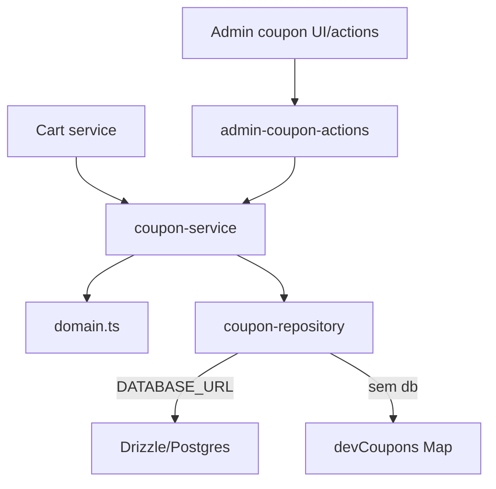

# Coupons, Design Tecnico

> Spec executavel da unit `coupons`. Descreve COMO a implementacao atual organiza dominio puro, service server-only, repository Drizzle/fallback e actions admin protegidas.

## 1. Interface

### 1.1 Tipos centrais

```ts
type CouponType = "percentage" | "fixed_amount" | "free_shipping";
type LegacyCouponType = "percent" | "fixed";
type CouponStatus = "active" | "inactive" | "scheduled" | "expired" | "exhausted";

type Coupon = {
  id: string;
  code: string;
  type: CouponType;
  value: number;
  isActive: boolean;
  startsAt: Date | null;
  endsAt: Date | null;
  maxUses: number | null;
  usedCount: number;
  minimumSubtotalCents: number | null;
  createdAt: Date;
  updatedAt: Date;
};
```

### 1.2 Dominio

```ts
normalizeCouponCode(input: string): string
mapLegacyCouponType(type: LegacyCouponType): CouponType
normalizeCouponType(type: CouponType | LegacyCouponType): CouponType
getCouponStatus(coupon: Coupon, now?: Date): CouponStatus
validateCouponForSubtotal(coupon: Coupon | null, subtotalCents: number, now?: Date): CouponValidationResult
calculateCouponDiscountCents(coupon: Coupon, subtotalCents: number): number
calculateCartCoupon(coupon: Coupon | null, subtotalCents: number, now?: Date): CouponCalculation
toCouponView(coupon: Coupon, now?: Date): CouponView
formatCouponValue(coupon: Pick<Coupon, "type" | "value">): string
```

### 1.3 Service

```ts
findCouponByCode(code: string): Promise<Coupon | null>
findCouponById(id: string | null): Promise<Coupon | null>
validateCouponForCart(input: { code: string; subtotalCents: number; now?: Date }): Promise<CouponValidationResult>
calculateAppliedCoupon(input: { couponId: string | null; subtotalCents: number; now?: Date }): Promise<CouponCalculation>
listAdminCoupons(): Promise<CouponView[]>
createAdminCoupon(input: CouponAdminInput): Promise<CouponMutationResult>
updateAdminCoupon(id: string, input: CouponAdminInput): Promise<CouponMutationResult>
```

### 1.4 Repository

```ts
type CouponRepository = {
  findCouponByNormalizedCode(code: string): Promise<Coupon | null>;
  findCouponById(id: string): Promise<Coupon | null>;
  listCouponsForAdmin(): Promise<Coupon[]>;
  createCoupon(input: CouponAdminInput): Promise<CouponMutationResult>;
  updateCoupon(id: string, input: CouponAdminInput): Promise<CouponMutationResult>;
  incrementUsedCount(id: string): Promise<boolean>;
};
```

## 2. Topologia



## 3. Fluxo Principal: Normalizacao e Status

1. Entrada de codigo passa por `normalizeCouponCode`.
2. Normalizacao executa `trim()` e `toUpperCase()`.
3. Tipos legados podem ser traduzidos:
   - `percent` -> `percentage`;
   - `fixed` -> `fixed_amount`.
4. `getCouponStatus` avalia, nesta ordem:
   - `!isActive` -> `inactive`;
   - `startsAt > now` -> `scheduled`;
   - `endsAt < now` -> `expired`;
   - `maxUses !== null && usedCount >= maxUses` -> `exhausted`;
   - caso contrario -> `active`.

## 4. Fluxo Principal: Validar Cupom para Subtotal

1. Receber `Coupon | null`, subtotal e data opcional.
2. Se cupom e `null`, retornar `coupon_not_found`.
3. Calcular status com `getCouponStatus`.
4. Se status nao e `active`, retornar codigo/mensagem correspondente.
5. Se subtotal <= 0, retornar `coupon_minimum_subtotal_not_met`.
6. Se `minimumSubtotalCents` existe e subtotal e menor, retornar `coupon_minimum_subtotal_not_met`.
7. Validar valor por tipo:
   - percentage: `value > 0 && value <= 100`;
   - fixed_amount: inteiro positivo;
   - free_shipping: `value >= 0`.
8. Se valor invalido, retornar `coupon_invalid_value`.
9. Caso contrario, retornar `{ status: "valid", coupon, messages: [] }`.

## 5. Fluxo Principal: Calcular Desconto

1. Se subtotal <= 0, desconto = 0.
2. Se tipo `percentage`, calcular `round(subtotal * value / 100)`.
3. Se tipo `fixed_amount`, usar `round(value)`.
4. Em ambos os casos, passar por `clampDiscount`.
5. Se tipo `free_shipping`, desconto monetario = 0.

## 6. Fluxo Principal: Calcular Cupom Aplicado

1. Chamar `validateCouponForSubtotal`.
2. Se invalido:
   - retornar `coupon` convertido em view quando existe;
   - `discountCents = 0`;
   - `partialTotalCents = subtotalCents`;
   - mensagens com motivo da invalidade.
3. Se valido:
   - calcular desconto;
   - converter cupom para view;
   - `partialTotalCents = subtotalCents - discountCents`;
   - retornar mensagens de validacao.

## 7. Fluxo Principal: Validar Cupom no Carrinho

1. `validateCouponForCart` verifica runtime.
2. Se nao ha banco e ambiente nao e dev/test:
   - retornar invalid `database_unavailable`;
   - mensagem: "Cupom indisponivel neste ambiente sem banco."
3. Se ambiente permite, buscar cupom por codigo normalizado.
4. Delegar para `validateCouponForSubtotal`.

## 8. Fluxo Principal: Repository Drizzle

Quando `db !== null`, o repository usa tabela `coupons`.

### Busca/listagem

- `findCouponByNormalizedCode` busca `coupons.code`.
- `findCouponById` busca `coupons.id`.
- `listCouponsForAdmin` ordena por codigo ascendente.
- Rows sao convertidas por `toCoupon`.

### Criacao

1. Chamar `assertCanMutateRealData`.
2. Se bloqueado, retornar `status: "blocked"`.
3. Converter input para row:
   - codigo normalizado;
   - tipo;
   - `value` como string para fixed/percent;
   - datas, limites, minimo e ativo.
4. Inserir e retornar cupom persistido.

### Atualizacao

1. Chamar `assertCanMutateRealData`.
2. Se bloqueado, retornar `blocked`.
3. Atualizar campos e `updatedAt`.
4. Se id nao existe, retornar `blocked` com "Cupom nao encontrado.".
5. Retornar cupom atualizado.

### Incremento de uso

1. Executar update atomico `usedCount = usedCount + 1`.
2. Atualizar `updatedAt`.
3. Retornar boolean indicando sucesso.

## 9. Fluxo Principal: Repository Fallback

Quando `db === null`, repository usa `globalThis.__triadeCouponFallbackStore`.

1. Store inicializa a partir de `devCoupons`.
2. Busca por codigo normalizado.
3. Busca por id procurando nos valores.
4. Listagem ordena por codigo.
5. Criacao gera id `coupon-dev-{codigo-normalizado}`.
6. Criacao/atualizacao retornam `status: "dev_fallback"` com mensagem explicita.
7. `incrementUsedCount` atualiza Map em memoria.

## 10. Fluxo Principal: Admin Actions

1. `listCouponsAction`, `createCouponAction` e `updateCouponAction` chamam `requireAdminLike`.
2. Se policy nao permite, converter mensagem para:
   - `blocked` quando mensagem contem "bloqueada";
   - `forbidden` nos demais casos.
3. Create/update convertem FormData para input.
4. Zod valida:
   - codigo;
   - tipo;
   - valor;
   - datas;
   - limite de uso;
   - minimo de subtotal.
5. Em parse invalido, retornar `validation_error`.
6. Codigo e normalizado antes de service.
7. Service cria/atualiza pelo repository.
8. Revalidar `/admin/cupons`.
9. Form actions redirecionam para `/admin/cupons` somente em sucesso.

## 11. Schemas

### Codigo

- string;
- trim;
- minimo 1;
- maximo 64.

### Admin coupon

- `type`: `percentage`, `fixed_amount`, `free_shipping`;
- `value`: numero nao negativo;
- `isActive`: boolean default true;
- `startsAt`, `endsAt`: datas opcionais;
- `maxUses`: inteiro minimo 1 opcional;
- `minimumSubtotalCents`: inteiro minimo 0 opcional.

Validacoes extras:

- percentage precisa ficar entre 1 e 100;
- fixed_amount precisa ser inteiro positivo.

## 12. Views

`toCouponView` produz:

- `id`;
- `code`;
- `type`;
- `status`;
- `valueLabel`;
- `minimumSubtotalCents`;
- `startsAt`;
- `endsAt`;
- `maxUses`;
- `usedCount`;
- `isPreparedBenefit`.

`formatCouponValue`:

- percentage -> `10%`;
- fixed_amount -> BRL;
- free_shipping -> `Frete gratis preparado`.

## 13. Dependencias

- `src/features/coupons/types.ts`
- `src/features/coupons/schemas.ts`
- `src/features/coupons/domain.ts`
- `src/features/coupons/server/coupon-service.ts`
- `src/features/coupons/server/coupon-repository.ts`
- `src/features/coupons/server/coupon-fixtures.ts`
- `src/features/coupons/server/admin-coupon-actions.ts`
- `src/features/auth/server/policies.ts`
- `src/db/schema.ts`
- `src/db/client.ts`
- `src/lib/runtime-mode.ts`
- `src/lib/money.ts`
- `next/cache`
- `next/navigation`

## 14. Decisoes de Design

- Dominio de cupom e puro e independente de banco.
- Service e `server-only` e decide fallback/ambiente.
- Repository seleciona Drizzle ou fallback no factory.
- Fallback e global em memoria para viabilizar dev/test sem banco.
- Admin actions ficam separadas do uso publico no carrinho.
- Mutacao real passa por guardrail antes de escrever no banco.
- `free_shipping` e modelado como beneficio preparado; a aplicacao no frete efetivo ocorre no carrinho.

## 15. Rastreabilidade RF -> Implementacao

| RF | Implementacao |
|----|---------------|
| RF-COUPON-01 | `normalizeCouponCode` |
| RF-COUPON-02 | `mapLegacyCouponType`, `normalizeCouponType` |
| RF-COUPON-03 | `getCouponStatus` active |
| RF-COUPON-04 | `getCouponStatus` inactive/scheduled/expired/exhausted |
| RF-COUPON-05 | `validateCouponForSubtotal` cupom null |
| RF-COUPON-06 | `validateCouponForSubtotal` subtotal/minimum |
| RF-COUPON-07 | `isCouponValueValid` percentage |
| RF-COUPON-08 | `isCouponValueValid` fixed_amount |
| RF-COUPON-09 | `calculateCouponDiscountCents` percentage |
| RF-COUPON-10 | `calculateCouponDiscountCents` fixed_amount |
| RF-COUPON-11 | `calculateCouponDiscountCents`, `toCouponView` |
| RF-COUPON-12 | `calculateCartCoupon` |
| RF-COUPON-13 | `validateCouponForCart` |
| RF-COUPON-14 | branch `database_unavailable` |
| RF-COUPON-15 | `listCouponsAction`, `listAdminCoupons` |
| RF-COUPON-16 | `createCouponAction`, `createAdminCoupon` |
| RF-COUPON-17 | `updateCouponAction`, `updateAdminCoupon` |
| RF-COUPON-18 | `requireAdminLike` em admin actions |
| RF-COUPON-19 | `incrementUsedCount` |

## 16. Riscos e Lacunas

- Nao ha deduplicacao explicita de codigo no service antes de criar cupom; depende do banco/schema ou comportamento do repository.
- Datas parseadas por FormData podem virar `Invalid Date` antes da validacao final.
- Fallback de update recria cupom e reinicia `usedCount`.
- `free_shipping` precisa continuar coordenado com o recalculo do carrinho.
- Incremento de uso deve permanecer acoplado a confirmacao financeira, nao a aplicacao no carrinho.
