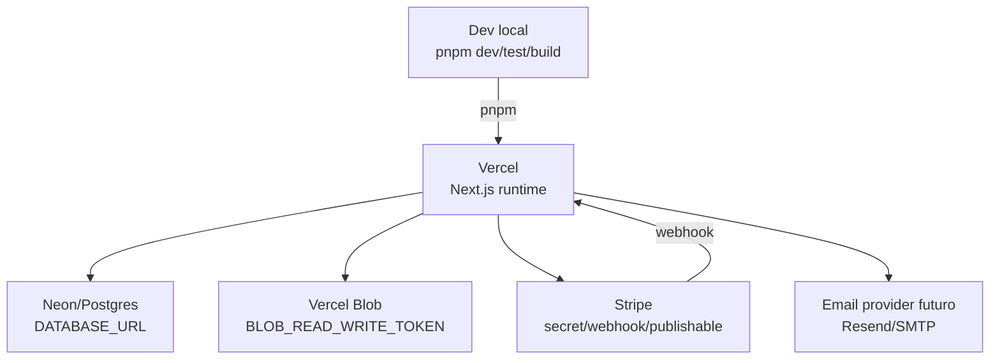

# Deployment - Triade Essenza Next

Atualizado em: 2026-06-11  
Agente: Architect

## Estado Detectado

- 🟢 Config Next presente: `next.config.ts`.
- 🟢 Config Drizzle presente: `drizzle.config.ts`.
- 🟢 Documentação operacional Vercel/Neon/Blob/Stripe existe em `docs/operations`.
- 🟢 `.env.example` define contrato de ambiente.
- 🔴 Não há `.github/workflows`.
- 🔴 Não há `Dockerfile` ou `docker-compose.yml`.

## Infraestrutura Alvo Inferida

## Variáveis Críticas

- `DATABASE_URL`
- `BETTER_AUTH_SECRET`
- `BETTER_AUTH_URL`
- `BLOB_READ_WRITE_TOKEN`
- `STRIPE_SECRET_KEY`
- `STRIPE_WEBHOOK_SECRET`
- `NEXT_PUBLIC_STRIPE_PUBLISHABLE_KEY`
- `ORDER_NOTIFICATION_RECIPIENTS`
- `EMAIL_PROVIDER`
- `EMAIL_FROM`

## Guardrails Operacionais

- 🟢 Sem `DATABASE_URL`, app usa fallback explícito quando permitido.
- 🟢 `db:migrate` exige `DATABASE_URL` por script guardião.
- 🟢 Stripe mock só deve existir em dev/test.
- 🟢 Preview/produção sem provider real falham de modo seguro.
- 🔴 Deploy automático não está configurado neste repositório.
