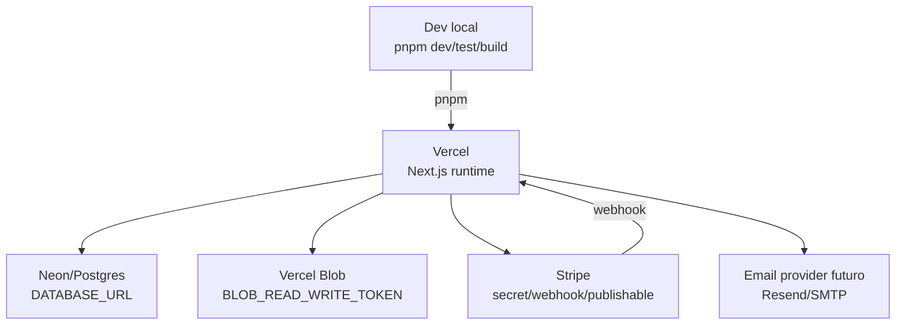

# Deployment - Triade Essenza Next

Atualizado em: 2026-07-02
Agente: Architect

## Estado Detectado

- 🟢 Config Next presente: `next.config.ts`.
- 🟢 Config Drizzle presente: `drizzle.config.ts`.
- 🟢 Documentação operacional Vercel/Neon/Blob/Stripe existe em `docs/operations`.
- 🟢 `.env.example` define contrato de ambiente.
- 🟢 Fase 12 adicionou checklists de producao/go-live e scripts locais seguros `ops:*`.
- 🟢 `pnpm-workspace.yaml` registra dependencias de build aprovadas para execucao local controlada.
- 🔴 Não há `.github/workflows`.
- 🔴 Não há `Dockerfile` ou `docker-compose.yml`.

## Infraestrutura Alvo Inferida

## Variáveis Críticas

- `DATABASE_URL`
- `BETTER_AUTH_SECRET`
- `BETTER_AUTH_URL`
- `BLOB_READ_WRITE_TOKEN`
- `STRIPE_SECRET_KEY`
- `STRIPE_WEBHOOK_SECRET`
- `NEXT_PUBLIC_STRIPE_PUBLISHABLE_KEY`
- `ORDER_NOTIFICATION_RECIPIENTS`
- `EMAIL_PROVIDER`
- `EMAIL_FROM`

## Scripts Operacionais Seguros

| Script | Funcao | Garantia |
| --- | --- | --- |
| `pnpm ops:check-env` | Verifica contrato de variaveis por ambiente | Nao imprime valores e nao conecta rede/banco |
| `pnpm ops:check-migrations` | Analisa `drizzle/*.sql` estaticamente | Nao executa migration e nao le `DATABASE_URL` |
| `pnpm ops:check-build` | Confirma scripts locais esperados | Nao chama Vercel, banco, migration ou provider externo |
| `pnpm ops:check-smoke` | Valida alvo de smoke seguro | Default local e sem pagamento/e-mail/upload real |
| `pnpm ops:check-data-dry-run` | Valida CSV/JSON locais para dados Must | Nao conecta banco, nao importa dados, nao faz upload e nao le `.env` |

## Guardrails Operacionais

- 🟢 Sem `DATABASE_URL`, app usa fallback explícito quando permitido.
- 🟢 `db:migrate` exige `DATABASE_URL` por script guardião.
- 🟢 Stripe mock só deve existir em dev/test.
- 🟢 Preview/produção sem provider real falham de modo seguro.
- 🟢 Deploy/migration real permanecem dependentes de aprovação humana explícita.
- 🟢 Dry-run de dados roda por arquivo local controlado e nao substitui aprovacao humana para import real.
- 🔴 Deploy automático não está configurado neste repositório nem foi executado nesta re-extração.

## Estado Pos-Fase 12

- Commit funcional de referencia: `ee26749 feat: prepare production migration readiness`.
- Validações reportadas: `pnpm lint`, `pnpm typecheck`, `pnpm test`, `pnpm build`, `pnpm test:e2e` e `pnpm ops:*`.
- Go-live ainda e fase posterior: requer envs reais nos providers, backup, smoke controlado, decisão avançar/abortar e rollback.

## Estado Pos-Fase 13

- Commit funcional de referencia: `9ad10b4 feat: add legacy parity and migration readiness`.
- Validacoes reportadas: `pnpm lint`, `pnpm typecheck`, `pnpm test` (37 arquivos / 108 testes), `pnpm build` e `pnpm test:e2e` (36 testes).
- Go-live real permanece bloqueado por dados: catalogo real, imagens, precos, estoque, cupons ativos e frete minimo precisam de dry-run/reconciliacao aprovados.
- Dry-run controlado ainda depende de fonte de dados aprovada e ambiente isolado; import real, migration real, banco real e deploy continuam proibidos sem aprovacao humana explicita.
- Rollback: Laravel legado deve permanecer intacto e disponivel para consulta/retorno operacional ate aceite formal pos-cutover.

## Estado Pos-Fase 14

- Commit funcional de referencia: `cc19f27 feat: add controlled data dry-run readiness`.
- Validacoes reportadas: `pnpm lint`, `pnpm typecheck`, `pnpm test` (43 arquivos / 121 testes), `pnpm build`, `pnpm test:e2e` (36 testes) e `pnpm ops:check-data-dry-run`.
- `ops:check-data-dry-run` passou com exemplos sinteticos: fonte `data/dry-run/input/examples`, resultado `go`, 0 bloqueadores e 0 avisos.
- A pasta `data/dry-run/input/` fica preparada para arquivos locais aprovados, mas dados reais sensiveis nao devem ser versionados.
- A pasta `data/dry-run/output/` recebe relatorios locais e fica ignorada pelo Git.
- Go-live real permanece bloqueado ate dry-run/reconciliacao com fonte real aprovada, checklist humano e decisao de corte.
