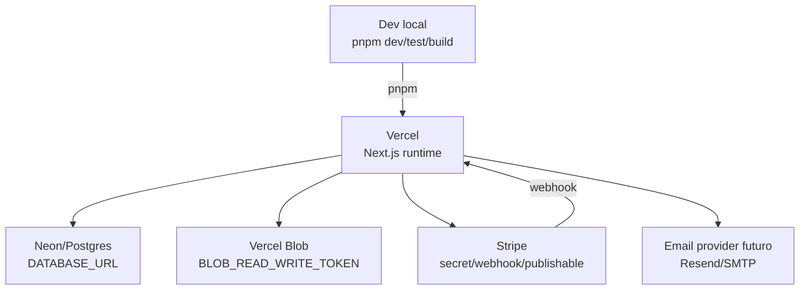

# Deployment - Triade Essenza Next

Atualizado em: 2026-07-03
Agente: Architect

## Estado Detectado

- 🟢 Config Next presente: `next.config.ts`.
- 🟢 Config Drizzle presente: `drizzle.config.ts`.
- 🟢 Documentação operacional Vercel/Neon/Blob/Stripe existe em `docs/operations`.
- 🟢 `.env.example` define contrato de ambiente.
- 🟢 Fase 12 adicionou checklists de producao/go-live e scripts locais seguros `ops:*`.
- 🟢 `pnpm-workspace.yaml` registra dependencias de build aprovadas para execucao local controlada.
- 🔴 Não há `.github/workflows`.
- 🔴 Não há `Dockerfile` ou `docker-compose.yml`.

## Infraestrutura Alvo Inferida

## Variáveis Críticas

- `DATABASE_URL`
- `BETTER_AUTH_SECRET`
- `BETTER_AUTH_URL`
- `BLOB_READ_WRITE_TOKEN`
- `STRIPE_SECRET_KEY`
- `STRIPE_WEBHOOK_SECRET`
- `NEXT_PUBLIC_STRIPE_PUBLISHABLE_KEY`
- `ORDER_NOTIFICATION_RECIPIENTS`
- `EMAIL_PROVIDER`
- `EMAIL_FROM`
- `STAGING_DATABASE_URL` (somente staging/dev remoto; nunca imprimir valor)
- `STAGING_IMPORT_SMOKE_URL` (somente smoke staging aprovado)
- `STAGING_SMOKE_URL` (somente smoke staging/preview aprovado; ausencia deve virar `pending-config`)

## Scripts Operacionais Seguros

| Script | Funcao | Garantia |
| --- | --- | --- |
| `pnpm ops:check-env` | Verifica contrato de variaveis por ambiente | Nao imprime valores e nao conecta rede/banco |
| `pnpm ops:check-migrations` | Analisa `drizzle/*.sql` estaticamente | Nao executa migration e nao le `DATABASE_URL` |
| `pnpm ops:check-build` | Confirma scripts locais esperados | Nao chama Vercel, banco, migration ou provider externo |
| `pnpm ops:check-smoke` | Valida alvo de smoke seguro | Default local e sem pagamento/e-mail/upload real |
| `pnpm ops:check-data-dry-run` | Valida CSV/JSON locais para dados Must | Nao conecta banco, nao importa dados, nao faz upload e nao le `.env` |
| `pnpm ops:import-staging` | Prepara/executa importacao staging/dev remoto aprovada | Bloqueia producao, exige preflight verde, aprovacao humana e nao imprime URL/secret |
| `pnpm ops:check-staging-import-smoke` | Smoke pos-importacao em URL staging aprovada | Sem URL retorna skipped esperado; nao faz deploy, migration ou import |
| `pnpm ops:check-staging-smoke` | Smoke real de staging/preview e go-live readiness | Sem URL/env/webhook retorna `pending-config`; bloqueia producao e Stripe live mode |

## Guardrails Operacionais

- 🟢 Sem `DATABASE_URL`, app usa fallback explícito quando permitido.
- 🟢 `db:migrate` exige `DATABASE_URL` por script guardião.
- 🟢 Stripe mock só deve existir em dev/test.
- 🟢 Preview/produção sem provider real falham de modo seguro.
- 🟢 Deploy/migration real permanecem dependentes de aprovação humana explícita.
- 🟢 Dry-run de dados roda por arquivo local controlado e nao substitui aprovacao humana para import real.
- 🟢 Importacao staging e restrita a staging/dev remoto; producao deve ser bloqueada tecnicamente.
- 🟢 Reset de staging exige backup/snapshot, flag explicita, aprovacao humana e ambiente nao produtivo.
- 🔴 Deploy automático não está configurado neste repositório nem foi executado nesta re-extração.

## Estado Pos-Fase 12

- Commit funcional de referencia: `ee26749 feat: prepare production migration readiness`.
- Validações reportadas: `pnpm lint`, `pnpm typecheck`, `pnpm test`, `pnpm build`, `pnpm test:e2e` e `pnpm ops:*`.
- Go-live ainda e fase posterior: requer envs reais nos providers, backup, smoke controlado, decisão avançar/abortar e rollback.

## Estado Pos-Fase 13

- Commit funcional de referencia: `9ad10b4 feat: add legacy parity and migration readiness`.
- Validacoes reportadas: `pnpm lint`, `pnpm typecheck`, `pnpm test` (37 arquivos / 108 testes), `pnpm build` e `pnpm test:e2e` (36 testes).
- Go-live real permanece bloqueado por dados: catalogo real, imagens, precos, estoque, cupons ativos e frete minimo precisam de dry-run/reconciliacao aprovados.
- Dry-run controlado ainda depende de fonte de dados aprovada e ambiente isolado; import real, migration real, banco real e deploy continuam proibidos sem aprovacao humana explicita.
- Rollback: Laravel legado deve permanecer intacto e disponivel para consulta/retorno operacional ate aceite formal pos-cutover.

## Estado Pos-Fase 14

- Commit funcional de referencia: `cc19f27 feat: add controlled data dry-run readiness`.
- Validacoes reportadas: `pnpm lint`, `pnpm typecheck`, `pnpm test` (43 arquivos / 121 testes), `pnpm build`, `pnpm test:e2e` (36 testes) e `pnpm ops:check-data-dry-run`.
- `ops:check-data-dry-run` passou com exemplos sinteticos: fonte `data/dry-run/input/examples`, resultado `go`, 0 bloqueadores e 0 avisos.
- A pasta `data/dry-run/input/` fica preparada para arquivos locais aprovados, mas dados reais sensiveis nao devem ser versionados.
- A pasta `data/dry-run/output/` recebe relatorios locais e fica ignorada pelo Git.
- Go-live real permanece bloqueado ate dry-run/reconciliacao com fonte real aprovada, checklist humano e decisao de corte.

## Estado Pos-Fase 15

- Commit funcional de referencia: `9c2b77d feat: implement approved data dry run`.
- A execucao aprovada inicial e `data/dry-run/input/primeira-execucao/`.
- Sem arquivos reais/exportados nessa pasta, o comando seguro retorna `pending-input`, gera relatorio de pendencia e preserva exit code de sucesso operacional.
- Com arquivos aprovados presentes, o mesmo comando executa dry-run em memoria, gera relatorios em `data/dry-run/output/<execucao>-<status>/` e classifica divergencias por origem.
- `data/dry-run/input/primeira-execucao/` e `data/dry-run/output/` permanecem ignorados pelo Git para evitar versionar dados reais ou relatorios brutos.
- Nenhum deploy, migration real, conexao com banco real, importacao real, upload real, segredo ou alteracao no Laravel legado foi executado.

## Estado Pos-Fase 16

- Commit funcional de referencia: `b7f871b feat: implement approved staging import`.
- `pnpm ops:import-staging` prepara importacao controlada em staging/dev remoto com preflight de arquivos aprovados, dry-run go/no-go, aprovacao humana e backup/snapshot quando necessario.
- Sem arquivos aprovados, sem `STAGING_DATABASE_URL`, sem aprovacao humana ou sem backup exigido, a operacao fica bloqueada/pending-input e nao conecta banco.
- O modo padrao e upsert seguro; reset/limpeza de staging so com backup confirmado, flag explicita, aprovacao humana e alvo nao produtivo.
- `pnpm ops:check-staging-import-smoke` cobre smoke pos-importacao; sem `STAGING_IMPORT_SMOKE_URL`, o E2E fica com 1 skipped esperado.
- Validacoes reportadas: `pnpm lint`, `pnpm typecheck`, `pnpm test` (48 arquivos / 138 testes), `pnpm build` e `pnpm test:e2e` (36 passed / 1 skipped).
- Nenhuma producao, deploy, migration real, banco real, segredo, push automatico ou alteracao no Laravel legado foi executada por este estado.

## Estado Pos-Fase 17

- Commit funcional de referencia: `c8b752f feat: implement staging smoke readiness`.
- `pnpm ops:check-staging-smoke` prepara smoke real de staging/preview e readiness de go-live sem executar deploy final.
- Ausencia de `STAGING_SMOKE_URL`, envs remotas ou Stripe test webhook retorna `pending-config`, com relatorio de pendencia e sem depender de credenciais reais para validacoes locais.
- Ausencia de arquivos aprovados para import staging smoke retorna `pending-input`, sem conectar banco e sem importacao.
- O smoke cobre home, catalogo, produto, carrinho, checkout em modo teste, pedido, admin e notificacoes/outbox quando houver ambiente aprovado.
- Producao, Stripe live mode, migration em producao, banco de producao e go-live definitivo continuam fora do fluxo e devem ser bloqueados.
- Commit visual de referencia: `547146a feat: apply triade visual identity`.
- O storefront publico foi alinhado ao manual Triade com paleta verde profundo/dourado, logo horizontal, hero com frasco premium, rodape institucional e vitrine de tres perfumes sinteticos.
- Validacoes reportadas apos identidade visual: `pnpm lint`, `pnpm typecheck`, `pnpm test` (50 arquivos / 144 testes), `pnpm build` e `pnpm test:e2e` (36 passed / 2 skipped esperados).
- Nenhum deploy, migration real, banco real, segredo, push automatico ou alteracao no Laravel legado foi executado nesta re-extracao.
