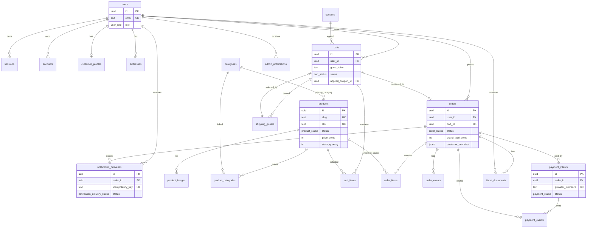

# ERD Complete - Triade Essenza Next

```mermaid
erDiagram
  users ||--o{ sessions : owns
  users ||--o{ accounts : owns
  users ||--o| customer_profiles : has
  users ||--o{ addresses : has
  users ||--o{ carts : owns
  users ||--o{ orders : places
  users ||--o{ notification_deliveries : receives

  categories ||--o{ products : primary_category
  products ||--o{ product_images : has
  products ||--o{ product_categories : linked
  categories ||--o{ product_categories : linked

  carts ||--o{ cart_items : contains
  products ||--o{ cart_items : selected
  coupons ||--o{ carts : applied
  carts ||--o{ shipping_quotes : quoted
  shipping_quotes ||--o| carts : selected_by

  carts ||--o| orders : converted_to
  orders ||--o{ order_items : contains
  products ||--o{ order_items : snapshot_source
  orders ||--o{ order_events : has

  orders ||--o{ payment_intents : paid_by
  payment_intents ||--o{ payment_events : emits
  orders ||--o{ payment_events : related

  orders ||--o{ notification_deliveries : triggers
  orders ||--o{ fiscal_documents : has
  users ||--o{ fiscal_documents : customer
  users ||--o{ admin_notifications : receives

  users {
    uuid id PK
    text email UK
    user_role role
  }
  products {
    uuid id PK
    text slug UK
    text sku UK
    product_status status
    int price_cents
    int stock_quantity
  }
  carts {
    uuid id PK
    uuid user_id FK
    text guest_token
    cart_status status
    uuid applied_coupon_id FK
  }
  orders {
    uuid id PK
    uuid user_id FK
    uuid cart_id UK
    order_status status
    int grand_total_cents
    jsonb customer_snapshot
  }
  payment_intents {
    uuid id PK
    uuid order_id FK
    text provider_reference UK
    payment_status status
  }
  notification_deliveries {
    uuid id PK
    uuid order_id FK
    text idempotency_key UK
    notification_delivery_status status
  }
```
