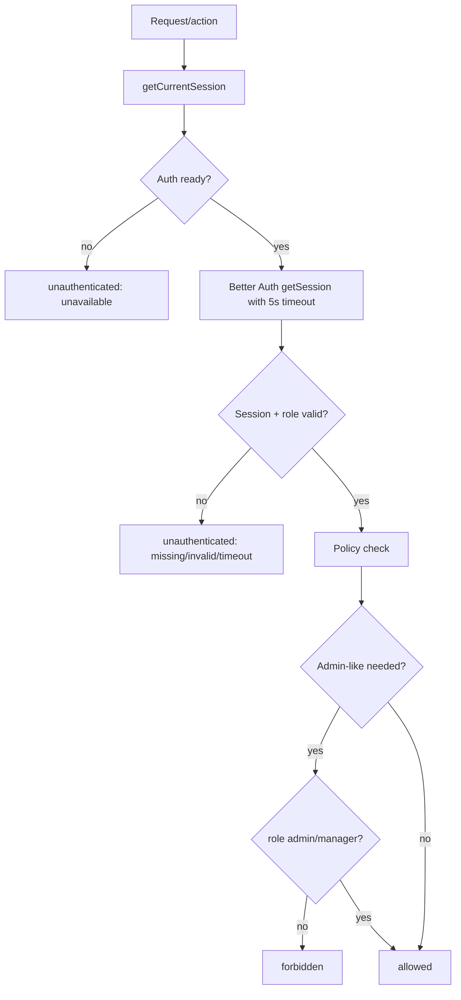

# Flowchart - auth

```mermaid
flowchart TD
  A["Request/action"] --> B["getCurrentSession"]
  B --> C{"Auth ready?"}
  C -- "no" --> U["unauthenticated: unavailable"]
  C -- "yes" --> D["Better Auth getSession with 5s timeout"]
  D --> E{"Session + role valid?"}
  E -- "no" --> V["unauthenticated: missing/invalid/timeout"]
  E -- "yes" --> F["Policy check"]
  F --> G{"Admin-like needed?"}
  G -- "yes" --> H{"role admin/manager?"}
  H -- "no" --> I["forbidden"]
  H -- "yes" --> J["allowed"]
  G -- "no" --> J
```
