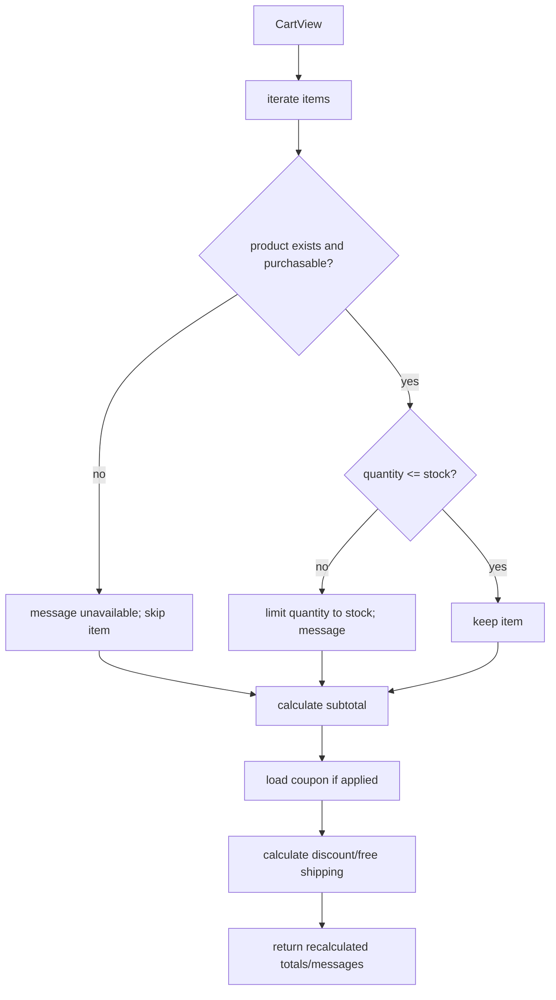

# Flowchart - cart.recalculateCartView

```mermaid
flowchart TD
  A["CartView"] --> B["iterate items"]
  B --> C{"product exists and purchasable?"}
  C -- "no" --> D["message unavailable; skip item"]
  C -- "yes" --> E{"quantity <= stock?"}
  E -- "no" --> F["limit quantity to stock; message"]
  E -- "yes" --> G["keep item"]
  D --> H["calculate subtotal"]
  F --> H
  G --> H
  H --> I["load coupon if applied"]
  I --> J["calculate discount/free shipping"]
  J --> K["return recalculated totals/messages"]
```
