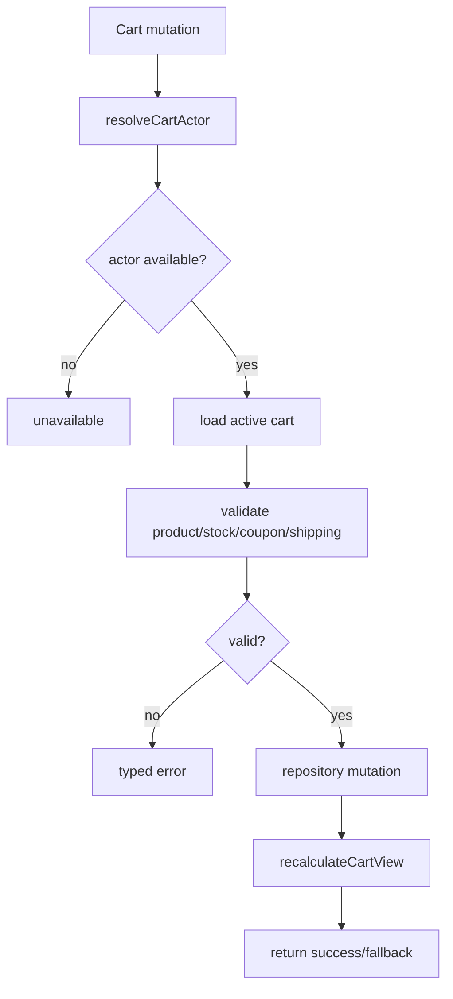

# Flowchart - cart

```mermaid
flowchart TD
  A["Cart mutation"] --> B["resolveCartActor"]
  B --> C{"actor available?"}
  C -- "no" --> U["unavailable"]
  C -- "yes" --> D["load active cart"]
  D --> E["validate product/stock/coupon/shipping"]
  E --> F{"valid?"}
  F -- "no" --> G["typed error"]
  F -- "yes" --> H["repository mutation"]
  H --> I["recalculateCartView"]
  I --> J["return success/fallback"]
```
