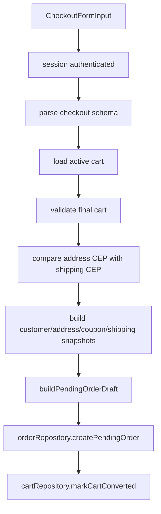

# Flowchart - checkout.createPendingCheckoutOrder

```mermaid
flowchart TD
  A["CheckoutFormInput"] --> B["session authenticated"]
  B --> C["parse checkout schema"]
  C --> D["load active cart"]
  D --> E["validate final cart"]
  E --> F["compare address CEP with shipping CEP"]
  F --> G["build customer/address/coupon/shipping snapshots"]
  G --> H["buildPendingOrderDraft"]
  H --> I["orderRepository.createPendingOrder"]
  I --> J["cartRepository.markCartConverted"]
```
