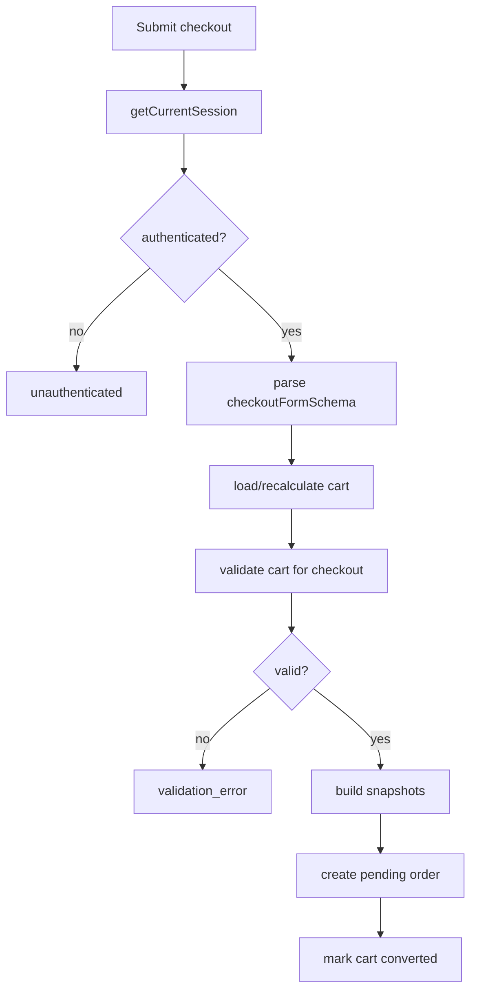

# Flowchart - checkout

```mermaid
flowchart TD
  A["Submit checkout"] --> B["getCurrentSession"]
  B --> C{"authenticated?"}
  C -- "no" --> U["unauthenticated"]
  C -- "yes" --> D["parse checkoutFormSchema"]
  D --> E["load/recalculate cart"]
  E --> F["validate cart for checkout"]
  F --> G{"valid?"}
  G -- "no" --> X["validation_error"]
  G -- "yes" --> H["build snapshots"]
  H --> I["create pending order"]
  I --> J["mark cart converted"]
```
