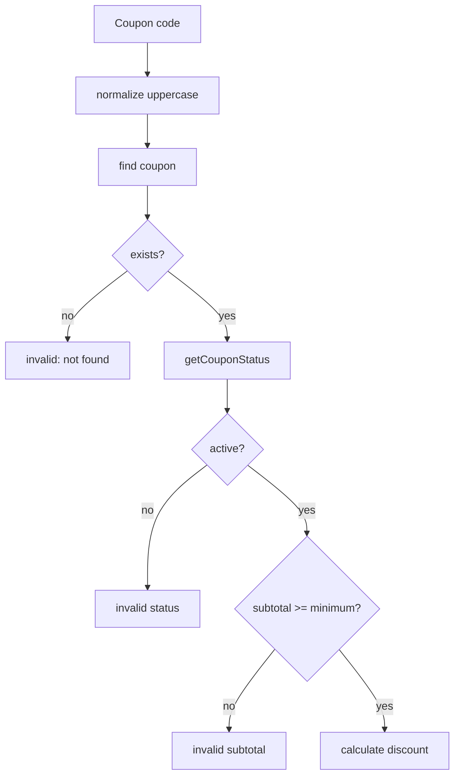

# Flowchart - coupons

```mermaid
flowchart TD
  A["Coupon code"] --> B["normalize uppercase"]
  B --> C["find coupon"]
  C --> D{"exists?"}
  D -- "no" --> X["invalid: not found"]
  D -- "yes" --> E["getCouponStatus"]
  E --> F{"active?"}
  F -- "no" --> Y["invalid status"]
  F -- "yes" --> G{"subtotal >= minimum?"}
  G -- "no" --> Z["invalid subtotal"]
  G -- "yes" --> H["calculate discount"]
```
