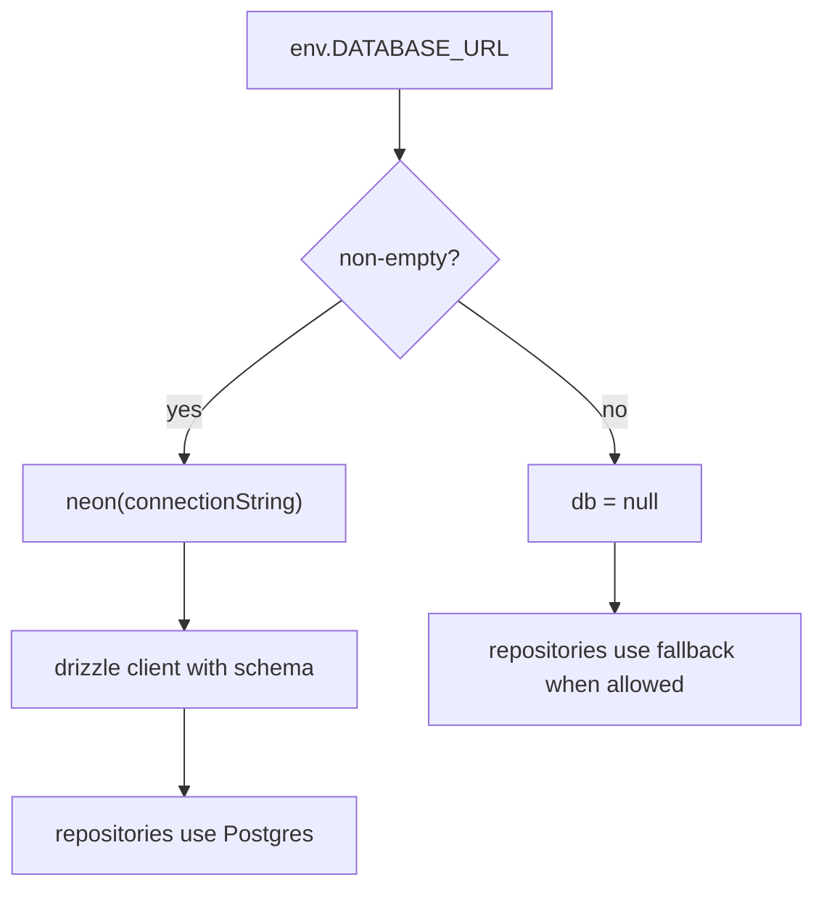

# Flowchart - db

```mermaid
flowchart TD
  A["env.DATABASE_URL"] --> B{"non-empty?"}
  B -- "no" --> C["db = null"]
  B -- "yes" --> D["neon(connectionString)"]
  D --> E["drizzle client with schema"]
  C --> F["repositories use fallback when allowed"]
  E --> G["repositories use Postgres"]
```
