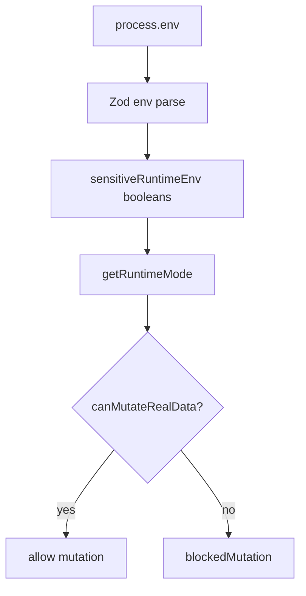

# Flowchart - lib

```mermaid
flowchart TD
  A["process.env"] --> B["Zod env parse"]
  B --> C["sensitiveRuntimeEnv booleans"]
  C --> D["getRuntimeMode"]
  D --> E{"canMutateRealData?"}
  E -- "yes" --> F["allow mutation"]
  E -- "no" --> G["blockedMutation"]
```
