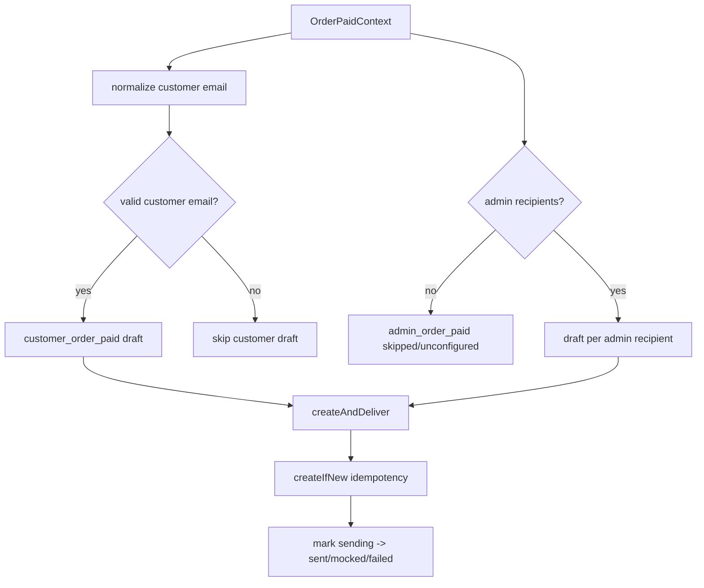

# Flowchart - notifications.processOrderPaid

```mermaid
flowchart TD
  A["OrderPaidContext"] --> B["normalize customer email"]
  B --> C{"valid customer email?"}
  C -- "yes" --> D["customer_order_paid draft"]
  C -- "no" --> E["skip customer draft"]
  D --> F["createAndDeliver"]
  A --> G{"admin recipients?"}
  G -- "no" --> H["admin_order_paid skipped/unconfigured"]
  G -- "yes" --> I["draft per admin recipient"]
  I --> F
  F --> J["createIfNew idempotency"]
  J --> K["mark sending -> sent/mocked/failed"]
```
