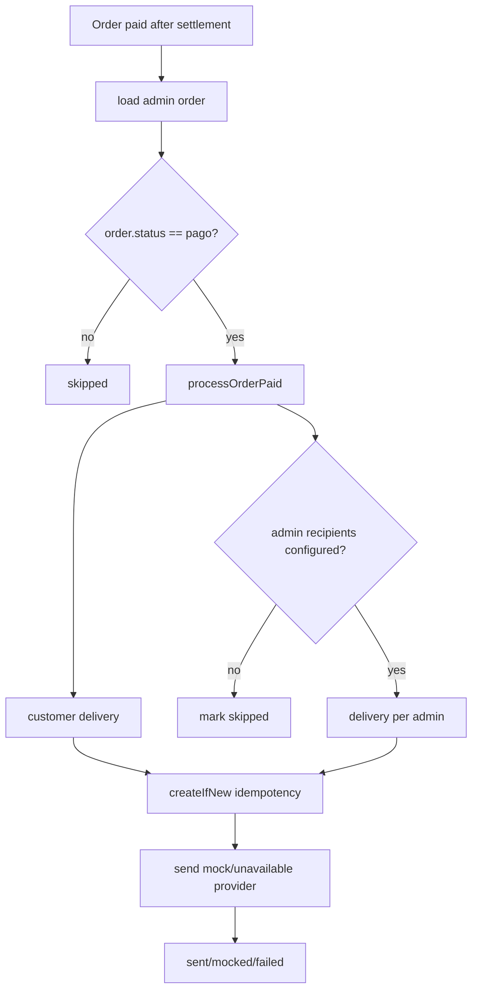

# Flowchart - notifications

```mermaid
flowchart TD
  A["Order paid after settlement"] --> B["load admin order"]
  B --> C{"order.status == pago?"}
  C -- "no" --> X["skipped"]
  C -- "yes" --> D["processOrderPaid"]
  D --> E["customer delivery"]
  D --> F{"admin recipients configured?"}
  F -- "no" --> G["mark skipped"]
  F -- "yes" --> H["delivery per admin"]
  E --> I["createIfNew idempotency"]
  H --> I
  I --> J["send mock/unavailable provider"]
  J --> K["sent/mocked/failed"]
```
