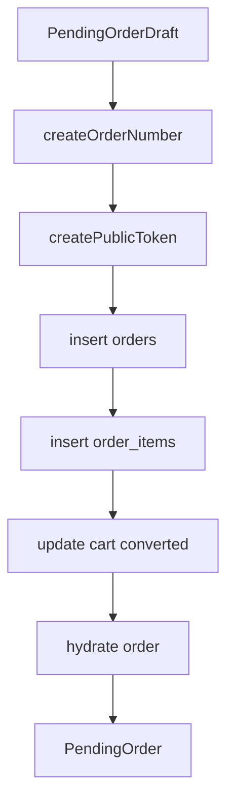

# Flowchart - orders

```mermaid
flowchart TD
  A["PendingOrderDraft"] --> B["createOrderNumber"]
  B --> C["createPublicToken"]
  C --> D["insert orders"]
  D --> E["insert order_items"]
  E --> F["update cart converted"]
  F --> G["hydrate order"]
  G --> H["PendingOrder"]
```
