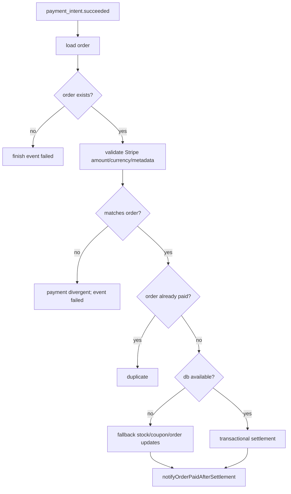

# Flowchart - payments.settleSucceededPayment

```mermaid
flowchart TD
  A["payment_intent.succeeded"] --> B["load order"]
  B --> C{"order exists?"}
  C -- "no" --> X["finish event failed"]
  C -- "yes" --> D["validate Stripe amount/currency/metadata"]
  D --> E{"matches order?"}
  E -- "no" --> Y["payment divergent; event failed"]
  E -- "yes" --> F{"order already paid?"}
  F -- "yes" --> Z["duplicate"]
  F -- "no" --> G{"db available?"}
  G -- "no" --> H["fallback stock/coupon/order updates"]
  G -- "yes" --> I["transactional settlement"]
  H --> J["notifyOrderPaidAfterSettlement"]
  I --> J
```
