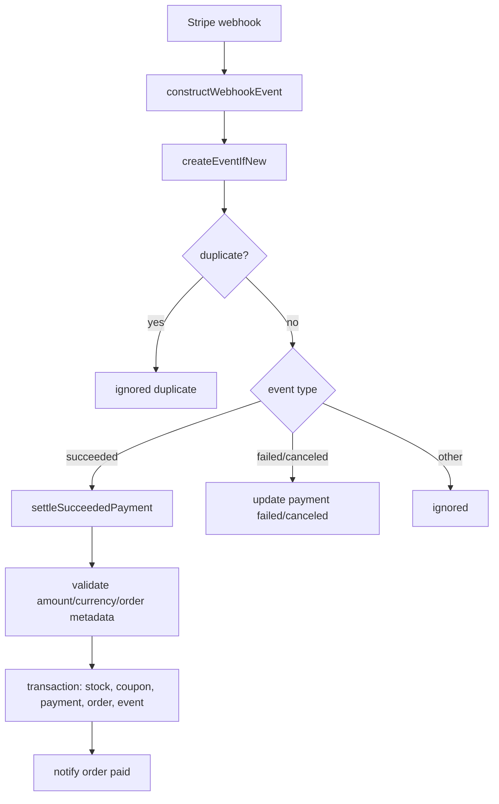

# Flowchart - payments

```mermaid
flowchart TD
  A["Stripe webhook"] --> B["constructWebhookEvent"]
  B --> C["createEventIfNew"]
  C --> D{"duplicate?"}
  D -- "yes" --> E["ignored duplicate"]
  D -- "no" --> F{"event type"}
  F -- "succeeded" --> G["settleSucceededPayment"]
  F -- "failed/canceled" --> H["update payment failed/canceled"]
  F -- "other" --> I["ignored"]
  G --> J["validate amount/currency/order metadata"]
  J --> K["transaction: stock, coupon, payment, order, event"]
  K --> L["notify order paid"]
```
