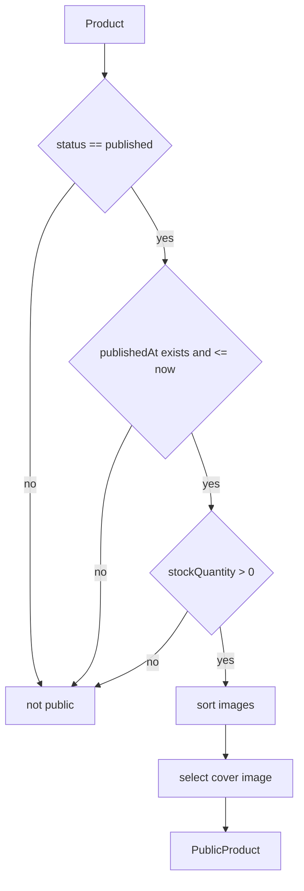

# Flowchart - products

```mermaid
flowchart TD
  A["Product"] --> B{"status == published"}
  B -- "no" --> X["not public"]
  B -- "yes" --> C{"publishedAt exists and <= now"}
  C -- "no" --> X
  C -- "yes" --> D{"stockQuantity > 0"}
  D -- "no" --> X
  D -- "yes" --> E["sort images"]
  E --> F["select cover image"]
  F --> G["PublicProduct"]
```
