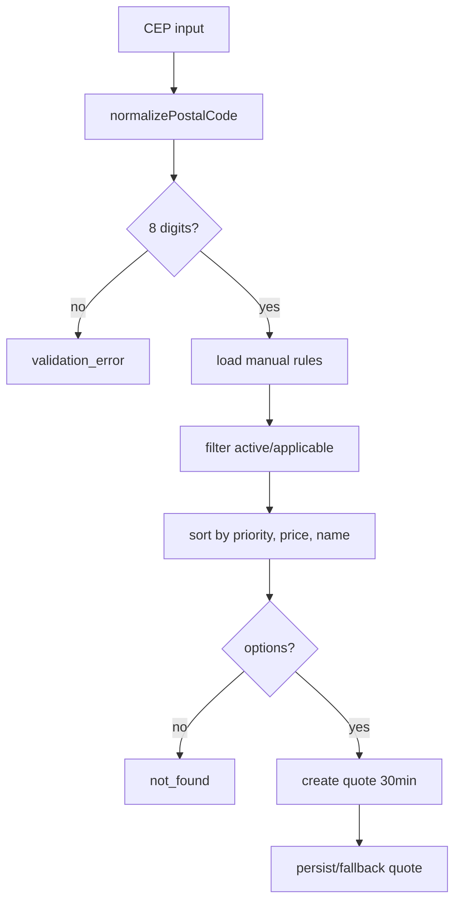

# Flowchart - shipping

```mermaid
flowchart TD
  A["CEP input"] --> B["normalizePostalCode"]
  B --> C{"8 digits?"}
  C -- "no" --> X["validation_error"]
  C -- "yes" --> D["load manual rules"]
  D --> E["filter active/applicable"]
  E --> F["sort by priority, price, name"]
  F --> G{"options?"}
  G -- "no" --> H["not_found"]
  G -- "yes" --> I["create quote 30min"]
  I --> J["persist/fallback quote"]
```
