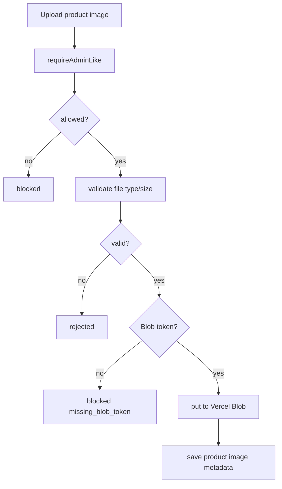

# Flowchart - uploads

```mermaid
flowchart TD
  A["Upload product image"] --> B["requireAdminLike"]
  B --> C{"allowed?"}
  C -- "no" --> X["blocked"]
  C -- "yes" --> D["validate file type/size"]
  D --> E{"valid?"}
  E -- "no" --> Y["rejected"]
  E -- "yes" --> F{"Blob token?"}
  F -- "no" --> Z["blocked missing_blob_token"]
  F -- "yes" --> G["put to Vercel Blob"]
  G --> H["save product image metadata"]
```
