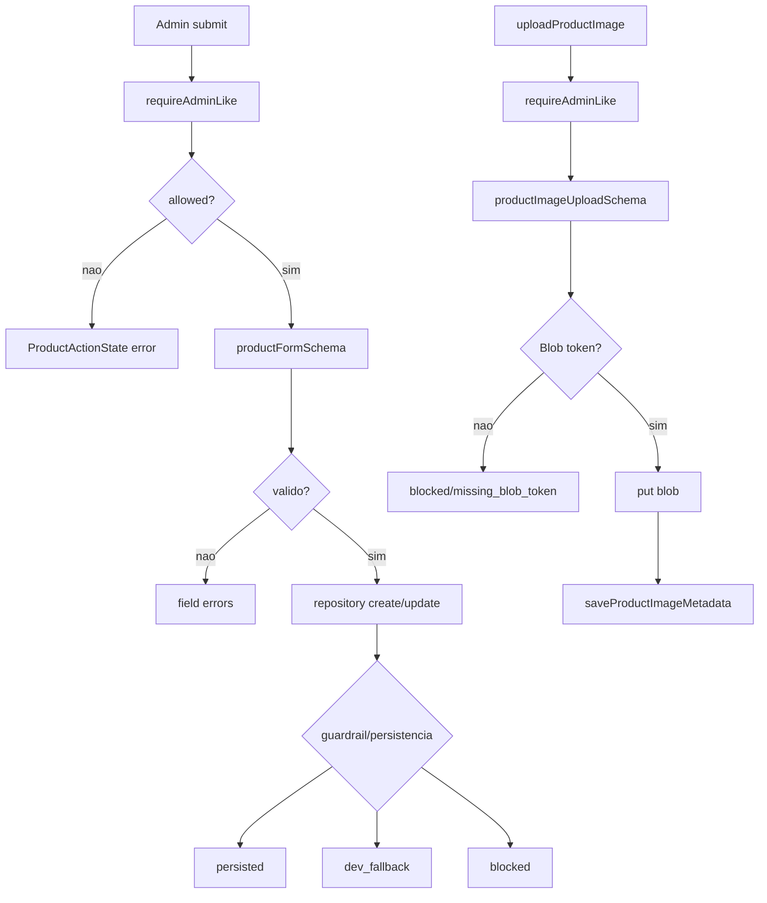

# Products / Admin Produtos e Imagens, Design Tecnico

> Spec executavel da subunidade `products/admin-produtos-imagens`. Foca no COMO a administracao de produtos e imagens e construida.

## Interface

### Rotas Admin

| Rota | Arquivo | Entrada | Saida | Observacao |
|------|---------|---------|-------|------------|
| `/admin/produtos` | `src/app/admin/produtos/page.tsx` | Sessao admin-like via layout | `ProductAdminTable` e avisos de runtime | Lista todos os produtos admin. |
| `/admin/produtos/novo` | `src/app/admin/produtos/novo/page.tsx` | Sessao admin-like via layout | `ProductForm` de criacao | Usa `createProductAction`. |
| `/admin/produtos/[id]/editar` | `src/app/admin/produtos/[id]/editar/page.tsx` | `params.id`, sessao admin-like | `ProductForm` de edicao ou `notFound` | Usa `updateProductAction.bind(null, id)`. |

### Componentes

| Simbolo | Props | Saida | Observacao |
|---------|-------|-------|------------|
| `ProductAdminTable` | `{ products: Product[] }` | Tabela admin | Nome, SKU, status, estoque, preco e link editar. |
| `ProductForm` | `{ product?, categories, action, submitLabel }` | Formulario client | Usa `useActionState` e divide o cadastro em paineis. |
| `PriceInput` | `{ name, label, defaultValueCents?, required? }` | Input decimal | Exibe centavos como valor decimal. |
| `ProductStatusSelect` | `{ defaultValue? }` | Select de status | Opcoes visuais incluem arquivado, persistindo `inactive`. |
| `ProductStatusBadge` | `{ product }` | Badge de status | `draft`, `published`, `inactive`. |
| `ProductImageManager` | `{ images }` | Painel de imagens | Upload input atualmente desabilitado; lista capa/galeria. |

### Actions e Upload

| Simbolo | Entrada | Saida | Observacao |
|---------|---------|-------|------------|
| `createProductAction` | `FormData` | `ProductActionState` | Exige `requireAdminLike`, valida e cria. |
| `updateProductAction` | `id`, `FormData` | `ProductActionState` | Exige `requireAdminLike`, valida e atualiza. |
| `uploadProductImage` | `{ productId, file, altText?, sortOrder?, isCover?, width?, height? }` | `ProductImageUploadResult` | Exige admin-like, valida arquivo, envia ao Blob e salva metadata. |

## Fluxo Principal: Listagem Admin

1. `AdminProdutosPage` executa dentro do layout admin.
2. Carrega `listAdminProducts()` e `getProductRuntimeMode()` em paralelo.
3. Renderiza intro com CTA `Novo produto`.
4. `AdminRuntimeNotices` mostra `databaseNotice` e/ou `adminAuthNotice`.
5. `ProductAdminTable` renderiza tabela com rows de produto.
6. Cada row mostra nome, SKU, status visual, estoque, preco e link de edicao.

## Fluxo Principal: Novo Produto

1. `NovoProdutoPage` carrega categorias e runtime mode em paralelo.
2. Renderiza avisos de banco/auth se existirem.
3. Renderiza `ProductForm` sem produto inicial.
4. `ProductForm` inicia estado `{ status: "idle", message: "" }` via `useActionState`.
5. Usuario preenche dados principais, comercial, categorias/SEO e visualiza painel de imagens.
6. Submit chama `createProductAction`.
7. Action chama `requireAdminLike`.
8. Se policy falhar, retorna erro seguro.
9. Se policy permitir, converte FormData com `productFormDataToObject`.
10. Valida `productFormSchema`.
11. Service chama repository `createProduct`.
12. Action revalida `/admin/produtos` e `/produtos`.
13. Retorna mensagem de sucesso, fallback ou bloqueio.

## Fluxo Principal: Editar Produto

1. `EditarProdutoPage` resolve `params.id`.
2. Carrega produto admin, categorias e runtime mode em paralelo.
3. Produto ausente chama `notFound()`.
4. Renderiza `ProductForm` com valores iniciais.
5. Action usada e `updateProductAction.bind(null, id)`.
6. Submit segue a mesma sequencia de policy, schema, repository e revalidacao.
7. Update revalida `/admin/produtos`, pagina de edicao e `/produtos`.

## Fluxo Principal: Formulario Admin

1. Painel `Dados principais` coleta nome, slug, SKU, status, genero, volume, descricoes.
2. Painel `Comercial` coleta preco, compare-at, custo, estoque, low-stock, `publishedAt` e destaque.
3. Painel `Categorias e SEO` coleta categorias ativas, marca, inspiracao, concentracao, SEO title/description.
4. Categorias inativas aparecem com checkbox desabilitado.
5. `ProductImageManager` mostra upload desabilitado e lista imagens existentes.
6. Estado de action renderiza mensagem `form-message--{status}`.
7. Erros de campo aparecem junto aos campos/painel aplicavel.

## Fluxo Principal: Upload de Imagem

1. Chamador invoca `uploadProductImage`.
2. Service chama `requireAdminLike`.
3. Se policy falhar, retorna `blocked` com reason mapeado e `policyMessage`.
4. Valida `productImageUploadSchema` com tipo e tamanho.
5. Sem `BLOB_READ_WRITE_TOKEN`, retorna `blocked/missing_blob_token`.
6. Monta pathname `products/{productId}/{uuid}-{file.name}`.
7. Envia arquivo via `@vercel/blob.put` com access publico.
8. Salva metadata via `createProductRepository().saveProductImageMetadata`.
9. Retorna dados do blob e resultado da metadata.

## Fluxo Principal: Metadata de Imagem

1. Repository Drizzle recebe metadata do upload.
2. Verifica `assertCanMutateRealData`.
3. Se bloqueado, retorna `blocked`.
4. Em transacao, se `isCover=true`, atualiza imagens do produto para `isCover=false`.
5. Insere nova linha em `product_images`.
6. Retorna `persisted` com `imageId`.
7. Repository fixture retorna `dev_fallback` sem persistencia real.

## Fluxos Alternativos

- **Policy falha em action de produto:** retorna `ProductActionState.error` com `policyMessage`.
- **Schema de produto falha:** action retorna `Revise os campos destacados antes de salvar.` e mapa de erros.
- **Produto publicado invalido:** schema adiciona issue em `status`.
- **Runtime sem banco:** paginas exibem aviso; repository retorna `dev_fallback`.
- **Mutation guardrail bloqueia:** repository retorna `blocked`; action converte para erro.
- **Arquivo de upload invalido:** retorna `rejected/invalid_file`.
- **Blob token ausente:** retorna `blocked/missing_blob_token`.
- **Id admin inexistente:** pagina de edicao chama `notFound`.

## Dependencias

- `src/features/auth/server/policies.ts`: `requireAdminLike` e `policyMessage`.
- `src/lib/runtime-mode.ts`: mensagens e guardrails de mutacao real.
- `src/lib/env.ts`: `BLOB_READ_WRITE_TOKEN`.
- `@vercel/blob`: upload real de arquivo.
- `src/features/products/schemas.ts`: schema de produto admin.
- `src/features/uploads/schemas.ts`: schema de upload de imagem.
- `src/features/products/server/product-repository.ts`: persistencia de produto/categoria/imagem.
- `next/cache`: `revalidatePath`.
- `next/navigation`: `notFound`.

## Decisoes de Design Identificadas

| Decisao | Evidencia no codigo | Confianca |
|---------|---------------------|-----------|
| A protecao principal de admin fica no layout e nas actions. | `src/app/admin/layout.tsx`, `src/features/products/server/product-actions.ts` | 🟢 |
| Actions verificam policy antes de validar schema. | `src/features/products/server/product-actions.ts` | 🟢 |
| Produto published invalido e bloqueado no schema. | `src/features/products/schemas.ts` | 🟢 |
| Upload service existe, mas input no formulario esta desabilitado. | `src/features/products/components/product-image-manager.tsx`, `src/features/uploads/product-image-upload.ts` | 🟢 |
| Upload valida tipo/tamanho antes de Blob. | `src/features/uploads/schemas.ts` | 🟢 |
| Metadata de capa mantem uma capa por produto. | `src/features/products/server/product-repository.ts` | 🟢 |
| Sem banco/token, fluxo deve falhar de forma explicita e segura. | `src/lib/runtime-mode.ts`, `src/features/uploads/product-image-upload.ts` | 🟢 |

## Estado Interno

### Produto Admin

- `ProductActionState`: `idle`, `success` ou `error`, com `message` e `fields`.
- `ProductMutationInput`: payload normalizado pelo schema.
- `ProductMutationPersistenceResult`: `persisted`, `dev_fallback` ou `blocked`.

### Upload

- `ProductImageUploadResult`: `rejected`, `blocked` ou `uploaded`.
- `ProductImageMetadataResult`: `persisted`, `blocked` ou `dev_fallback`.

## Observabilidade

- Mensagens de runtime aparecem nas paginas admin.
- Actions retornam mensagens exibidas pelo formulario.
- Testes de upload cobrem token ausente, tipo invalido e tamanho acima do limite.
- Sem logger estruturado dedicado.

## Riscos e Lacunas

- 🟡 UI de upload esta desabilitada apesar de existir service real.
- 🟡 Status visual `archived` mapeia para `inactive`, podendo confundir se virar requisito operacional.
- 🟡 Delete/reordenacao de imagens nao aparecem nesta superficie.
- 🔴 Historico auditavel de alteracoes de produto/estoque ainda nao existe.
- 🔴 Integracao ERP/Bling/fiscal para produto ainda nao existe.
