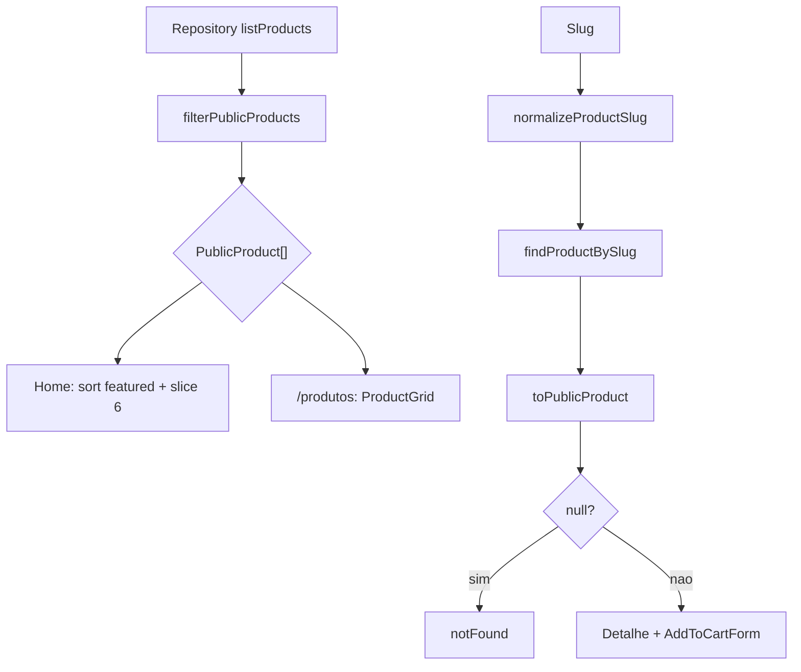

# Products / Catalogo Publico, Design Tecnico

> Spec executavel da subunidade `products/catalogo-publico`. Foca no COMO a vitrine publica e construida.

## Interface

### Rotas

| Rota | Arquivo | Entrada | Saida | Observacao |
|------|---------|---------|-------|------------|
| `/` | `src/app/(storefront)/page.tsx` | Nenhuma | `StorefrontHome` | Lista produtos publicos com fallback de erro seguro. |
| `/produtos` | `src/app/(storefront)/produtos/page.tsx` | Nenhuma | `ProductGrid` | Lista todos os produtos publicos. |
| `/produto/[slug]` | `src/app/(storefront)/produto/[slug]/page.tsx` | `params.slug` | Detalhe ou `notFound()` | Busca por slug normalizado e filtrado. |

### Componentes

| Simbolo | Props | Saida | Observacao |
|---------|-------|-------|------------|
| `StorefrontHome` | `{ products: PublicProduct[], catalogUnavailable?: boolean }` | Home com hero, vitrine e promessa | Nunca executa query; recebe dados prontos. |
| `ProductGrid` | `{ products: PublicProduct[] }` | Grid ou estado vazio | Estado vazio usa `role="status"`. |
| `ProductCard` | `{ product: PublicProduct }` | Card com link de detalhe | Assume produto ja filtrado como publico. |
| `ProductImage` | `{ image: ProductImage \| null, label: string }` | Imagem CSS ou fallback `Sem imagem` | Usa `role="img"` e `aria-label`. |
| `ProductPrice` | `{ priceCents, compareAtPriceCents? }` | Preco formatado | Usa `formatProductPrice`. |

### Services

| Simbolo | Entrada | Saida | Observacao |
|---------|---------|-------|------------|
| `listPublicProducts` | `now?` | `Promise<PublicProduct[]>` | Lista repository e aplica filtro publico. |
| `getPublicProductBySlug` | `slug`, `now?` | `Promise<PublicProduct \| null>` | Normaliza slug e retorna null para produto nao publico. |

## Fluxo Principal: Home

1. `HomePage` inicializa `products=[]` e `catalogUnavailable=false`.
2. Chama `listPublicProducts()` dentro de `try/catch`.
3. Se a chamada falhar, marca `catalogUnavailable=true`.
4. Se a chamada passar, recebe apenas `PublicProduct[]`.
5. Cria `featuredProducts` copiando a lista, ordenando por `isFeatured` desc e aplicando `slice(0, 6)`.
6. Renderiza `StorefrontHome`.
7. `StorefrontHome` mostra hero da marca, CTA `/produtos` e link `/carrinho`.
8. Se `catalogUnavailable=true`, renderiza estado seguro de catalogo indisponivel.
9. Caso contrario, renderiza `ProductGrid`.
10. Home tambem renderiza bloco de promessa com tres artigos institucionais.

## Fluxo Principal: Listagem `/produtos`

1. `ProdutosPage` chama `listPublicProducts()`.
2. Service aplica filtro publico server-side.
3. Pagina renderiza intro com heading `Produtos`.
4. `ProductGrid` recebe a lista.
5. Se lista vazia, renderiza estado amigavel `Nenhum produto disponível no momento.`
6. Se houver produtos, renderiza cards via `ProductCard`.

## Fluxo Principal: Detalhe `/produto/[slug]`

1. `ProdutoPage` aguarda `params` e extrai `slug`.
2. Chama `getPublicProductBySlug(slug)`.
3. Service normaliza o slug.
4. Repository busca produto interno por slug.
5. Service aplica `toPublicProduct`.
6. Produto inexistente, draft, inactive, futuro ou sem estoque vira `null`.
7. Pagina chama `notFound()` se o resultado for `null`.
8. Produto publico renderiza imagem/categoria/nome/descricao curta.
9. Renderiza `ProductPrice`, facts de SKU/volume/estoque e `AddToCartForm`.
10. Descricao longa aparece se existir.

## Fluxo Principal: Card Publico

1. `ProductGrid` itera `products`.
2. `ProductCard` usa `product.id` como key.
3. Imagem linka para `/produto/{slug}` com `aria-label`.
4. Categoria usa primeira categoria ou fallback `Produto`.
5. Badge textual mostra `Disponível`.
6. Nome linka para detalhe.
7. Resumo curto aparece se existir.
8. Preco e compare-at sao formatados por `ProductPrice`.
9. CTA textual `Ver detalhes` aponta para a pagina de produto.

## Fluxos Alternativos

- **Home com erro de catalogo:** catch em `HomePage` evita exception visual e mostra estado seguro em `StorefrontHome`.
- **Listagem vazia:** `ProductGrid` mostra estado vazio com copy amigavel.
- **Produto sem imagem:** `ProductImage` renderiza fallback `Sem imagem`.
- **Produto sem categoria:** card/detalhe usa fallback `Produto`.
- **Produto sem volume:** detalhe mostra `Nao informado`.
- **Slug nao publico:** `getPublicProductBySlug` retorna `null` e pagina chama `notFound`.

## Dependencias

- `src/features/products/server/product-service.ts`: services publicos.
- `src/features/products/domain.ts`: filtro publico, `toPublicProduct`, capa e imagens.
- `src/features/products/types.ts`: `PublicProduct` e `ProductImage`.
- `src/features/products/utils.ts`: formatacao de preco.
- `src/lib/money.ts`: formatacao monetaria em BRL.
- `src/features/cart/components/add-to-cart-form.tsx`: CTA de carrinho no detalhe.
- `next/link`: navegacao entre home, catalogo, carrinho e detalhe.
- `next/navigation`: `notFound` para detalhe invalido.

## Decisoes de Design Identificadas

| Decisao | Evidencia no codigo | Confianca |
|---------|---------------------|-----------|
| Home captura erro de catalogo localmente e nao vaza exception. | `src/app/(storefront)/page.tsx` | 🟢 |
| Home limita vitrine a 6 produtos e prioriza destacados. | `src/app/(storefront)/page.tsx` | 🟢 |
| Listagem `/produtos` confia no service publico para filtrar produtos. | `src/app/(storefront)/produtos/page.tsx`, `product-service.ts` | 🟢 |
| Detalhe usa `notFound` para slug inexistente ou nao publico. | `src/app/(storefront)/produto/[slug]/page.tsx` | 🟢 |
| Card publico nao faz nova validacao de disponibilidade. | `src/features/products/components/product-card.tsx` | 🟢 |
| Fallback de imagem e visual, nao quebra layout. | `src/features/products/components/product-image.tsx` | 🟢 |
| Checkout direto nao e CTA da vitrine; carrinho e o destino publico. | `src/components/storefront/storefront-home.tsx`, `ProdutoPage` | 🟢 |

## Estado Interno

Esta subunidade nao mantem estado persistido. Ela consome:

- `PublicProduct[]`: lista filtrada no servidor.
- `catalogUnavailable`: booleano derivado de erro de listagem na home.
- `coverImage`: imagem calculada pelo dominio.
- `compareAtPriceCents`: preco promocional opcional para exibicao.

## Observabilidade

- Estados de UI sao cobertos por testes de home e E2E de catalogo.
- Home permite observar indisponibilidade por texto seguro `Catálogo temporariamente indisponível`.
- Estado vazio usa `role="status"`.
- Nao ha logs estruturados dedicados ao catalogo publico.

## Riscos e Lacunas

- 🟡 `/produtos` nao tem catch local para indisponibilidade do catalogo.
- 🟡 `ProductCard` mostra `Disponível` por confiar que todos os produtos recebidos ja sao publicos.
- 🟡 Sem imagem real, fallback visual pode reduzir qualidade comercial da vitrine.
- 🔴 Filtros, busca, ordenacao por categoria/genero/preco e paginacao ainda nao existem.
