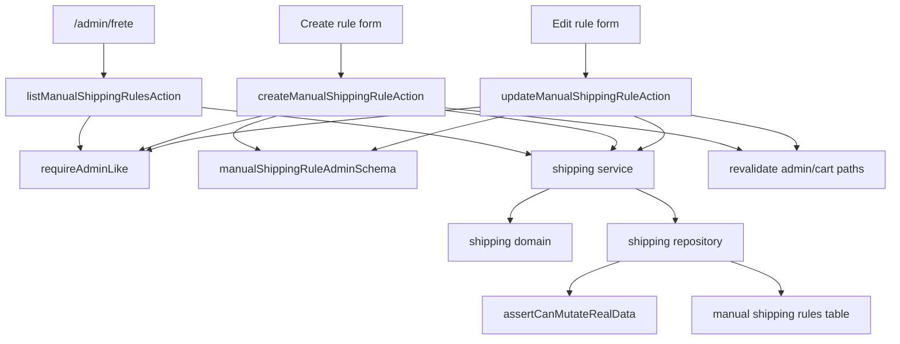

# Shipping / Admin Frete Manual, Design Tecnico

> Spec executavel da subunit `shipping/admin-frete-manual`.
> Descreve COMO administrar regras manuais de frete com actions protegidas, schemas, service/repository, revalidate e guardrails.

## 1. Interface

### 1.1 Actions Administrativas

```ts
listManualShippingRulesAction(): Promise<ManualShippingRuleAdminResult>
createManualShippingRuleAction(formData: FormData): Promise<ManualShippingRuleMutationResult>
updateManualShippingRuleAction(
  id: string,
  formData: FormData
): Promise<ManualShippingRuleMutationResult>
```

### 1.2 Service

```ts
listManualShippingRules(): Promise<ManualShippingRuleView[]>
createManualShippingRule(input: ManualShippingRuleAdminInput): Promise<ManualShippingRuleMutationResult>
updateManualShippingRule(
  id: string,
  input: ManualShippingRuleAdminInput
): Promise<ManualShippingRuleMutationResult>
```

### 1.3 Input Administrativo

```ts
type ManualShippingRuleAdminInput = {
  label: string;
  uf: string | null;
  postalCodeStart: string | null;
  postalCodeEnd: string | null;
  amountCents: number;
  estimatedDays: number | null;
  isActive: boolean;
};
```

### 1.4 Resultado

```ts
type ManualShippingRuleMutationResult =
  | { status: "success"; rule: ManualShippingRuleView; message: string }
  | { status: "validation_error"; message: string; fieldErrors?: Record<string, string[]> }
  | { status: "forbidden"; message: string }
  | { status: "blocked"; message: string }
  | { status: "not_found"; message: string };
```

## 2. Topologia



## 3. Fluxo: Listar Regras

1. Admin abre superficie de frete manual.
2. `listManualShippingRulesAction` chama `requireAdminLike`.
3. Se policy falhar:
   - retornar `forbidden` para usuario sem papel;
   - retornar `blocked` para ambiente/auth indisponivel.
4. Action chama `listManualShippingRules`.
5. Service chama repository.
6. Repository retorna regras manuais ordenadas.
7. Service converte para view administrativa.
8. UI exibe label, cobertura, valor, prazo e status.

## 4. Fluxo: Criar Regra Manual

1. Formulario administrativo envia `FormData`.
2. Action chama `requireAdminLike`.
3. Action converte `FormData` para objeto bruto.
4. Schema valida:
   - label;
   - UF;
   - CEP inicial/final;
   - preco;
   - prazo;
   - ativo/inativo.
5. Em erro, retornar `validation_error`.
6. Em sucesso, action chama service.
7. Service normaliza CEPs e UF quando necessario.
8. Repository chama `assertCanMutateRealData`.
9. Se guardrail bloquear, retornar `blocked`.
10. Repository insere regra.
11. Action revalida rotas administrativas e superficies publicas afetadas.
12. Action retorna `success`.

## 5. Fluxo: Atualizar Regra Manual

1. Formulario envia `id` e `FormData`.
2. Action chama `requireAdminLike`.
3. Action valida id minimo.
4. Schema valida input.
5. Service chama repository.
6. Repository chama `assertCanMutateRealData`.
7. Repository atualiza regra por id.
8. Se id nao existir, retornar `not_found` ou `blocked` seguro conforme contrato real.
9. Action revalida rotas.
10. Quotes antigas nao sao alteradas.

## 6. Parse e Schema

| Campo | Conversao | Validacao |
|-------|-----------|-----------|
| `label` | string trimada | Obrigatoria, legivel, tamanho maximo definido. |
| `uf` | uppercase ou null | Duas letras quando informado. |
| `postalCodeStart` | CEP normalizado ou null | 8 digitos quando informado. |
| `postalCodeEnd` | CEP normalizado ou null | 8 digitos quando informado. |
| `amountCents` | inteiro | Maior que zero. |
| `estimatedDays` | inteiro ou null | Maior que zero quando informado. |
| `isActive` | boolean | Default coerente para nova regra. |

Validações compostas:

- pelo menos UF ou faixa de CEP deve definir cobertura;
- quando inicio/fim de CEP existirem, inicio <= fim;
- faixa parcial deve ser rejeitada ou normalizada por regra explicita;
- preco zero/negativo deve falhar.

## 7. Repository

### 7.1 Listagem

- Ordenar por status, UF/faixa, label ou ordem definida pelo produto.
- Incluir regras inativas para operacao administrativa.
- Nao chamar providers externos.

### 7.2 Criacao

```ts
async function createManualShippingRule(input: ManualShippingRuleAdminInput) {
  const guard = assertCanMutateRealData();
  if (!guard.allowed) return blocked(guard.message);

  const row = toManualShippingRuleInsert(input);
  const inserted = await db.insert(manualShippingRules).values(row).returning();
  return success(toManualShippingRuleView(inserted));
}
```

### 7.3 Atualizacao

```ts
async function updateManualShippingRule(id: string, input: ManualShippingRuleAdminInput) {
  const guard = assertCanMutateRealData();
  if (!guard.allowed) return blocked(guard.message);

  const updated = await db
    .update(manualShippingRules)
    .set(toManualShippingRuleUpdate(input))
    .where(eq(manualShippingRules.id, id))
    .returning();

  if (!updated) return notFound("Regra de frete nao encontrada.");
  return success(toManualShippingRuleView(updated));
}
```

## 8. Revalidacao

Apos criacao/atualizacao bem-sucedida:

- revalidar rota admin de frete;
- revalidar carrinho/produtos se as cotacoes futuras puderem mudar;
- nao forcar alteracao de quotes ja emitidas.

Revalidate nao substitui recalculo server-side quando o usuario cota novamente.

## 9. Efeito em Cotacoes

Regra manual e fonte para cotacao futura.

Nao deve:

- alterar quote ja emitida;
- alterar frete selecionado em carrinho existente;
- alterar snapshot de pedido;
- alterar pagamento.

Deve:

- afetar novas cotacoes;
- ser ignorada quando `isActive=false`;
- aparecer em listagem administrativa mesmo inativa.

## 10. Sobreposicao de Regras

Sobreposicao pode acontecer quando:

- duas regras cobrem mesma faixa;
- uma regra por UF e outra por faixa cobrem o mesmo CEP;
- ranges amplos e especificos coexistem.

Design minimo:

- permitir multiplas opcoes quando multiplas regras cobrem o CEP;
- ordenar de forma previsivel;
- documentar risco operacional;
- evolucao futura pode adicionar alerta de sobreposicao no admin.

## 11. Segurança

- `requireAdminLike` antes de qualquer listagem/mutacao.
- `assertCanMutateRealData` antes de escrita real.
- Sem SQL ou stack trace em erro.
- Sem DSN ou secrets em mensagem.
- Sem chamada externa de transporte.
- Sem escrita no Laravel legado.

## 12. Estados de UI Admin

- lista carregando;
- lista vazia;
- regra ativa;
- regra inativa;
- cobertura por UF;
- cobertura por faixa;
- cobertura combinada;
- erro de validacao;
- erro de permissao;
- mutacao bloqueada por guardrail;
- sucesso com revalidate.

## 13. Rastreabilidade RF -> Design

| RF | Design |
|----|--------|
| RF-ADMIN-SHIPPING-01 | `listManualShippingRulesAction` + `requireAdminLike`. |
| RF-ADMIN-SHIPPING-02 | `createManualShippingRuleAction` + `requireAdminLike`. |
| RF-ADMIN-SHIPPING-03 | `updateManualShippingRuleAction` + `requireAdminLike`. |
| RF-ADMIN-SHIPPING-04 | Fluxo de listagem e view administrativa. |
| RF-ADMIN-SHIPPING-05 | Fluxo de criacao. |
| RF-ADMIN-SHIPPING-06 | Fluxo de atualizacao. |
| RF-ADMIN-SHIPPING-07 | Branch id inexistente. |
| RF-ADMIN-SHIPPING-08 | Schema de label. |
| RF-ADMIN-SHIPPING-09 | Schema de UF. |
| RF-ADMIN-SHIPPING-10 | Normalizacao/validacao de CEP. |
| RF-ADMIN-SHIPPING-11 | Validacao inicio <= fim. |
| RF-ADMIN-SHIPPING-12 | Schema de `amountCents`. |
| RF-ADMIN-SHIPPING-13 | Schema de `estimatedDays`. |
| RF-ADMIN-SHIPPING-14 | Campo `isActive`. |
| RF-ADMIN-SHIPPING-15 | Revalidate apos mutacao. |
| RF-ADMIN-SHIPPING-16 | Separacao regra vs quote. |
| RF-ADMIN-SHIPPING-17 | Providers externos fora do fluxo. |
| RF-ADMIN-SHIPPING-18 | Contratos de erro seguro. |

## 14. Dependencias

- `src/features/shipping/domain`
- `src/features/shipping/server/shipping-repository.ts`
- `src/features/shipping/server/shipping-service.ts`
- `src/features/auth/server/policies.ts`
- `src/lib/runtime-mode.ts`
- `src/db/schema.ts`
- `next/cache`

## 15. Decisoes de Design

- Admin de frete manual opera regras, nao quotes emitidas.
- Regra alterada afeta apenas cotacoes futuras.
- Listagem admin mostra regras ativas e inativas.
- Sobreposicoes nao sao bloqueadas no design minimo, mas precisam de ordenacao e risco documentado.
- Provider externo real permanece fora desta subunit.
- Guardrail de mutacao real e obrigatorio antes de escrita.

## 16. Riscos Tecnicos

- Falta de UI de alerta para sobreposicao pode gerar preco inesperado.
- Regras amplas demais podem abrir cobertura comercial incorreta.
- Validar UF sem derivar UF do CEP pode gerar combinacoes incoerentes.
- Revalidate excessivo pode afetar performance se feito sem criterio.
- Mudanca de regra nao atualizar quote antiga pode surpreender admin; precisa ser claro na UI.
