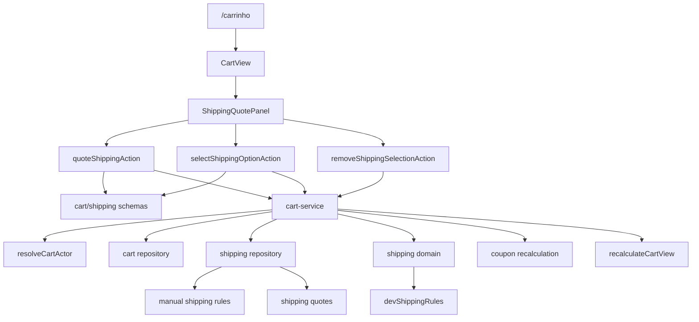
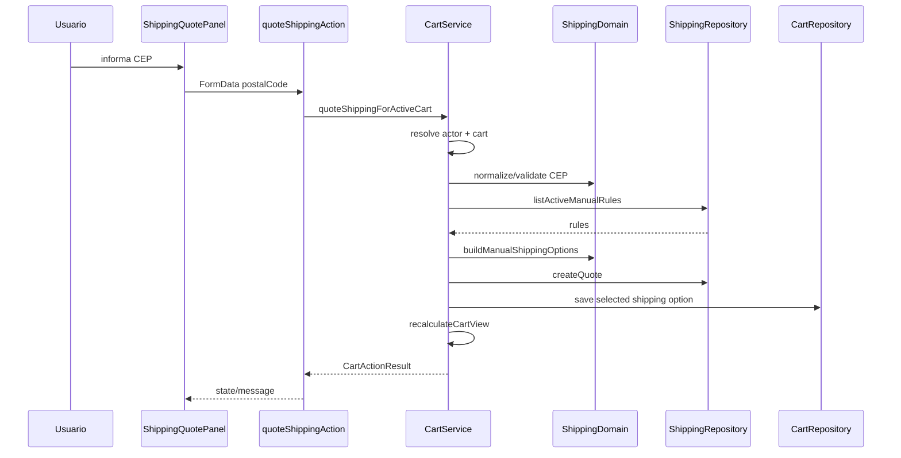

# Shipping / Cotacao Publica no Carrinho, Design Tecnico

> Spec executavel da subunidade `shipping/cotacao-publica-carrinho`.
> Descreve COMO o fluxo publico de frete manual deve operar dentro de `/carrinho`.

## 1. Topologia



## 2. Componentes

### 2.1 `ShippingQuotePanel`

Responsavel por:

- renderizar formulario de CEP;
- exibir estado sem cotacao;
- exibir opcoes retornadas;
- exibir frete selecionado;
- disparar actions de cotar, selecionar e remover;
- exibir mensagens de erro/sucesso;
- chamar `router.refresh()` apos sucesso, quando componente cliente existir.

Props esperadas:

```ts
type ShippingQuotePanelProps = {
  cartId: string;
  shipping: CartShippingView | null;
  messages?: string[];
};
```

O componente nao deve calcular frete no cliente. Ele apenas coleta entrada, renderiza estado ja calculado no servidor e submete actions.

### 2.2 `cart-actions.ts`

Actions publicas esperadas:

```ts
quoteShippingAction(formData: FormData): Promise<CartActionResult>
quoteShippingStateAction(
  prevState: CartActionState,
  formData: FormData
): Promise<CartActionState>

selectShippingOptionAction(formData: FormData): Promise<CartActionResult>
selectShippingOptionStateAction(
  prevState: CartActionState,
  formData: FormData
): Promise<CartActionState>

removeShippingSelectionAction(): Promise<CartActionResult>
removeShippingSelectionStateAction(
  prevState: CartActionState,
  formData: FormData
): Promise<CartActionState>
```

As actions:

1. validam entrada minima;
2. delegam regra para `cart-service`;
3. normalizam retorno para UI;
4. revalidam `/carrinho` e superficies dependentes quando necessario;
5. nunca retornam erro tecnico bruto.

### 2.3 `cart-service.ts`

Funcoes de orquestracao:

```ts
quoteShippingForActiveCart(input: {
  postalCode: string;
}): Promise<CartActionResult>

selectShippingOptionForActiveCart(input: {
  quoteId: string;
  optionId: string;
}): Promise<CartActionResult>

removeShippingSelectionFromActiveCart(): Promise<CartActionResult>
```

Responsabilidades do service:

- resolver ator guest/customer;
- obter ou criar carrinho ativo;
- validar CEP e ids;
- buscar regras de frete;
- construir quote;
- persistir quote;
- gravar selecao;
- recalcular carrinho;
- aplicar cupom de frete gratis quando elegivel;
- devolver resultado seguro.

### 2.4 `shipping-repository.ts`

Operacoes esperadas:

```ts
type ShippingRepository = {
  listActiveManualRules(): Promise<ManualShippingRule[]>;
  createQuote(input: CreateShippingQuoteInput): Promise<ShippingQuote>;
  findQuoteById(id: string): Promise<ShippingQuote | null>;
};
```

O repository deve filtrar regras inativas para uso publico. Listagens administrativas podem usar outro metodo que inclui regras inativas.

### 2.5 Dominio `shipping`

Funcoes puras:

```ts
normalizePostalCode(input: string): string
validatePostalCode(input: string): PostalCodeValidationResult
matchesManualRule(rule: ManualShippingRule, postalCode: string): boolean
buildManualShippingOptions(input: {
  postalCode: string;
  rules: ManualShippingRule[];
}): ShippingOption[]
```

O dominio nao deve conhecer session, cookies, banco, React ou Next.js.

## 3. Fluxo de Cotacao

1. Usuario informa CEP no painel.
2. `ShippingQuotePanel` submete `postalCode`.
3. `quoteShippingAction` valida formato basico do `FormData`.
4. `quoteShippingForActiveCart` resolve ator com `createGuestToken: true`.
5. Service obtem ou cria carrinho ativo.
6. Service chama `normalizePostalCode`.
7. Service chama `validatePostalCode`.
8. Se invalido, retorna `validation_error`.
9. Repository lista regras manuais ativas.
10. Se houver regras persistidas:
    - dominio gera opcoes com source `manual`.
11. Se nao houver regras persistidas:
    - service carrega `devShippingRules` quando ambiente permitir;
    - dominio gera opcoes com source `fixture`.
12. Se nenhuma opcao for gerada:
    - retorna `validation_error` com mensagem de sem cobertura.
13. Service calcula `cartHash`.
14. Repository cria quote com expiracao.
15. Service seleciona primeira opcao quando permitido.
16. Service recalcula carrinho.
17. Action revalida `/carrinho`.
18. UI renderiza opcoes e total atualizado.



## 4. Fluxo de Selecao de Opcao

1. UI envia `quoteId` e `optionId`.
2. Action valida presenca dos ids.
3. Service resolve ator e carrinho ativo.
4. Repository busca quote.
5. Se quote nao existir, retorna `validation_error`.
6. Se `quote.cartId !== cart.id`, retorna `forbidden`.
7. Se `quote.expiresAt < now`, retorna `validation_error`.
8. Service procura `optionId` dentro de `quote.options`.
9. Se nao encontrar, retorna `validation_error`.
10. Cart repository grava opcao selecionada.
11. Service recalcula carrinho.
12. Action revalida `/carrinho`.

## 5. Fluxo de Remocao de Frete

1. UI aciona remover frete.
2. Action chama `removeShippingSelectionFromActiveCart`.
3. Service resolve ator.
4. Service obtem carrinho ativo.
5. Cart repository limpa quote/opcao selecionada.
6. Service recalcula carrinho sem frete.
7. Action retorna mensagem "Frete removido." ou equivalente.
8. UI atualiza resumo.

## 6. Modelo de Dados Logico

### 6.1 Quote

```ts
type ShippingQuote = {
  id: string;
  cartId: string;
  cartHash: string;
  postalCode: string;
  options: ShippingOption[];
  source: "manual" | "fixture";
  expiresAt: Date;
  createdAt: Date;
};
```

### 6.2 Opcao

```ts
type ShippingOption = {
  id: string;
  label: string;
  amountCents: number;
  estimatedDays: number | null;
  source: "manual" | "fixture";
  ruleId?: string;
};
```

### 6.3 Shipping no Carrinho

```ts
type CartShippingView = {
  postalCode: string | null;
  quoteId: string | null;
  selectedOptionId: string | null;
  selectedOption: ShippingOption | null;
  options: ShippingOption[];
  amountCents: number;
  effectiveAmountCents: number;
  freeShippingApplied: boolean;
};
```

`amountCents` representa o valor original da opcao. `effectiveAmountCents` representa o valor apos cupom de frete gratis.

## 7. Validacao de CEP

Algoritmo:

1. Receber string.
2. Remover tudo que nao for digito.
3. Exigir 8 caracteres.
4. Retornar objeto de validacao:

```ts
type PostalCodeValidationResult =
  | { ok: true; postalCode: string }
  | { ok: false; code: "invalid_postal_code"; message: string };
```

Mensagens devem ser amigaveis:

- "Informe um CEP com 8 digitos."
- "Nao foi possivel calcular frete para este CEP."
- "Nao ha cobertura manual para este CEP."

## 8. Regras e Fixtures

Ordem de fonte:

1. regras manuais persistidas e ativas;
2. fixtures dev/test quando nao houver regra persistida;
3. erro de sem cobertura.

Regras:

- fixture nunca substitui regra persistida;
- fixture deve usar source `fixture`;
- fixture nao deve mascarar erro de banco real em producao;
- regra inativa nunca entra em cotacao publica.

## 9. Expiracao e `cartHash`

Quote deve receber `expiresAt = now + 30min`.

`cartHash` deve refletir o estado comercial relevante:

- itens;
- quantidades;
- subtotal;
- cupom aplicado quando impactar frete;
- informacoes que alterem elegibilidade.

Se o carrinho mudar, mutacoes de item devem limpar frete selecionado. Se a validacao por hash for endurecida, selecao de quote stale deve retornar `validation_error`.

## 10. Recalculo

`recalculateCartView` deve:

1. carregar itens do carrinho;
2. calcular subtotal;
3. validar cupom aplicado;
4. carregar frete selecionado;
5. aplicar frete ao total;
6. se cupom `free_shipping` for elegivel, zerar apenas `effectiveAmountCents`;
7. manter quote original sem mutacao;
8. devolver totals server-side para UI.

O cliente nunca deve somar frete e subtotal como fonte de verdade.

## 11. Estados de UI

### 11.1 Sem Cotacao

- campo `CEP`;
- CTA `Cotar`;
- texto "Cotacao ainda nao realizada.";
- resumo indica frete pendente.

### 11.2 Pending

- botao desabilitado;
- label "Cotando..." ou equivalente;
- nenhuma duplicacao de submissao.

### 11.3 Com Opcoes

- lista de opcoes;
- nome/label;
- prazo estimado ou "Prazo a confirmar";
- preco formatado;
- indicador da opcao selecionada;
- CTA para selecionar outra opcao;
- CTA para remover frete.

### 11.4 Erro

- mensagem de CEP invalido;
- mensagem de sem cobertura;
- mensagem de quote expirada;
- mensagem generica segura para falha inesperada.

## 12. Tratamento de Erros

| Erro | Origem | Resultado |
|------|--------|-----------|
| `invalid_postal_code` | schema/dominio | `validation_error` |
| `no_shipping_coverage` | dominio/service | `validation_error` |
| `quote_not_found` | repository | `validation_error` |
| `quote_forbidden` | service | `forbidden` |
| `quote_expired` | service | `validation_error` |
| `cart_unavailable` | cart service/repository | `blocked` |
| erro inesperado | infra | mensagem generica segura |

Nenhum erro deve incluir SQL, stack trace, connection string, segredo ou payload de provider externo.

## 13. Revalidacao e Cache

Apos sucesso em cotar, selecionar ou remover:

- revalidar `/carrinho`;
- atualizar resumo do carrinho;
- atualizar CTA de checkout;
- preservar mensagens de sucesso/erro por state client ou retorno de action.

Se a implementacao usar `router.refresh()`, ele deve ocorrer apenas apos sucesso ou estado terminal conhecido.

## 14. Rastreabilidade RF -> Design

| RF | Design |
|----|--------|
| RF-SHIPPING-PUB-01 | `ShippingQuotePanel`. |
| RF-SHIPPING-PUB-02 | Validacao de CEP. |
| RF-SHIPPING-PUB-03 | Branch `invalid_postal_code`. |
| RF-SHIPPING-PUB-04 | `resolveCartActor` + cart service. |
| RF-SHIPPING-PUB-05 | `createGuestToken: true`. |
| RF-SHIPPING-PUB-06 | `listActiveManualRules`. |
| RF-SHIPPING-PUB-07 | Filtro de regras inativas. |
| RF-SHIPPING-PUB-08 | `devShippingRules`. |
| RF-SHIPPING-PUB-09 | Branch `no_shipping_coverage`. |
| RF-SHIPPING-PUB-10 | `createQuote`. |
| RF-SHIPPING-PUB-11 | Selecao automatica da primeira opcao. |
| RF-SHIPPING-PUB-12 | Estado UI "Com Opcoes". |
| RF-SHIPPING-PUB-13 | Fluxo de selecao. |
| RF-SHIPPING-PUB-14 | Branch `quote_not_found`. |
| RF-SHIPPING-PUB-15 | Validacao `quote.cartId !== cart.id`. |
| RF-SHIPPING-PUB-16 | `expiresAt`. |
| RF-SHIPPING-PUB-17 | Fluxo de remocao. |
| RF-SHIPPING-PUB-18 | `recalculateCartView`. |
| RF-SHIPPING-PUB-19 | Recalculo com `free_shipping`. |
| RF-SHIPPING-PUB-20 | Revalidacao/cache. |
| RF-SHIPPING-PUB-21 | Estado UI "Sem Cotacao". |
| RF-SHIPPING-PUB-22 | Estado UI "Pending". |
| RF-SHIPPING-PUB-23 | Tratamento de erros. |
| RF-SHIPPING-PUB-24 | Providers externos ausentes do fluxo. |

## 15. Dependencias

- `src/features/shipping/components/shipping-quote-panel.tsx`
- `src/features/cart/server/cart-actions.ts`
- `src/features/cart/server/cart-service.ts`
- `src/features/cart/schemas.ts`
- `src/features/cart/types.ts`
- `src/features/cart/components/cart-view.tsx`
- `src/features/shipping/domain`
- `src/features/shipping/server/shipping-repository.ts`
- `src/features/shipping/server/shipping-fixtures.ts`
- `src/features/coupons/domain.ts`
- `src/lib/money.ts`
- `next/cache`
- `next/navigation`

## 16. Decisoes de Design

- Cotacao publica e sempre server-side.
- Guest pode cotar frete sem login.
- Regra persistida prevalece sobre fixture.
- Regra inativa nunca aparece na UI publica.
- Quote pertence a um unico carrinho.
- Quote expirada exige nova cotacao.
- Cupom de frete gratis altera valor efetivo, nao quote original.
- Nenhum provider externo participa desta subunidade.

## 17. Riscos Tecnicos

- `cartHash` inconsistente pode permitir quote stale ou bloqueios indevidos.
- Fallback fixture em ambiente errado pode mascarar ausencia de configuracao real.
- Regra manual ampla demais pode gerar frete comercial incorreto.
- Falta de expiracao efetiva pode permitir frete antigo no checkout.
- UI sem estado pending pode permitir submissao duplicada.
- Erro bruto de repository pode vazar detalhe interno se nao for normalizado na action.
