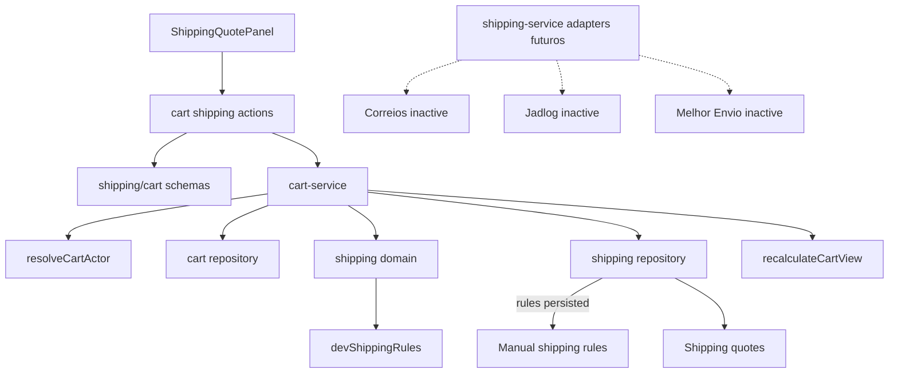
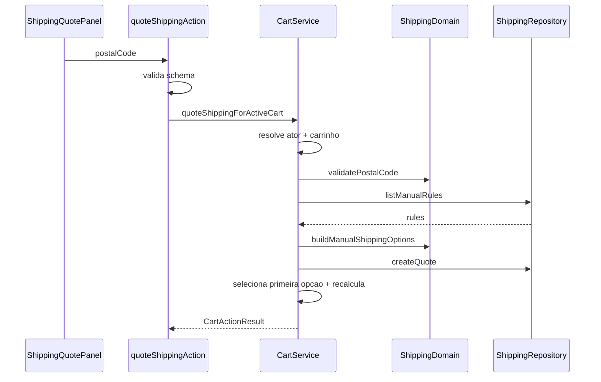

# Shipping, Design Tecnico

> Spec executavel da unit `shipping`.
> Descreve COMO o frete manual, CEP, regras, quotes, fixtures e providers futuros se organizam tecnicamente.

## 1. Interface

### 1.1 Dominio

```ts
normalizePostalCode(input: string): string
validatePostalCode(input: string): PostalCodeValidationResult
buildManualShippingOptions(input: {
  postalCode: string;
  rules: ManualShippingRule[];
}): ShippingOption[]
matchesManualRule(rule: ManualShippingRule, postalCode: string): boolean
```

### 1.2 Tipos Centrais

```ts
type ShippingSource = "manual" | "fixture" | "correios" | "jadlog" | "melhor_envio";

type ManualShippingRule = {
  id: string;
  label: string;
  uf: string | null;
  postalCodeStart: string | null;
  postalCodeEnd: string | null;
  amountCents: number;
  estimatedDays: number | null;
  isActive: boolean;
};

type ShippingOption = {
  id: string;
  label: string;
  amountCents: number;
  estimatedDays: number | null;
  source: ShippingSource;
};

type ShippingQuote = {
  id: string;
  cartId: string;
  cartHash: string;
  postalCode: string;
  options: ShippingOption[];
  source: ShippingSource;
  expiresAt: Date;
  createdAt: Date;
};
```

### 1.3 Repository

```ts
type ShippingRepository = {
  listManualRules(): Promise<ManualShippingRule[]>;
  createQuote(input: CreateShippingQuoteInput): Promise<ShippingQuote>;
  findQuoteById(id: string): Promise<ShippingQuote | null>;
  selectShippingQuoteOption(input: {
    quoteId: string;
    optionId: string;
  }): Promise<ShippingOption | null>;
};
```

### 1.4 Integracao com Carrinho

```ts
quoteShippingForActiveCart(input: { postalCode: string }): Promise<CartActionResult>
selectShippingOptionForActiveCart(input: {
  quoteId: string;
  optionId: string;
}): Promise<CartActionResult>
removeShippingSelectionFromActiveCart(): Promise<CartActionResult>
```

## 2. Topologia



## 3. Fluxo: Normalizar e Validar CEP

1. Receber `postalCode` do formulario.
2. Remover caracteres nao numericos.
3. Conferir se o resultado tem exatamente 8 digitos.
4. Se invalido, retornar `validation_error`.
5. Se valido, usar CEP normalizado em regras, quote e snapshot futuro.

## 4. Fluxo: Cotar Frete Manual

1. Action de cotacao valida `FormData`.
2. Service resolve ator com `createGuestToken: true`.
3. Service obtem ou cria carrinho ativo.
4. CEP e normalizado/validado.
5. Repository lista regras manuais persistidas.
6. Se existirem regras persistidas ativas:
   - dominio calcula opcoes a partir das regras.
7. Se nao existirem regras persistidas:
   - usar `devShippingRules` quando ambiente permitir;
   - marcar source como `fixture`.
8. Se nenhuma regra cobrir o CEP:
   - retornar `validation_error` com mensagem amigavel.
9. Criar quote com:
   - `cartId`;
   - `cartHash`;
   - `postalCode`;
   - `options`;
   - `source`;
   - `expiresAt = now + 30min`.
10. Persistir quote.
11. Selecionar primeira opcao quando aplicavel.
12. Gravar selecao no carrinho.
13. Recalcular carrinho.



## 5. Fluxo: Selecionar Opcao

1. UI envia `quoteId` e `optionId`.
2. Action valida formato minimo.
3. Service resolve ator e carrega carrinho ativo.
4. Repository busca quote por id.
5. Se quote nao existe, retornar `validation_error`.
6. Se `quote.cartId !== cart.id`, retornar `forbidden`.
7. Se quote esta expirada, retornar `validation_error` e pedir nova cotacao.
8. Repository seleciona opcao por `optionId`.
9. Se opcao nao existe na quote, retornar `validation_error`.
10. Carrinho grava selecao de frete.
11. Carrinho e recalculado.

## 6. Fluxo: Remover Frete

1. UI envia solicitacao de remocao.
2. Action chama service.
3. Service resolve ator.
4. Repository de carrinho limpa selecao de frete.
5. Carrinho e recalculado sem frete.
6. Action retorna mensagem amigavel.

## 7. Regras Manuais

Regra manual ativa pode cobrir por:

- UF;
- faixa de CEP;
- combinacao de UF/faixa;
- label e prazo configurado.

O algoritmo deve:

1. Ignorar regra inativa.
2. Comparar CEP normalizado com faixas quando presentes.
3. Comparar UF quando a regra tiver UF derivavel/aplicavel.
4. Gerar `ShippingOption` para cada regra elegivel.
5. Ordenar opcoes de forma previsivel, preferencialmente por preco e label.

## 8. Fixtures Dev/Test

`devShippingRules` serve para desenvolvimento/teste sem regras persistidas.

- Deve ter source `fixture`.
- Deve ser explicito em mensagens/logs seguros quando relevante.
- Nao substitui regra persistida quando ela existe.
- Nao deve acionar provider externo.
- Nao deve ser usado como persistencia real.

## 9. Quotes

Quote e snapshot temporario da cotacao.

Campos essenciais:

- `id`;
- `cartId`;
- `cartHash`;
- `postalCode`;
- `options`;
- `source`;
- `expiresAt`;
- `createdAt`.

Quote nao deve ser compartilhada entre carrinhos. Selecionar quote de outro carrinho e violacao de integridade e retorna `forbidden`.

## 10. Cart Hash

`cartHash` representa o estado do carrinho no momento da cotacao.

Objetivo:

- detectar quote stale quando itens/quantidades/subtotal mudam;
- limpar selecao de frete apos alteracao de item;
- evitar uso de frete cotado para outro estado comercial.

Risco atual: a composicao do hash na UI e no service precisa permanecer alinhada se a validacao for endurecida.

## 11. Integracao com Recalculo

`recalculateCartView` usa selecao de frete para:

1. obter `shippingAmountCents`;
2. compor total com frete;
3. aplicar `free_shipping` quando cupom elegivel existir;
4. manter quote original intacta;
5. retornar valor efetivo para resumo e checkout.

Frete selecionado deve virar snapshot no pedido durante checkout, nao ser recalculado client-side.

## 12. Providers Futuros

Providers externos ficam modelados como contratos/adapters futuros.

Estado atual:

- Correios: inativo;
- Jadlog: inativo;
- Melhor Envio: inativo.

Regras:

- nenhuma chamada real sem fase dedicada;
- nenhuma credencial nos artefatos;
- falha de provider futuro deve ser segura;
- mocks/dev devem ser explicitos.

## 13. Estados de UI

### Sem Cotacao

- Campo de CEP.
- Botao "Cotar".
- Texto "Cotacao ainda nao realizada.".

### Cotando

- Botao desabilitado.
- Mensagem de pending.
- Nenhum total calculado no client.

### Com Opcoes

- Lista de opcoes.
- Label.
- Prazo ou "Prazo a confirmar".
- Preco formatado.
- CTA de selecionar.
- CTA de remover frete.

### Erro

- CEP invalido.
- Sem cobertura.
- Quote inexistente.
- Quote de outro carrinho.
- Quote expirada.

## 14. Rastreabilidade RF -> Design

| RF | Design |
|----|--------|
| RF-SHIPPING-01 | `normalizePostalCode`. |
| RF-SHIPPING-02 | `validatePostalCode`. |
| RF-SHIPPING-03 | Fluxo de cotacao manual. |
| RF-SHIPPING-04 | `listManualRules` antes de fixtures. |
| RF-SHIPPING-05 | `devShippingRules` explicito. |
| RF-SHIPPING-06 | Branch sem opcoes/cobertura. |
| RF-SHIPPING-07 | `createQuote`. |
| RF-SHIPPING-08 | Selecao da primeira opcao. |
| RF-SHIPPING-09 | `ShippingOption`. |
| RF-SHIPPING-10 | Fluxo selecionar opcao. |
| RF-SHIPPING-11 | Branch quote inexistente. |
| RF-SHIPPING-12 | Validacao `quote.cartId !== cart.id`. |
| RF-SHIPPING-13 | `removeShippingSelectionFromActiveCart`. |
| RF-SHIPPING-14 | `expiresAt = now + 30min`. |
| RF-SHIPPING-15 | Limpeza em mutacoes de item. |
| RF-SHIPPING-16 | Recalculo com `free_shipping`. |
| RF-SHIPPING-17 | Providers/adapters futuros. |
| RF-SHIPPING-18 | Providers externos inativos. |

## 15. Dependencias

- `src/features/shipping/domain`
- `src/features/shipping/server/shipping-repository.ts`
- `src/features/shipping/server/shipping-service.ts`
- `src/features/shipping/server/shipping-fixtures.ts`
- `src/features/shipping/components/shipping-quote-panel.tsx`
- `src/features/cart/server/cart-actions.ts`
- `src/features/cart/server/cart-service.ts`
- `src/features/cart/schemas.ts`
- `src/features/cart/types.ts`
- `src/features/coupons/domain.ts`
- `src/lib/money.ts`
- `next/navigation`
- `next/cache`

## 16. Decisoes de Design

- Frete atual e manual, nao externo.
- Cotacao e sempre server-side.
- Quote pertence a um carrinho e nao pode ser reutilizada por outro.
- Fixture e fallback explicito de dev/test, nao comportamento produtivo.
- Quote tem expiracao operacional de 30 minutos.
- Alteracao de item invalida selecao de frete.
- `free_shipping` altera valor efetivo, nao a quote original.
- Providers externos entram apenas em fase futura dedicada.

## 17. Riscos Tecnicos

- Validacao forte de `cartHash` exige padronizacao entre UI e service.
- Sem provider real, cobertura depende da qualidade das regras manuais.
- Se regra manual for ampla demais, pode gerar frete comercial incorreto.
- Se quote expirada nao for bloqueada, checkout pode usar frete antigo.
- Providers externos futuros precisam de rate limit, timeout, retry e mascaramento de credenciais.
