# State Machines - Triade Essenza Next

Atualizado em: 2026-07-03
Agente: Detective

## Produto

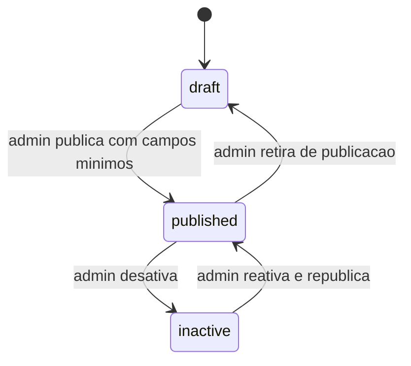

Regras:

- 🟢 `published` só é público se `publishedAt <= now` e estoque positivo.
- 🟢 `draft`, `inactive`, futuro e sem estoque não aparecem no catálogo público.

## Carrinho

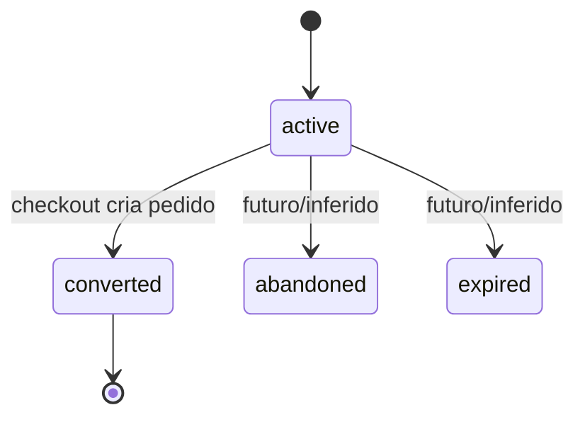

Regras:

- 🟢 `active` permite item, cupom e frete.
- 🟢 `converted` é terminal para mutações de compra.
- 🟡 `abandoned` e `expired` existem no enum, mas sem rotina operacional completa.

## Cupom

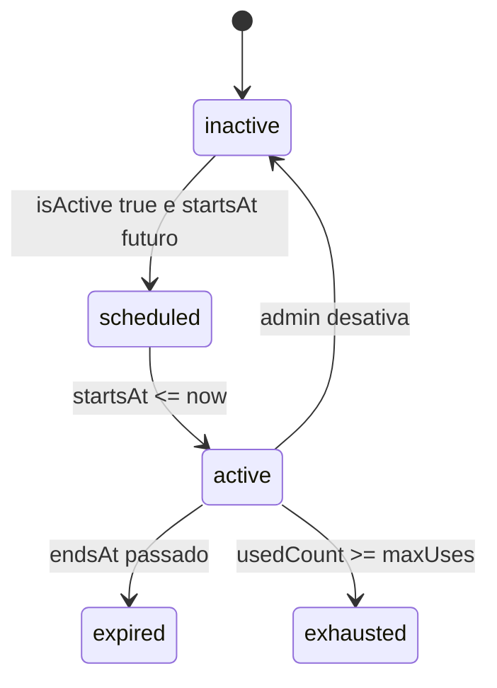

Regras:

- 🟢 Status é calculado, não necessariamente persistido.
- 🟢 `usedCount` incrementa no settlement, não no carrinho.

## Cotação de Frete

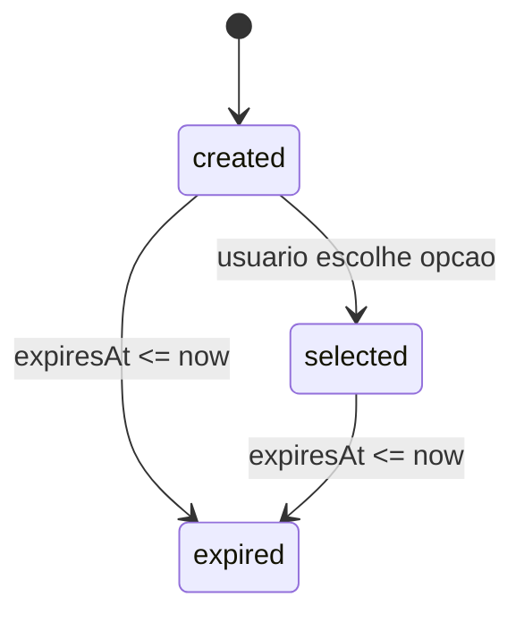

Regras:

- 🟢 Cotação vale por 30 minutos.
- 🟢 Cotação precisa pertencer ao carrinho atual.

## Pedido

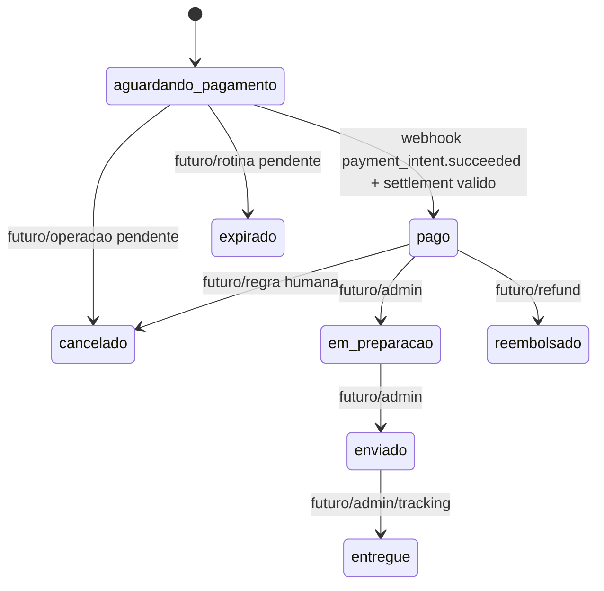

Regras:

- 🟢 Implementado hoje: `aguardando_pagamento -> pago`.
- 🟢 Browser e admin não marcam pedido pago.
- 🔴 Transições operacionais restantes ainda não foram implementadas.

## Pagamento Interno

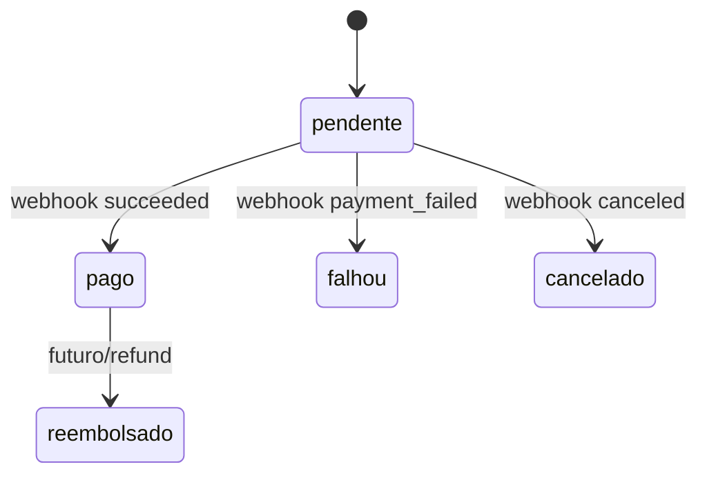

Regras:

- 🟢 PaymentIntent pendente pode ser reutilizado se valor/moeda/pedido ainda batem.
- 🟢 Falha/cancelamento não muda pedido para pago.

## Evento de Pagamento

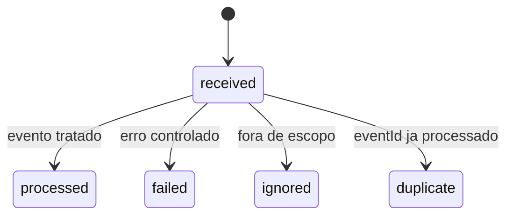

Regras:

- 🟢 `eventId` único impede repetição do settlement.
- 🟢 Payload armazenado é sanitizado/normalizado, não segredo bruto.

## Entrega de Notificação

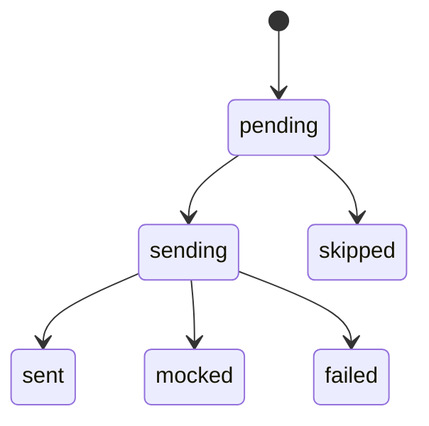

Regras:

- 🟢 `mocked` só em dev/test.
- 🟢 `skipped` cobre ausência de destinatário admin.
- 🟢 Duplicata idempotente retorna registro existente.
- 🟢 Falha de notificação não altera pedido, pagamento, estoque ou cupom.

## Fulfillment

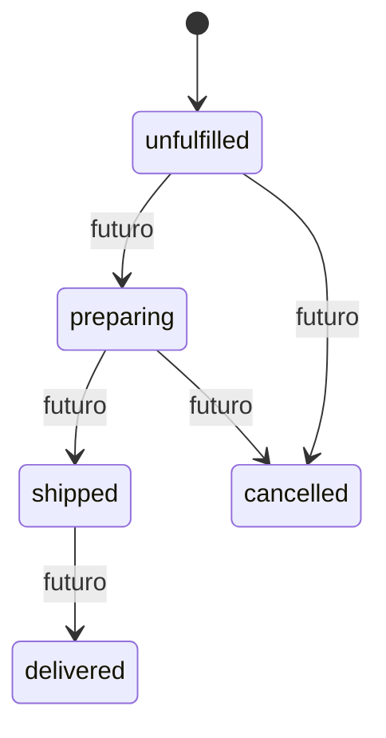

Regras:

- 🔴 Enum existe; fluxo operacional ainda não foi implementado.

## Readiness Operacional

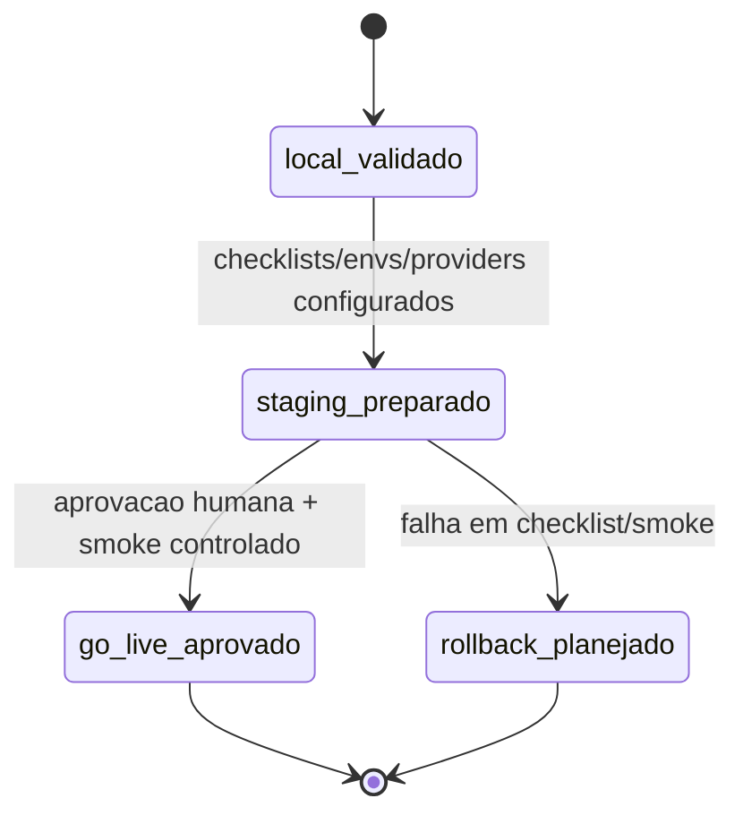

Regras:

- 🟢 Fase 12 concluiu `local_validado` com lint, typecheck, testes, build, E2E e `ops:*`.
- 🟢 Transicao para staging/producao exige configuracao externa aprovada; nao e automatica.
- 🟢 Migration real, banco real e deploy real permanecem fora da execucao automatica.

## Paridade e Migracao Controlada

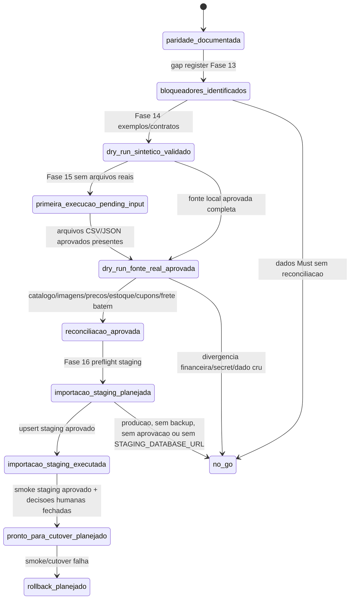

Regras:

- 🟢 Fase 13 concluiu `paridade_documentada` e `bloqueadores_identificados`.
- 🟢 Fase 14 concluiu `dry_run_sintetico_validado` com exemplos locais, contratos CSV/JSON e `ops:check-data-dry-run`.
- 🟢 Fase 15 introduziu `primeira_execucao_pending_input`: a pasta aprovada existe conceitualmente, mas sem arquivos reais/exportados o resultado seguro e `pending-input`.
- 🟢 Fase 16 introduziu `importacao_staging_planejada` e `importacao_staging_executada`: somente staging/dev remoto aprovado, com producao bloqueada, upsert seguro e reset protegido.
- 🔴 `dry_run_fonte_real_aprovada` ainda nao ocorreu; depende de arquivos CSV/JSON reais aprovados em `data/dry-run/input/primeira-execucao/`.
- 🟢 `no_go` e obrigatorio enquanto catalogo real, imagens, precos, estoque, cupons ativos e frete minimo nao forem reconciliados com fonte real.
- 🟢 `rollback_planejado` preserva o Laravel legado intacto ate aceite formal.

## Importacao Staging Controlada

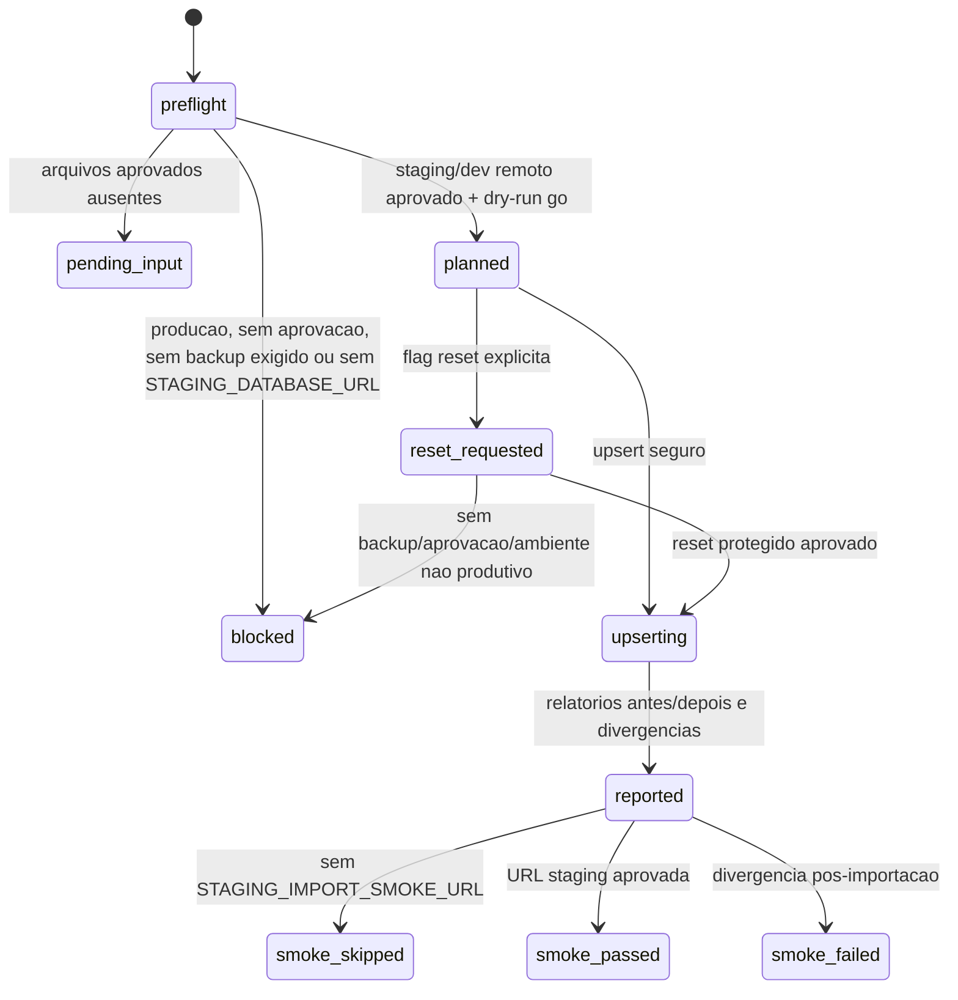

Regras:

- 🟢 `pending_input` e seguro e nao abre conexao remota.
- 🟢 `blocked` impede escrita e deve explicar a precondicao ausente sem imprimir secrets.
- 🟢 `upserting` so ocorre contra staging/dev remoto aprovado.
- 🟢 `smoke_skipped` sem URL e esperado na suite E2E local; nao autoriza go-live.
