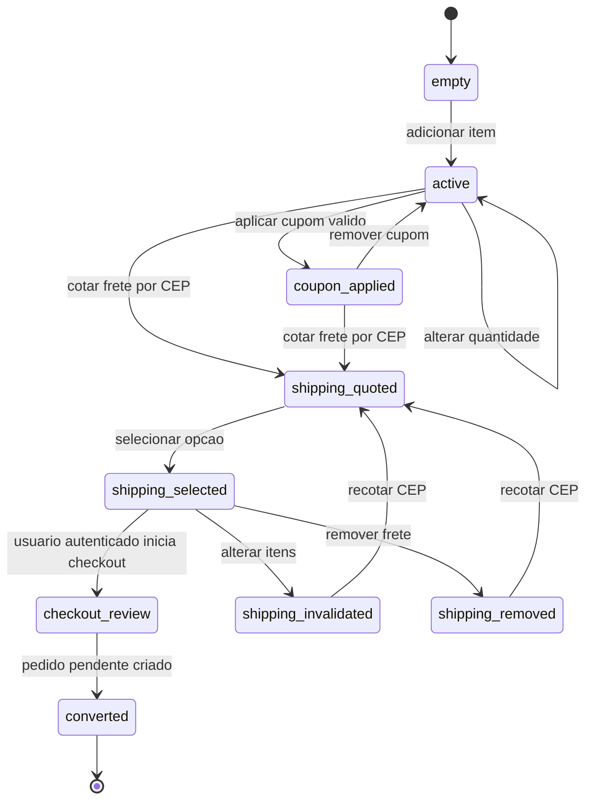
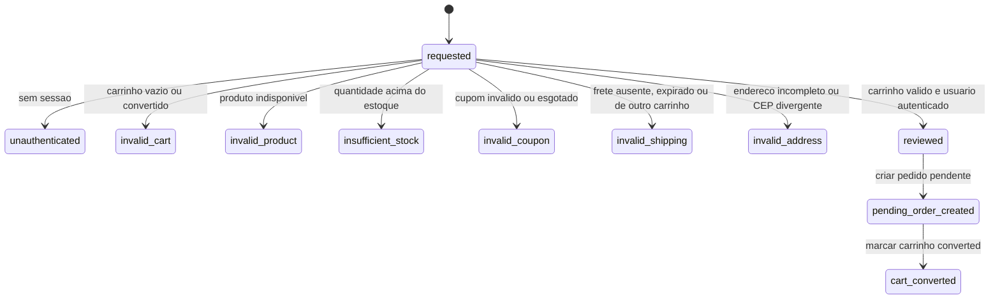
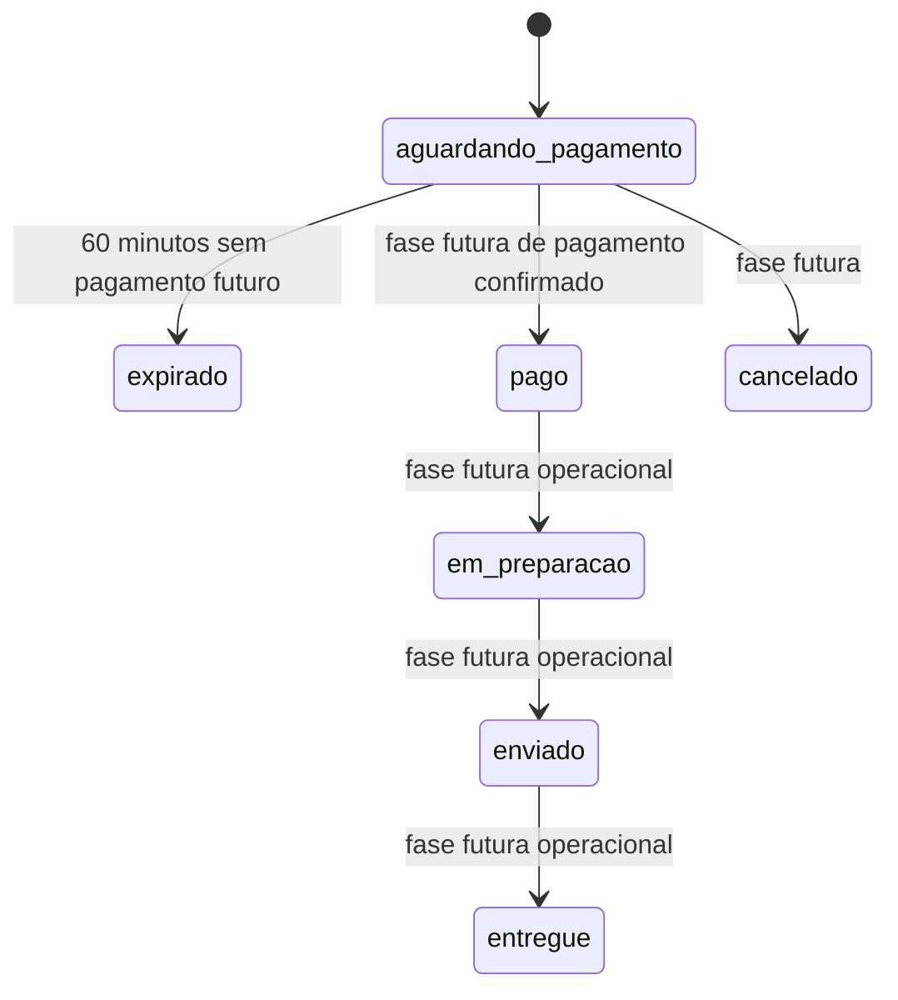
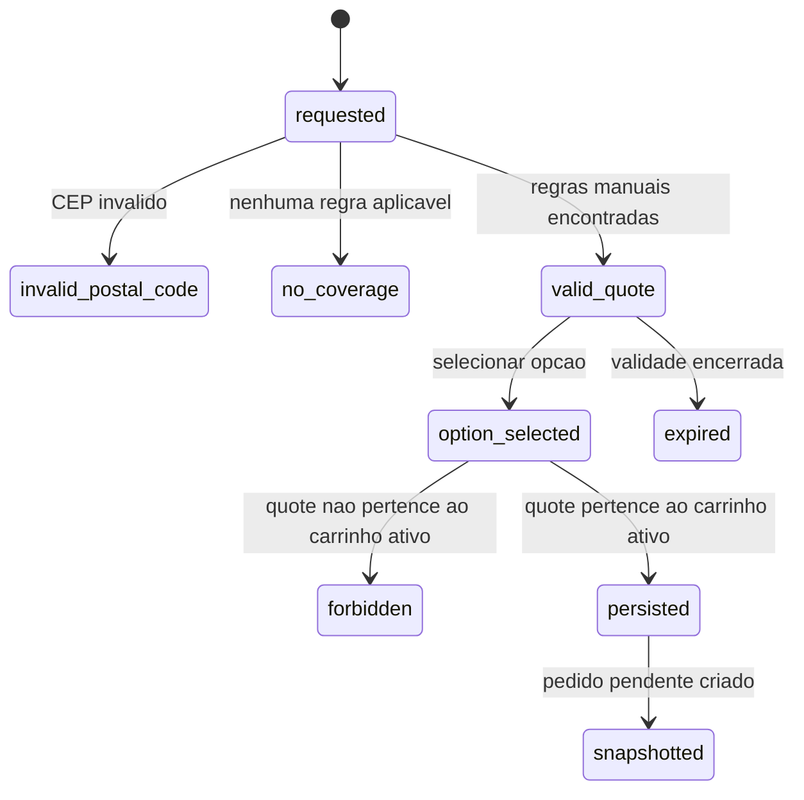
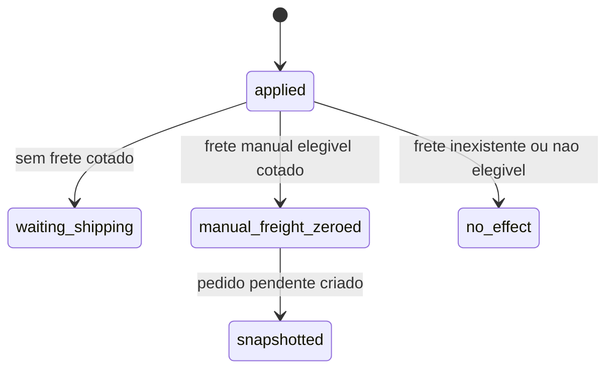
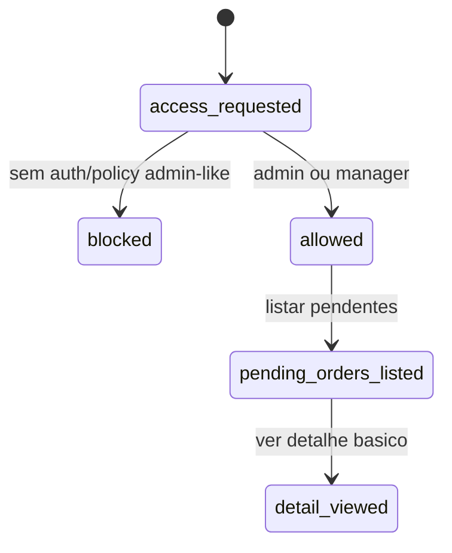

# Maquinas de estado Reversa - Triade Essenza Next

Data: 2026-06-10
Escopo: estados apos Fase 8.

## Carrinho

Estados relevantes:

- `empty`: sem itens.
- `active`: com itens e sem checkout.
- `coupon_applied`: cupom valido aplicado.
- `shipping_quoted`: quote gerada para CEP.
- `shipping_selected`: opcao de frete persistida.
- `checkout_review`: usuario autenticado revisa pedido.
- `converted`: pedido pendente criado; carrinho bloqueado.
- `shipping_invalidated`: frete descartado apos mudanca de itens.
- `shipping_removed`: usuario removeu a selecao de frete.

## Checkout pendente

Regras:

- Visitante nao cria pedido.
- Carrinho anonimo nao vira pedido diretamente.
- O servidor recalcula tudo antes de criar pedido.
- Payload financeiro do cliente e ignorado.
- Nenhum pagamento real e iniciado.

## Pedido

Estado implementado na Fase 8:

- `aguardando_pagamento`: criado sem pagamento real, com snapshots e expiracao de 60 minutos.

Estados futuros modelados:

- `pago`, `em_preparacao`, `enviado`, `entregue`, `cancelado`, `expirado`, `reembolsado`.

## Cotacao de frete

Regras:

- CEP deve ter 8 digitos numericos.
- Apenas regras manuais ativas sao usadas.
- Providers externos nao participam do fluxo atual.
- Selecao exige ownership da quote pelo carrinho ativo.
- Checkout copia snapshot do frete.

## Cupom `free_shipping`

Regras:

- O cupom nao cria frete.
- O cupom nao altera desconto monetario de produtos.
- O cupom zera somente frete manual calculado e elegivel.
- Pedido pendente nao consome `usedCount`.

## Admin de pedidos

Permissao:

- `admin` e `manager` podem listar pedidos pendentes.
- Nao ha transicao para marcar pago, editar valores, baixar estoque ou criar pagamento.

## Fluxos ainda inexistentes

- Pagamento real.
- Stripe real.
- PaymentIntent real.
- Coleta de cartao.
- Captura de pagamento.
- Reserva definitiva de estoque.
- Baixa definitiva de estoque.
