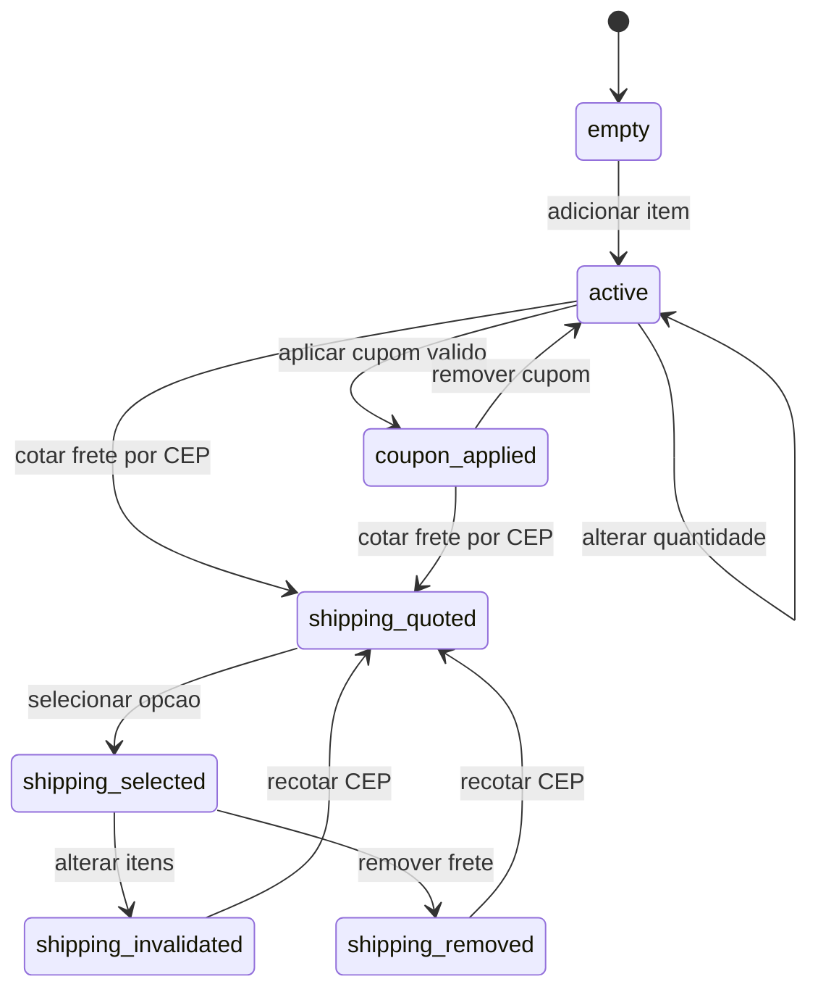
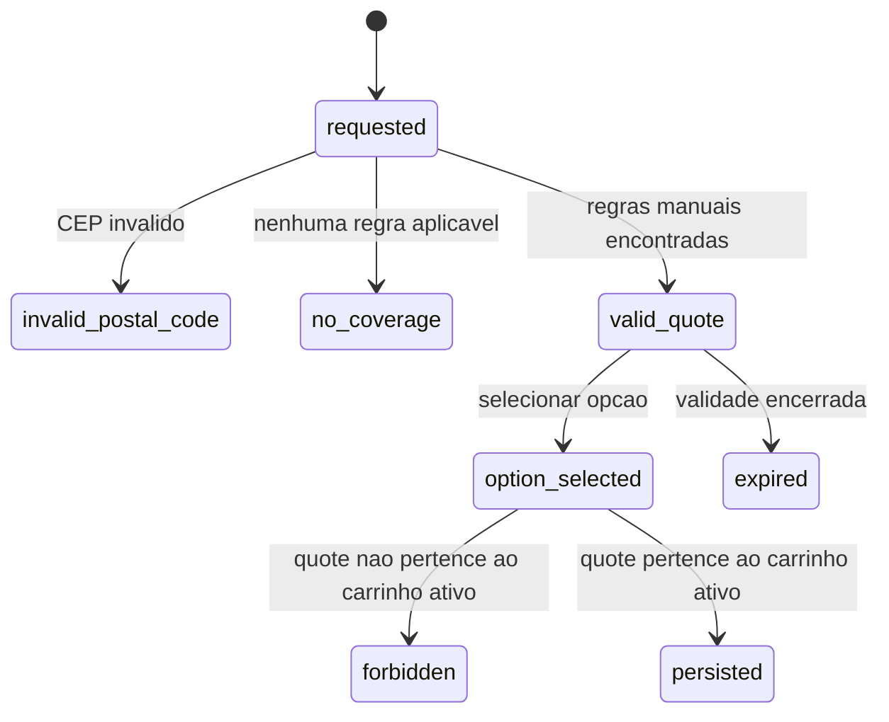
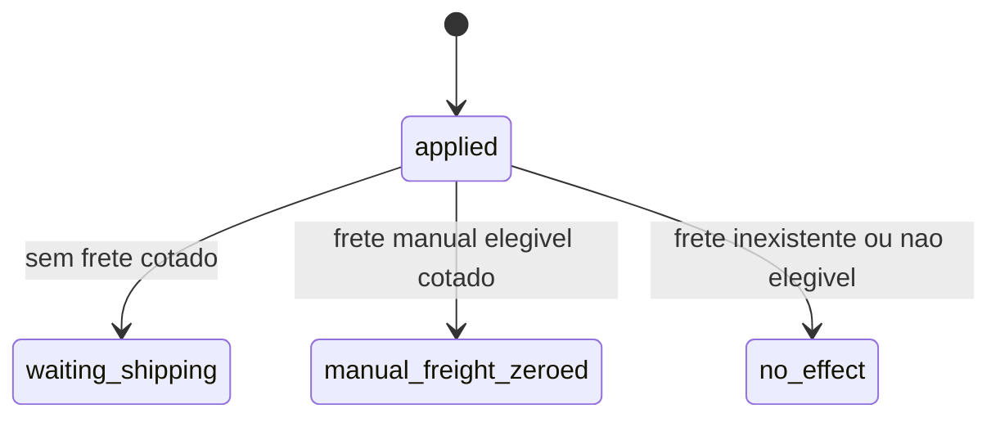
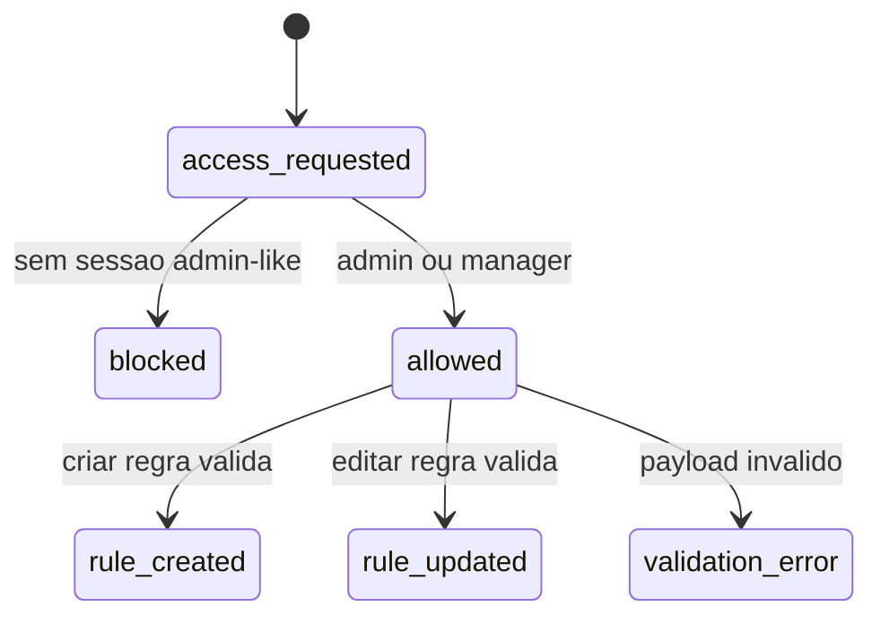

# Maquinas de estado Reversa - Triade Essenza Next

Data: 2026-06-09
Escopo: estados apos Fase 7.

## Carrinho

Estados relevantes:

- `empty`: sem itens.
- `active`: com itens e sem checkout.
- `coupon_applied`: cupom valido aplicado.
- `shipping_quoted`: quote gerada para CEP.
- `shipping_selected`: opcao de frete persistida.
- `shipping_invalidated`: frete descartado apos mudanca de itens.
- `shipping_removed`: usuario removeu a selecao de frete.

## Cotacao de frete

Regras:

- CEP deve ter 8 digitos numericos.
- Apenas regras manuais ativas sao usadas.
- Providers externos nao participam do fluxo atual.
- Selecao exige ownership da quote pelo carrinho ativo.

## Cupom `free_shipping`

Regras:

- O cupom nao cria frete.
- O cupom nao altera desconto monetario de produtos.
- O cupom zera somente frete manual calculado e elegivel.

## Admin de frete

Permissao:

- `admin` e `manager` podem listar, criar e editar regras.
- Outros atores devem ser bloqueados.

## Fluxos ainda inexistentes

- Checkout.
- Pagamento.
- Stripe.
- Pedido.
- Reserva de estoque.
- Baixa de estoque.
