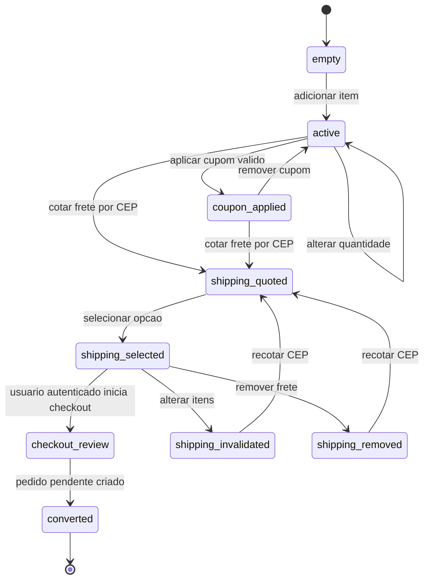
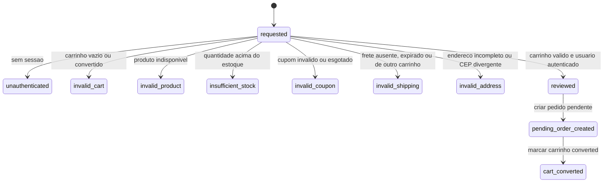
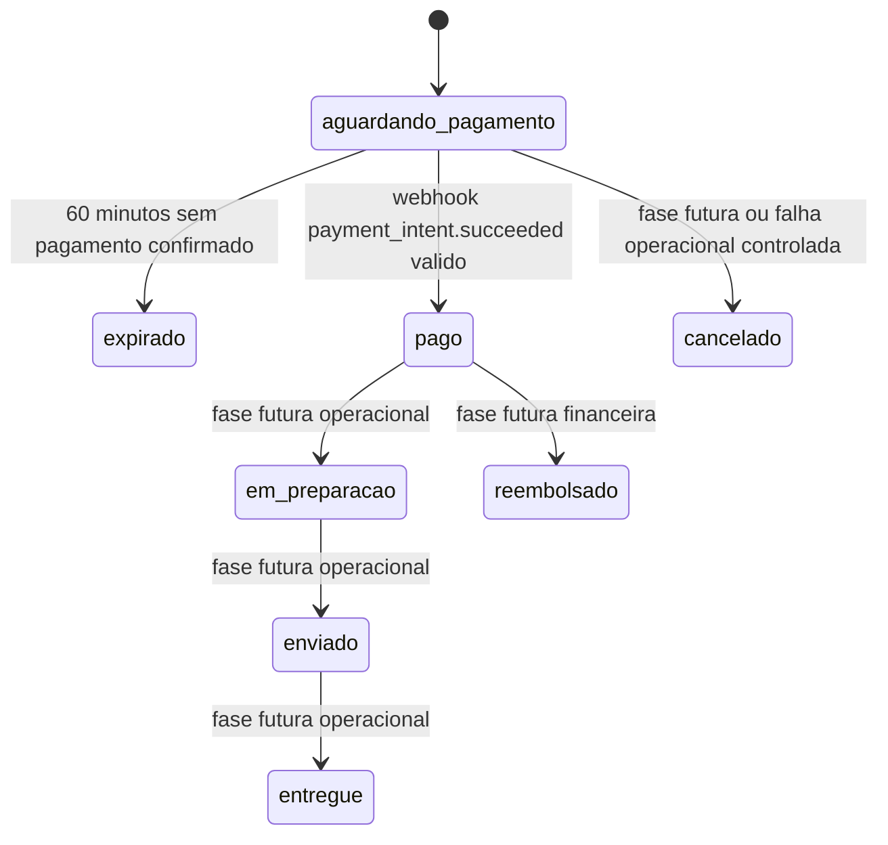
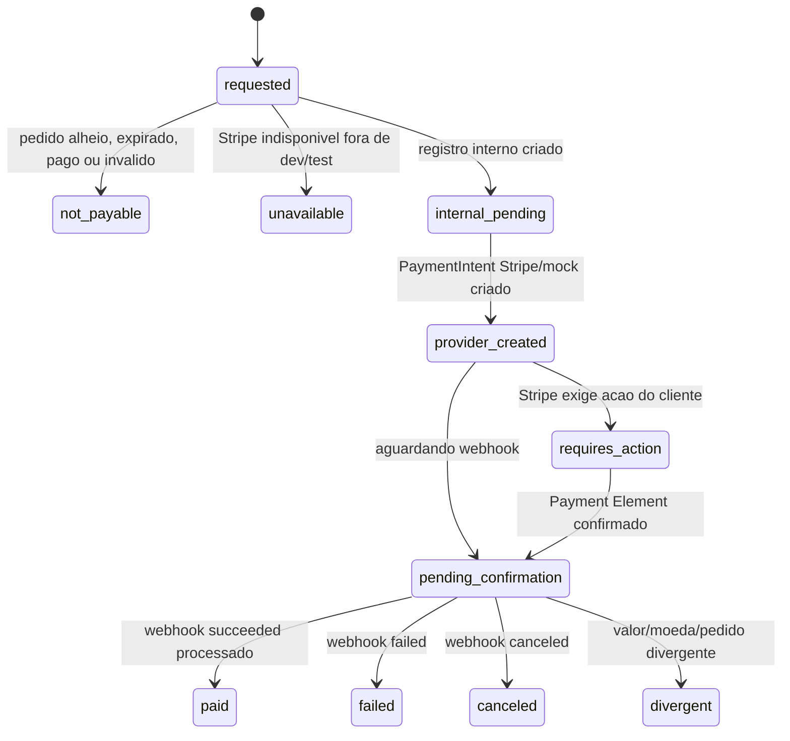
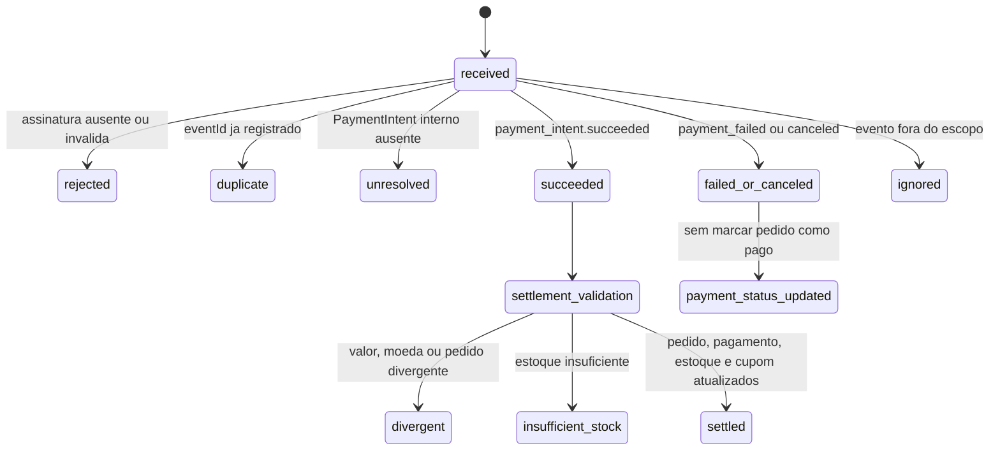
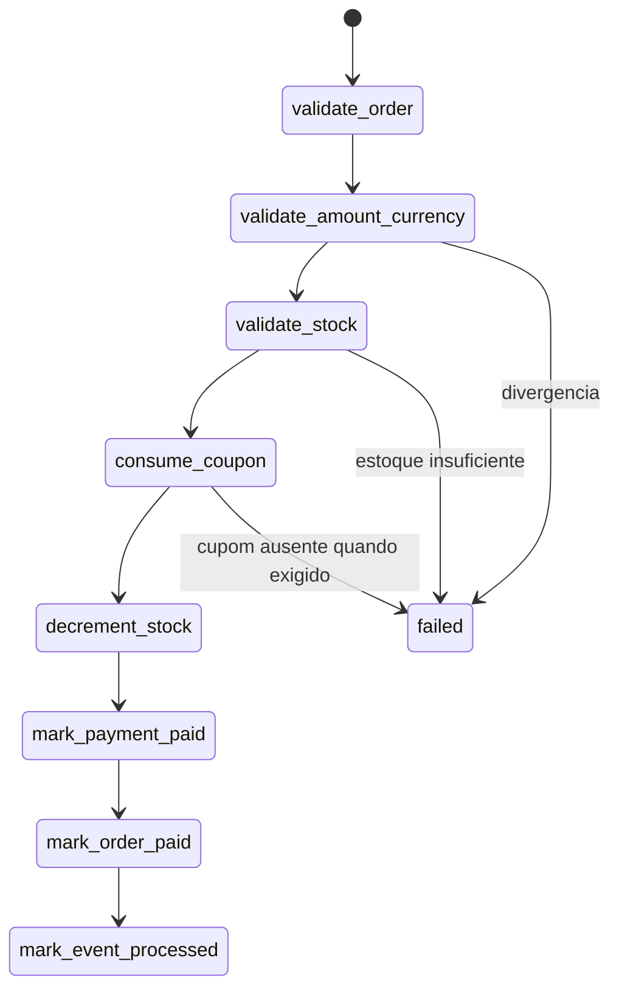
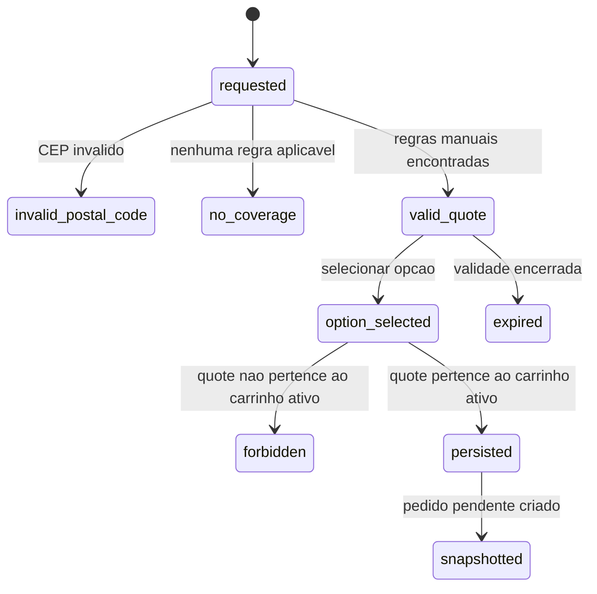
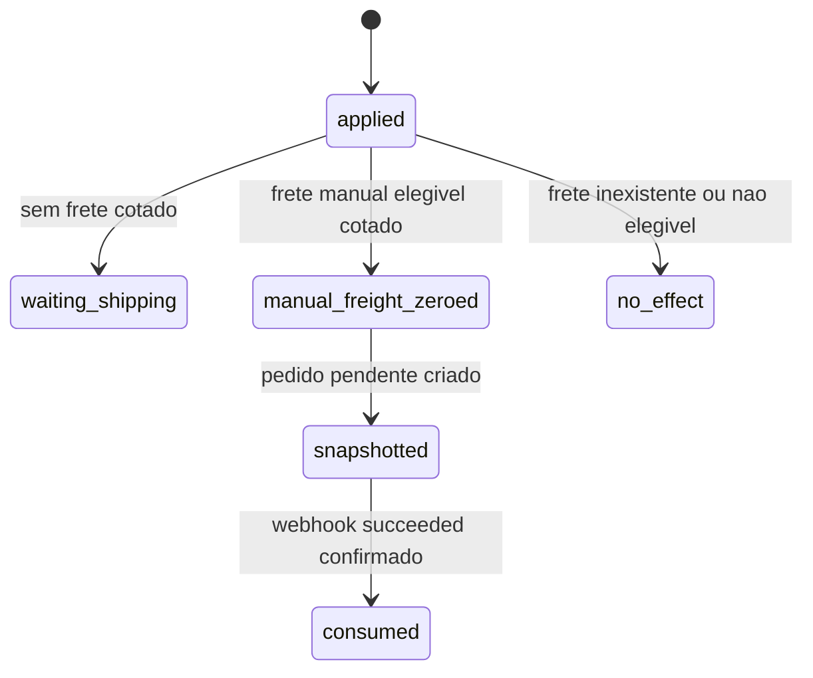
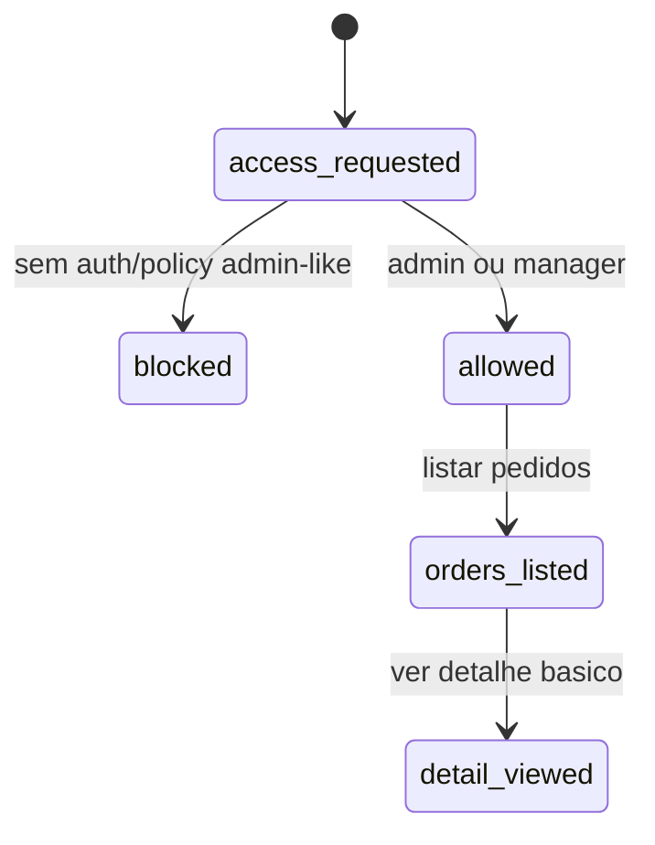

# Maquinas de estado Reversa - Triade Essenza Next

Data: 2026-06-10
Escopo: estados apos Fase 9.

## Carrinho

Carrinho `converted` e terminal para novas mutacoes. Pagamento nao reabre carrinho.

## Checkout pendente

Regras:

- Visitante nao cria pedido.
- O servidor recalcula tudo antes de criar pedido.
- Payload financeiro do cliente e ignorado.
- Nenhum pagamento e confirmado no checkout.

## Pedido

Estado implementado na Fase 9:

- `aguardando_pagamento`: criado sem pagamento confirmado.
- `pago`: somente por settlement de webhook assinado/idempotente.

Estados futuros:

- `em_preparacao`, `enviado`, `entregue`, `cancelado`, `expirado`, `reembolsado`.

## PaymentIntent

Regras:

- PaymentIntent usa valor e moeda do pedido no servidor.
- Client nao define amount/currency.
- PaymentIntent pode ser reutilizado quando ainda e seguro.
- Client secret nao e secret key e nao deve ser confundido com credencial server-side.
- Retorno client-side nao muda pedido para `pago`.

## Webhook Stripe

Regras:

- Assinatura valida e pre-condicao.
- `eventId` unico torna o processamento idempotente.
- Evento duplicado nao baixa estoque nem consome cupom de novo.
- Falha/cancelamento nao marca pedido como pago.
- Divergencia nao conclui estado operacional parcial.

## Settlement

No banco real, o settlement e executado em transacao Drizzle. Em mock dev/test, os efeitos simulam a mesma ordem conceitual sobre fixtures.

## Cotacao de frete

## Cupom `free_shipping`

Pedido pendente nao consome `usedCount`; webhook confirmado consome uma vez.

## Admin de pedidos

Permissao:

- `admin` e `manager` podem listar pedidos.
- Nao ha transicao admin para marcar pago, editar valores, baixar estoque, consumir cupom ou criar pagamento.

## Fluxos ainda inexistentes

- Stripe Checkout Session como fluxo principal.
- Coleta propria de cartao.
- Armazenamento de dados sensiveis de cartao.
- Refund/disputa completos.
- Fiscal/Bling/NF-e.
- E-mail transacional real obrigatorio.
